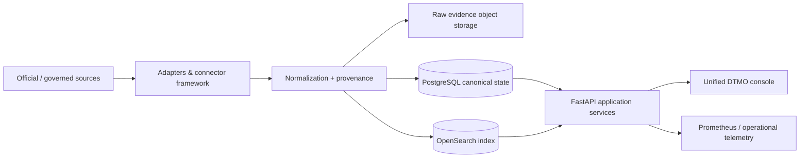

# DTMO — Dutch Threat Monitoring for Education

DTMO is an open Cyber Threat Intelligence (CTI) platform designed for education-sector security teams. It brings governed threat-source operations, normalized intelligence, provenance, investigation, visual analytics, role-based administration and governance evidence together in one controlled application.

> **Release baseline:** `16.0.0rc12`  
> **Functional product acceptance:** `RC13 PASS / OWNER_ACCEPTED`  
> **Production-readiness stage:** Phase 8 — real production-equivalent staging validation  
> **Production status:** **not production ready**

## Why DTMO

Education environments combine broad digital estates, sensitive data, large user populations, cloud dependencies and a threat landscape that ranges from opportunistic exploitation to targeted campaigns. DTMO is intended to help security teams turn heterogeneous public and governed intelligence sources into traceable, reviewable and operationally useful intelligence without weakening authorization, privacy or publication controls.

DTMO focuses on five principles:

1. **Provenance first** — source identity and evidence remain traceable through normalization and analysis.
2. **Fail closed** — missing evidence, invalid source contracts, unknown types or incomplete acceptance never become implicit success.
3. **Human authority remains human** — ingestion, analytics, Administration, CI and staging access do not grant publication or external-share authority.
4. **Least privilege by design** — human and service-account responsibilities remain separated and privileged operations are auditable.
5. **Evidence-based governance** — framework mappings are explicit and provenance-backed; missing mappings remain visibly unmapped rather than inferred.

## Product capabilities

### Unified security console

The canonical DTMO web application provides a single operator experience for:

- **Overview** — security and intelligence KPIs, source state, trends and recent intelligence;
- **Intelligence** — recent normalized intelligence records with provenance and investigation context;
- **Sources & Catalog** — governed source registration, catalog state, enable/disable controls and source execution;
- **Visual Analytics** — native analytical views for severity, source, connector and review state;
- **Administration** — governed principal and role assignment management with safety controls;
- **Governance** — repository-backed governance/framework knowledge and evidence boundaries.

### Intelligence pipeline

DTMO supports provider-specific and framework-based adapters that feed a canonical intelligence pipeline:



The canonical PostgreSQL record is the durable application truth for console intelligence and dashboard aggregation. Search/index and raw-evidence storage provide supporting capabilities rather than replacing that canonical state.

### Security and governance

DTMO implements and preserves:

- server-side RBAC and least privilege;
- strict human/service-account role separation;
- privileged Administration protections, including self-management and final-admin safeguards;
- externally issued and cryptographically validated bearer-token trust;
- tamper-evident auditability and request correlation;
- provenance and confidence preservation;
- privacy/data-minimization boundaries;
- separate review and external-share approval authority;
- explicit secret references instead of raw credentials in repository/catalog evidence;
- truthful framework mapping states (`MAPPED`, `UNMAPPED`, `CONTEXT_ONLY`) based on explicit evidence.

## Architecture

The reference platform consists of:

- Python 3.12+
- FastAPI / Uvicorn
- SQLAlchemy / Alembic
- PostgreSQL 17
- Redis 8
- OpenSearch 2.19
- S3-compatible AIStor/MinIO object storage
- Prometheus 3
- Grafana 13 for separately authenticated operational/advanced dashboards
- Nginx
- Docker Compose reference topology

See [System Architecture](docs/architecture/SYSTEM_ARCHITECTURE.md) for trust boundaries, data flows, deployment boundaries and component responsibilities.

## Current maturity and release position

| Stage | Scope | Status |
|---|---|---|
| Phases 1–7 | Repository-controlled engineering, security, recovery, connectors, performance, accessibility and operations | `PASS` |
| RC13 | Functional unified-console acceptance | `PASS / OWNER_ACCEPTED` |
| Phase 8 | Real production-equivalent staging acceptance | `READY / PENDING_EXTERNAL_DEPLOYMENT_IDENTITY` |
| Phase 9 | Independent external assurance | `NOT COMPLETE` |
| Phase 10 | Formal production go/no-go | `NOT STARTED` |

The current production-readiness objective is to provision and evidence one approved production-equivalent staging environment with an immutable deployment identity, least-privilege application credentials, configuration parity, TLS/network evidence, controlled data handling, rollback/change evidence and deployment-time security review.

Repository CI, local Docker Compose and synthetic staging/browser fixtures are engineering evidence only; they do not substitute for real staging or independent assurance.

## Product roadmap

Post-RC13 product evolution is tracked separately from production-readiness evidence. The next planned product slices are:

1. consistent accessible severity semantics and filtering across Overview and Intelligence;
2. governed manual source onboarding;
3. richer Visual Analytics and trend analysis;
4. first-class provenance-backed framework mappings;
5. deeper Administration role/permission management;
6. deeper framework-oriented Governance coverage and evidence drill-down.

See [Production Roadmap](docs/roadmap/PRODUCTION_ROADMAP.md) and GitHub issue #171 for the detailed enhancement sequence.

## Documentation

The professional documentation portal is [docs/README.md](docs/README.md). Key building blocks include:

- [System Architecture](docs/architecture/SYSTEM_ARCHITECTURE.md)
- [Frontend UX](docs/ux/FRONTEND_UX.md)
- [Security Overview](docs/security/SECURITY_OVERVIEW.md)
- [Governance Mapping Registry](docs/governance/GOVERNANCE_MAPPING_REGISTRY.md)
- [Source Catalog](docs/intelligence/SOURCE_CATALOG.md)
- [Traceability Matrix](docs/traceability/TRACEABILITY_MATRIX.md)
- [QA and Release Gates](docs/qa/QA_AND_RELEASE_GATES.md)
- [Production Readiness Report](docs/project/PRODUCTION_READINESS_REPORT.md)
- [Production Checklist](docs/project/PRODUCTION_CHECKLIST.md)
- [Operations Manual](docs/operations/OPERATIONS_MANUAL.md)

Operational implementation history and immutable run evidence are intentionally separated under `docs/development/` and are not used as substitutes for professional architecture or product documentation.

## Local reference environment

A fresh clone now has a dedicated preflight/bootstrap helper. It checks that Docker is actually running, generates strong **development-only** credentials into the local `.env`, validates the AIStor image/license prerequisites and runs `docker compose config` before startup.

```bash
git clone https://github.com/GJvManen/dtmo.git
cd dtmo
python3 tools/bootstrap_local.py
# Follow any ACTION REQUIRED message for the real AIStor image/license.
docker compose up --build
```

If Docker Desktop is not running, the helper stops immediately with an actionable message instead of failing later while pulling PostgreSQL or another service.

`AISTOR_IMAGE` is deliberately **not** given a fake runnable default. The value in `.env.example` is documentation-shaped only. Supply a real vendor-supported AIStor release reference (preferably digest pinned). Likewise, provide a real local license path through `AISTOR_LICENSE_FILE`; if the license is stored as `./AISTOR_LICENSE_FILE`, the helper will detect it automatically.

The local Compose topology is a development/reference environment. Generated local credentials and compatibility exceptions — including object-storage bootstrap/admin identity handling — must **not** be propagated into staging or production. Staging and production require distinct least-privilege application identities and independently governed secrets.

## Open source and responsible use

DTMO is licensed under the **Apache License, Version 2.0**. The canonical license text is in [`LICENSE`](LICENSE); applicable notices are maintained in [`NOTICE`](NOTICE).

Open-source governance and security entry points:

- [`SECURITY.md`](SECURITY.md)
- [`CONTRIBUTING.md`](CONTRIBUTING.md)
- [`CODE_OF_CONDUCT.md`](CODE_OF_CONDUCT.md)
- [`SUPPORTED_VERSIONS.md`](SUPPORTED_VERSIONS.md)
- [`docs/legal/LICENSING.md`](docs/legal/LICENSING.md)
- [`docs/legal/THIRD_PARTY.md`](docs/legal/THIRD_PARTY.md)

Use DTMO only with lawful access to intelligence sources and infrastructure. Technical connectivity does not itself establish legal permission to collect, process, publish or redistribute third-party material.
