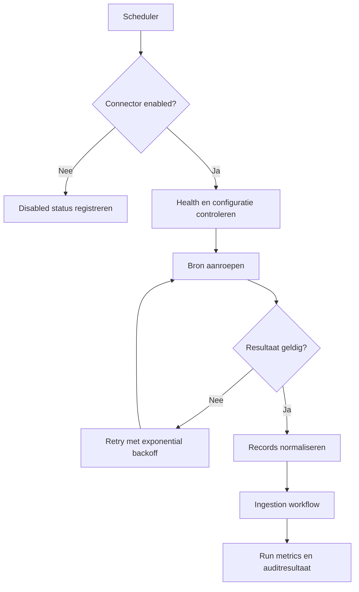
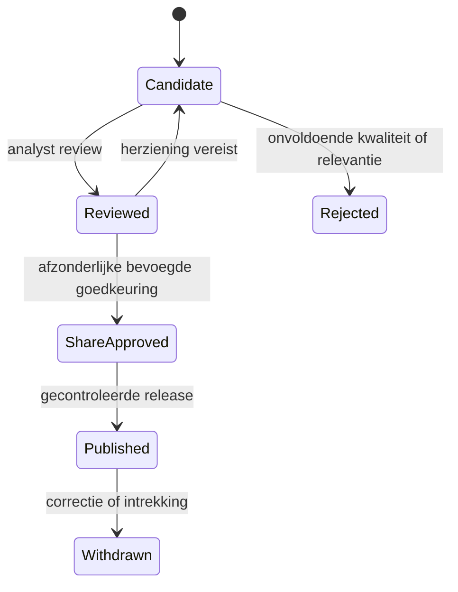
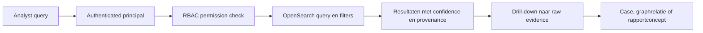
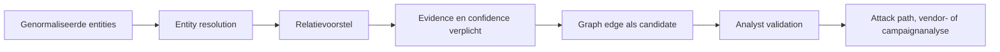
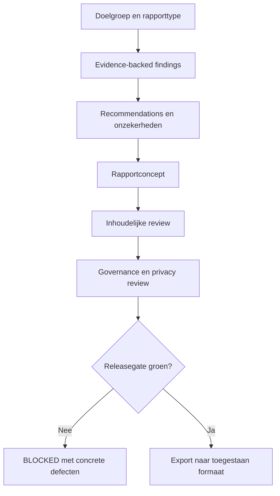
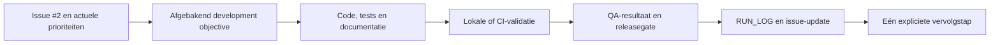
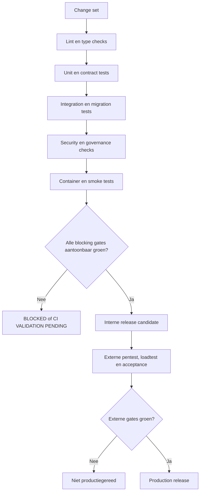

# DTMO

**Dutch Threat Monitoring for Education**

DTMO is een open, onderwijsgericht Cyber Threat Intelligence-platform voor historische incidenten, actuele intelligence, kwetsbaarheden, IOC's, leveranciersrisico en bestuurlijke rapportage.

## RC4.8 implementation

De repository bevat stapsgewijze implementaties van RC4.1 tot en met RC4.8:

- **RC4.1:** FastAPI-platformbasis, configuratie, logging, scheduler, metrics, Docker Compose en CI;
- **RC4.2:** PostgreSQL/SQLAlchemy-persistentiemodellen, provenance en gecontroleerde share approval;
- **RC4.3:** immutable Intelligence Lake met SHA-256-receipts en integriteitscontrole;
- **RC4.4:** beheerde connectorcatalogus, reliabilityvalidatie en health snapshots;
- **RC4.5:** evidence-backed Knowledge Graph en begrensde attack-pathqueries;
- **RC4.6:** responsieve SOC/CTI-workspace voor intelligence, CVE's, IOC's, graph en hunting;
- **RC4.7:** RBAC, scheiding van review en share approval, evidence-gated reporting en exports;
- **RC4.8:** migraties, MinIO, OpenSearch en beveiligde intelligence-ingestion/search API.

## Huidige status

**CI VALIDATION PENDING**

De code, tests en documentatie zijn gecommit. RC4.8 wordt pas `RC_READY` nadat GitHub Actions aantoonbaar succesvol is afgerond. Een ontbrekende status wordt niet als pass behandeld.

## System workflows

DTMO gebruikt expliciete workflows om brondata, intelligence, analyse, review, publicatie en softwareontwikkeling van elkaar te scheiden. Elke workflow behoudt provenance, auditgegevens en afzonderlijke releasegates.

### 1. Intelligence ingestion workflow

```mermaid
flowchart LR
    A[Open bron of connector] --> B[Fetch met timeout en retry]
    B --> C[Raw payload naar Intelligence Lake]
    C --> D[SHA-256 receipt en provenance]
    D --> E[Schema-validatie en normalisatie]
    E --> F[Deduplicatie en entity resolution]
    F --> G[PostgreSQL candidate record]
    G --> H[OpenSearch indexing]
    H --> I[Candidate queue voor analyst review]
```



Belangrijke invarianten:

- de originele bronpayload wordt vóór normalisatie bewaard;
- ieder raw object krijgt een hash en opslagreceipt;
- nieuwe intelligence start altijd als `candidate`;
- een indexeringsfout verwijdert geen raw of genormaliseerde data;
- bron, externe identifier, confidence en timestamps blijven herleidbaar.

### 2. Connector execution workflow



Connectorruns registreren minimaal connector-ID, start- en eindtijd, status, attempts, recordaantal en foutinformatie. Live connectoren staan standaard uit en worden alleen via een feature flag en gecontroleerde configuratie geactiveerd.

### 3. Analyst review and publication workflow



Governancegrenzen:

- `reviewed` is nooit automatisch `share approved`;
- review en share approval zijn afzonderlijke RBAC-permissions;
- rapportages zonder evidence worden geweigerd;
- publicatie vereist een bevoegde menselijke beslissing;
- alle statusovergangen moeten auditbaar zijn.

### 4. Search and investigation workflow



Zoeken ondersteunt prioritering op onder meer severity, confidence en onderwijsrelevantie. Zoekresultaten zijn analyse-input en vormen op zichzelf geen bewijs van compromittering.

### 5. Knowledge Graph and correlation workflow



Graphrelaties worden niet alleen op naamsovereenkomst aangemaakt. Een relatie vereist rationale, bewijs en een confidencewaarde. Correlatie bewijst geen incident en blijft onderworpen aan analyst review.

### 6. Reporting workflow



Rapporten bevatten evidence, confidence en onzekerheden. Een ontbrekende bron, review of release-evidence blokkeert de publicatie.

### 7. Continuous development workflow



Elke development-run legt vast:

1. run-ID, datum en werkstroom;
2. doel en gewijzigde bestanden;
3. commits en werkelijk uitgevoerde tests;
4. blockers, risico's en onzekerheden;
5. releasegate: `PASS`, `BLOCKED` of `NO-CHANGE`;
6. eerstvolgende concrete actie.

Een development-run kan voor zijn afgebakende doel `PASS` krijgen, terwijl de totale RC-release `CI VALIDATION PENDING` of `BLOCKED` blijft.

### 8. QA and release-gate workflow



Er wordt nooit een releasepass toegekend op basis van alleen geconfigureerde tests. De testuitvoering en uitkomst moeten aantoonbaar beschikbaar zijn.

## Nieuwe beveiligde API

De versioned API verbindt raw storage, persistence en search:

- `POST /api/v1/intelligence`
- `GET /api/v1/intelligence/search`

De routes gebruiken API-key authenticatie, subject/role-resolutie en route-level RBAC. Ingestion levert uitsluitend candidate intelligence op; review en share approval blijven gescheiden.

Zie:

- `docs/api/INTELLIGENCE_API.md`
- `docs/architecture/ADR-0001-SECURED-INTELLIGENCE-INGESTION.md`
- `docs/development/RUN_LOG.md`

## Snel starten

```bash
git clone https://github.com/GJvManen/dtmo.git
cd dtmo
cp .env.example .env
docker compose up --build
```

Daarna:

- API: `http://localhost:8000`
- OpenAPI: `http://localhost:8000/docs`
- Health: `http://localhost:8000/health`
- Metrics: `http://localhost:8000/metrics`
- MinIO Console: `http://localhost:9001`
- Prometheus: `http://localhost:9090`

Live connectoren staan standaard uit. Activeer deze alleen gecontroleerd:

```text
DTMO_FEATURE_LIVE_CONNECTORS=true
```

Voor productie is daarnaast een API-key van minimaal 32 tekens vereist:

```text
DTMO_API_KEY=<secret-from-secret-manager>
```

## Repositorystructuur

```text
backend/dtmo/                 API, connectors, persistence, lake, graph, auth en reporting
backend/tests/                unit-, contract- en regressietests
frontend/                     professionele SOC/CTI-workspace
infrastructure/prometheus/    monitoring
database/migrations/          Alembic-databasemigraties
.github/workflows/            CI en GitHub Pages
docs/                         API, architectuur, governance en development runlogs
releases/RC4.8/               release notes en QA-rapport
Dockerfile                    applicatiecontainer
docker-compose.yml            lokale platformstack
```

## Veiligheids- en governancegrenzen

- Intelligence wordt niet automatisch extern gepubliceerd.
- `reviewed` is niet gelijk aan `share approved`.
- Publicatie vereist een afzonderlijke bevoegdheid en menselijke goedkeuring.
- Open bronnen en OSINT behouden provenance, confidence en bronclassificatie.
- Rapportages zonder evidence worden geweigerd.
- Secrets horen uitsluitend in environment variables of een secrets manager.
- Productieacceptatie vereist onafhankelijke pentest, loadtest, hersteltest en deployment acceptance.

## Quality gates

GitHub Actions controleert onder meer:

1. Ruff-linting;
2. strict MyPy typing;
3. Pytest met coverage-drempel;
4. cross-sprinttests voor lake, graph, RBAC, API en reporting;
5. Alembic upgrade/downgrade/upgrade tegen PostgreSQL;
6. Python compile checks;
7. containerbuild en `/health` smoke test;
8. dependency review bij pull requests.

## GitHub Pages

De statische projectpagina staat in `docs/` en wordt gepubliceerd via `.github/workflows/pages.yml`. Stel onder **Settings → Pages → Build and deployment** de bron in op **GitHub Actions**.

## Externe productiegates

De openstaande externe acceptatiepunten worden bijgehouden in issue **#1**. Het continue ontwikkelprogramma en alle runs worden beheerd via issue **#2** en `docs/development/RUN_LOG.md`.
