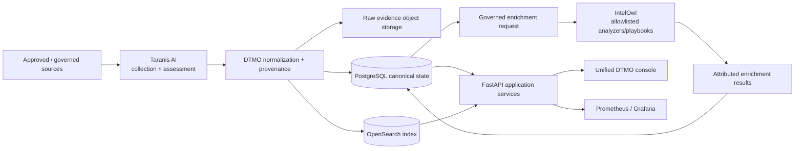

# DTMO — Dutch Threat Monitoring for Education

DTMO is an open Cyber Threat Intelligence (CTI) platform for education-sector security teams. It combines governed threat-source operations, canonical intelligence, provenance, vulnerability intelligence, investigation, visual analytics, role-based administration and governance evidence in one controlled application.

> **Software baseline:** `16.0.0rc12` with accepted post-RC13, E8 and Phase 11 repository enhancements  
> **Engineering baseline:** Phases 1–7 `PASS`  
> **Functional acceptance:** RC13 `PASS / OWNER_ACCEPTED`  
> **Product evolution:** E8.1–E8.10 `PASS / REPOSITORY_COMPLETE`  
> **Production-equivalent staging:** Phase 8 `PASS / OWNER_ACCEPTED`  
> **Independent assurance:** Phase 9 `PASS / EXTERNAL_ASSURANCE_ACCEPTED`  
> **Phase 10 production decision:** `NO-GO / BLOCKED — PLATFORM INDUSTRIALISATION REQUIRED`  
> **Phase 11.1 Taranis architecture/contract:** `PASS / REPOSITORY_COMPLETE`  
> **Phase 11.2 Taranis adapter:** `PASS / REPOSITORY_COMPLETE`  
> **Active bounded priority:** Phase 11.3 IntelOwl `IN PROGRESS / CONTRACT BASELINE IN EXACT-HEAD VALIDATION`  
> **Next production authorization:** Phase 12 `NOT STARTED`  
> **Production status:** **not production authorized**

## Why DTMO

Education environments combine broad digital estates, sensitive information, cloud dependencies and a threat landscape ranging from opportunistic exploitation to targeted campaigns. DTMO is designed to turn heterogeneous public and governed intelligence sources into traceable, reviewable and operationally useful security intelligence while preserving authorization, privacy, provenance and publication controls.

DTMO is built around five principles:

1. **Provenance first** — source identity and evidence remain traceable through ingestion, normalization, correlation and presentation.
2. **Fail closed** — missing evidence, invalid contracts, incomplete acceptance or unknown state never become implicit success.
3. **Human authority remains human** — ingestion, analytics, Administration, CI and staging access do not grant publication or external-sharing authority.
4. **Least privilege by design** — human and service identities are separated and privileged operations remain auditable.
5. **Evidence-based governance** — framework relationships are explicit, versioned and provenance-backed; mappings are not inferred from free text or semantic similarity.

## Product capabilities

### Unified security console

The canonical web application provides one operator experience for:

- **Overview** — security/intelligence KPIs, severity, source state, vulnerability trends and recent intelligence;
- **Intelligence** — normalized records with provenance, classification, vulnerability/CTI context and investigation support;
- **Sources & Catalog** — curated sources, governed registration, activation and execution;
- **Visual Analytics** — native severity, source, connector, review, CVSS/EPSS/KEV and vulnerability trend analytics;
- **Administration** — governed principals, roles, permissions and privileged-action protections;
- **Governance** — versioned framework knowledge, explicit mappings and evidence boundaries.

### Intelligence and CTI ecosystem

The repository-complete product baseline includes governed integrations and semantics for OpenCVE, CIRCL Vulnerability-Lookup, MISP and AIL, together with vulnerability prioritization and analytics. MISP outbound sharing remains separately governed and human-approved; AIL integration remains bounded to governed read/enrichment/correlation behavior rather than autonomous crawling or mutation.

Phase 11 evolves the platform by integrating mature open-source subsystems rather than expanding DTMO into a monolith. Taranis AI architecture/contract and the Taranis→DTMO canonical adapter are repository-complete. **Phase 11.3 IntelOwl** is now the sole active bounded priority, beginning with a testable service/API/security/licensing contract before adapter code is accepted. The remaining fixed order is IntelOwl → OpenCTI → MISP consolidation → TheHive → Cortex only if justified → integrated runtime industrialisation.

### Intelligence pipeline



PostgreSQL is the canonical application truth. OpenSearch is the search/index representation, object storage preserves raw evidence, Redis supports coordination, and Prometheus/Grafana provide operational observability. IntelOwl is designed as an enrichment service only: analyzer verdicts and evaluations remain attributable context and do not become proof of local compromise or external-share authority.

### Security and governance

DTMO preserves server-side RBAC, least privilege, human/service-account separation, bearer-token trust validation, privileged Administration safeguards, request correlation, auditable security-relevant actions, provenance/confidence preservation, data minimization and distinct review/external-share authority.

The Phase 11.3 IntelOwl contract requires a dedicated non-admin service identity, runtime-secret-backed API token, TLS verification outside local development, explicit observable and analyzer/playbook allowlists, bounded execution/rate-limit behavior, analyzer/job/result provenance and fail-closed TLP/privacy handling. IntelOwl external Connectors are excluded from the initial enrichment path.

The governance model includes explicit versioned relationships to Normenkader IBP, MITRE ATT&CK, NIST CSF and vulnerability-scoring/context semantics such as CVSS. E8.10 adds repository-backed vulnerability-management evidence mapping, including Normenkader IBP SM.07, while explicitly avoiding broader compliance, maturity or certification claims.

## Architecture

The current DTMO reference platform consists of Python 3.12+, FastAPI/Uvicorn, SQLAlchemy/Alembic, PostgreSQL, Redis, OpenSearch, S3-compatible object storage, Prometheus, separately authenticated Grafana, Nginx and a Docker Compose reference topology.

The Phase 11 target is a composed service architecture in which Taranis AI provides generic OSINT collection/analyst workflow, IntelOwl provides generic IOC enrichment, OpenCTI provides STIX knowledge-graph capabilities, MISP remains the CTI exchange fabric under DTMO governed outbound approval, and TheHive provides incident/case handoff. Kubernetes/Helm/GitOps is the preferred integrated runtime direction.

See [System Architecture](docs/architecture/SYSTEM_ARCHITECTURE.md), [Taranis Platform Integration Assessment](docs/architecture/TARANIS_PLATFORM_INTEGRATION_ASSESSMENT.md), [IntelOwl → DTMO Integration Contract](docs/architecture/INTELOWL_DTMO_INTEGRATION_CONTRACT.md) and [Security Overview](docs/security/SECURITY_OVERVIEW.md).

## Current maturity and release position

| Stage | Scope | Status |
|---|---|---|
| Phases 1–7 | Repository-controlled engineering baseline | `PASS` |
| RC13 | Unified-console functional acceptance | `PASS / OWNER_ACCEPTED` |
| E8.1–E8.10 | Vulnerability & CTI product evolution | `PASS / REPOSITORY_COMPLETE` |
| Phase 8 | Production-equivalent staging validation and accountable acceptance | `PASS / OWNER_ACCEPTED` |
| Phase 9 | Independent external assurance | `PASS / EXTERNAL_ASSURANCE_ACCEPTED` |
| Phase 10 | Formal production go/no-go | `NO-GO / BLOCKED — PLATFORM INDUSTRIALISATION REQUIRED` |
| Phase 11.1 | Taranis architecture/API/data-model/identity/licensing | `PASS / REPOSITORY_COMPLETE` |
| Phase 11.2 | Taranis→DTMO canonical adapter | `PASS / REPOSITORY_COMPLETE` |
| Phase 11.3 | IntelOwl enrichment integration | `IN PROGRESS / CONTRACT BASELINE IN EXACT-HEAD VALIDATION` |
| Phase 12 | New formal production go/no-go | `NOT STARTED` |

Phase 8 and Phase 9 remain accepted historical evidence for the prior candidate. The Phase 10 decision did not grant production authorization. Because Phase 11 materially changes the platform, the integrated candidate will require fresh production-equivalent validation and independent external assurance in Phases 11.10 and 11.11 before Phase 12.

Repository CI, Docker Compose, staging emulators and synthetic fixtures remain supporting engineering evidence. They are not represented as the source of external Phase 8 acceptance, independent Phase 9 assurance or future production authorization.

## Product roadmap

The current priority sequence is:

1. accept the Phase 11.3 IntelOwl service/API/security/licensing contract on exact-head CI;
2. implement the bounded IntelOwl enrichment adapter with allowlisted analyzers/playbooks and attributed results;
3. integrate OpenCTI STIX/graph capabilities;
4. consolidate MISP authority/synchronization;
5. add TheHive incident/case handoff;
6. add Cortex only when a validated IntelOwl gap requires it;
7. industrialise the composed runtime with Kubernetes/Helm/GitOps, HA, secrets, observability, recovery and supply-chain controls;
8. complete migration/compatibility;
9. execute new production-equivalent validation and independent external assurance;
10. conduct Phase 12 production GO/NO-GO.

See the [Platform Industrialisation Roadmap](docs/roadmap/PLATFORM_INDUSTRIALISATION_ROADMAP.md), [Production Roadmap](docs/roadmap/PRODUCTION_ROADMAP.md), [Production Readiness Report](docs/project/PRODUCTION_READINESS_REPORT.md) and [Phase 10 Production Go/No-Go](docs/production/PHASE10_PRODUCTION_GO_NO_GO.md).

## Documentation

The authoritative professional documentation portal is [docs/README.md](docs/README.md). Key documents are:

- [Current Project State](docs/project/CURRENT_STATE.md)
- [Executive Status](docs/project/EXECUTIVE_STATUS.md)
- [Executive Decision View](docs/project/EXECUTIVE_DECISION_VIEW.md)
- [Platform Industrialisation Roadmap](docs/roadmap/PLATFORM_INDUSTRIALISATION_ROADMAP.md)
- [Taranis Platform Integration Assessment](docs/architecture/TARANIS_PLATFORM_INTEGRATION_ASSESSMENT.md)
- [Taranis → DTMO Integration Contract](docs/architecture/TARANIS_DTMO_INTEGRATION_CONTRACT.md)
- [IntelOwl → DTMO Integration Contract](docs/architecture/INTELOWL_DTMO_INTEGRATION_CONTRACT.md)
- [System Architecture](docs/architecture/SYSTEM_ARCHITECTURE.md)
- [Security Overview](docs/security/SECURITY_OVERVIEW.md)
- [Governance Mapping Registry](docs/governance/GOVERNANCE_MAPPING_REGISTRY.md)
- [Production Readiness Report](docs/project/PRODUCTION_READINESS_REPORT.md)
- [Production Checklist](docs/project/PRODUCTION_CHECKLIST.md)
- [QA and Release Gates](docs/qa/QA_AND_RELEASE_GATES.md)
- [Evidence Index](docs/evidence/EVIDENCE_INDEX.md)
- [Production Roadmap](docs/roadmap/PRODUCTION_ROADMAP.md)
- [Phase 10 Production Go/No-Go](docs/production/PHASE10_PRODUCTION_GO_NO_GO.md)

Point-in-time PR/CI/run chronology remains under `docs/development/`, GitHub issues/pull requests and CI artifacts. Historical evidence is retained rather than rewritten to match later decisions.

## Local reference environment

```bash
git clone https://github.com/GJvManen/dtmo.git
cd dtmo
python3 tools/bootstrap_local.py
docker compose up --build
```

The local Compose topology is a development/reference environment only. Development credentials, compatibility exceptions and bootstrap identities must not be propagated into staging or production.

## Open source and responsible use

DTMO is licensed under the **Apache License, Version 2.0**. The canonical open-source governance and legal entry points are:

- [`LICENSE`](LICENSE)
- [`NOTICE`](NOTICE)
- [`SECURITY.md`](SECURITY.md)
- [`CONTRIBUTING.md`](CONTRIBUTING.md)
- [`CODE_OF_CONDUCT.md`](CODE_OF_CONDUCT.md)
- [`SUPPORTED_VERSIONS.md`](SUPPORTED_VERSIONS.md)
- [`docs/legal/LICENSING.md`](docs/legal/LICENSING.md)
- [`docs/legal/THIRD_PARTY.md`](docs/legal/THIRD_PARTY.md)

Taranis AI remains a separate service under its own upstream license and is not vendored into DTMO. IntelOwl and pyIntelOwl are AGPL-3.0; Phase 11.3 uses a separate service/API boundary and does not vendor their source into DTMO. Any future embedding, modification, redistribution or operation of modified network-facing IntelOwl components requires explicit licensing review before acceptance.

Use DTMO only with lawful access to intelligence sources and infrastructure. Technical connectivity does not itself establish legal authority to collect, process, enrich, publish or redistribute third-party material.