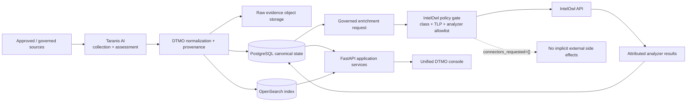

# DTMO — Dutch Threat Monitoring for Education

DTMO is an open Cyber Threat Intelligence (CTI) platform for education-sector security teams. It combines governed threat-source operations, canonical intelligence, provenance, vulnerability intelligence, investigation, visual analytics, role-based administration and governance evidence in one controlled application.

> **Software baseline:** `16.0.0rc12` with accepted post-RC13, E8 and Phase 11 repository enhancements  
> **Engineering baseline:** Phases 1–7 `PASS`  
> **Functional acceptance:** RC13 `PASS / OWNER_ACCEPTED`  
> **Product evolution:** E8.1–E8.10 `PASS / REPOSITORY_COMPLETE`  
> **Production-equivalent staging:** Phase 8 `PASS / OWNER_ACCEPTED`  
> **Independent assurance:** Phase 9 `PASS / EXTERNAL_ASSURANCE_ACCEPTED`  
> **Phase 10 production decision:** `NO-GO / BLOCKED — PLATFORM INDUSTRIALISATION REQUIRED`  
> **Phase 11.1 Taranis architecture/contract:** `PASS / REPOSITORY_COMPLETE`  
> **Phase 11.2 Taranis adapter:** `PASS / REPOSITORY_COMPLETE`  
> **Phase 11.3 IntelOwl contract:** `PASS / REPOSITORY_COMPLETE`  
> **Active bounded priority:** Phase 11.3 IntelOwl adapter `IN PROGRESS / EXACT-HEAD VALIDATION REQUIRED`  
> **Next production authorization:** Phase 12 `NOT STARTED`  
> **Production status:** **not production authorized**

## Why DTMO

Education environments combine broad digital estates, sensitive information, cloud dependencies and a threat landscape ranging from opportunistic exploitation to targeted campaigns. DTMO is designed to turn heterogeneous public and governed intelligence sources into traceable, reviewable and operationally useful security intelligence while preserving authorization, privacy, provenance and publication controls.

DTMO is built around five principles:

1. **Provenance first** — source identity and evidence remain traceable through ingestion, normalization, correlation and presentation.
2. **Fail closed** — missing evidence, invalid contracts, incomplete acceptance or unknown state never become implicit success.
3. **Human authority remains human** — ingestion, analytics, Administration, CI and staging access do not grant publication or external-sharing authority.
4. **Least privilege by design** — human and service identities are separated and privileged operations remain auditable.
5. **Evidence-based governance** — framework relationships are explicit, versioned and provenance-backed; mappings are not inferred from free text or semantic similarity.

## Product capabilities

### Unified security console

The canonical web application provides one operator experience for Overview, Intelligence, Sources & Catalog, Visual Analytics, Administration and Governance.

### Intelligence and CTI ecosystem

The repository-complete product baseline includes governed integrations and semantics for OpenCVE, CIRCL Vulnerability-Lookup, MISP and AIL. Phase 11.1–11.2 added the repository-complete read-only Taranis service boundary and canonical adapter. Phase 11.3 now implements IntelOwl as a separate generic enrichment service rather than vendoring an enrichment engine into DTMO.

### Intelligence pipeline



PostgreSQL remains canonical application truth. IntelOwl results are attributable enrichment context: they do not become proof of local compromise or external-share/publication authority.

### Security and governance

The IntelOwl adapter requires a runtime-secret API token, production HTTPS and an explicit analyzer allowlist. Approved observable classes default to CVE, IP, domain, URL and hash; email/personal-data observables remain excluded pending explicit privacy/data-processing approval. Restricted handling can block external analyzer disclosure before a network request. Unknown analyzers, job-ID mismatches, oversized/malformed results and unbounded polling fail closed.

The initial adapter submits `connectors_requested=[]`, so IntelOwl MISP/OpenCTI/Slack/email connector side effects remain outside the path. Normalized metadata explicitly records `external_share_authorized=false` and `local_compromise_proven=false`.

## Architecture

The current DTMO reference platform consists of Python 3.12+, FastAPI/Uvicorn, SQLAlchemy/Alembic, PostgreSQL, Redis, OpenSearch, S3-compatible object storage, Prometheus/Grafana, Nginx and a Docker Compose reference topology. The Phase 11 target is a composed service architecture: Taranis AI for collection/assessment, IntelOwl for IOC enrichment, OpenCTI for STIX graph, MISP for governed exchange and TheHive for incident/case handoff.

See [System Architecture](docs/architecture/SYSTEM_ARCHITECTURE.md), [IntelOwl → DTMO Integration Contract](docs/architecture/INTELOWL_DTMO_INTEGRATION_CONTRACT.md), [IntelOwl Integration](docs/integrations/INTELOWL_INTEGRATION.md) and [Security Overview](docs/security/SECURITY_OVERVIEW.md).

## Current maturity and release position

| Stage | Scope | Status |
|---|---|---|
| Phases 1–7 | Repository-controlled engineering baseline | `PASS` |
| RC13 | Unified-console functional acceptance | `PASS / OWNER_ACCEPTED` |
| E8.1–E8.10 | Vulnerability & CTI product evolution | `PASS / REPOSITORY_COMPLETE` |
| Phase 8 | Production-equivalent staging validation and accountable acceptance | `PASS / OWNER_ACCEPTED` |
| Phase 9 | Independent external assurance | `PASS / EXTERNAL_ASSURANCE_ACCEPTED` |
| Phase 10 | Formal production go/no-go | `NO-GO / BLOCKED — PLATFORM INDUSTRIALISATION REQUIRED` |
| Phase 11.1 | Taranis architecture/API/data-model/identity/licensing | `PASS / REPOSITORY_COMPLETE` |
| Phase 11.2 | Taranis→DTMO canonical adapter | `PASS / REPOSITORY_COMPLETE` |
| Phase 11.3 contract | IntelOwl service/API/security/licensing contract | `PASS / REPOSITORY_COMPLETE` |
| Phase 11.3 adapter | Bounded IntelOwl enrichment adapter | `IN PROGRESS / EXACT-HEAD VALIDATION REQUIRED` |
| Phase 12 | New formal production go/no-go | `NOT STARTED` |

Phase 8/9 remain historical evidence for the earlier candidate. The materially changed integrated platform requires fresh Phase 11.10 production-equivalent validation and Phase 11.11 independent external assurance before Phase 12.

## Product roadmap

The current priority sequence is:

1. accept the bounded Phase 11.3 IntelOwl adapter on fully green exact-head CI;
2. complete Phase 11.3 governed execution/persistence and operational integration;
3. integrate OpenCTI;
4. consolidate MISP authority/synchronization;
5. add TheHive handoff;
6. add Cortex only when a validated IntelOwl gap exists;
7. industrialise Kubernetes/Helm/GitOps, HA, secrets, network, observability, recovery and supply chain;
8. complete migration/compatibility;
9. execute new production-equivalent validation and independent assurance;
10. conduct Phase 12 production GO/NO-GO.

See the [Platform Industrialisation Roadmap](docs/roadmap/PLATFORM_INDUSTRIALISATION_ROADMAP.md), [Current Project State](docs/project/CURRENT_STATE.md), [QA and Release Gates](docs/qa/QA_AND_RELEASE_GATES.md) and [Evidence Index](docs/evidence/EVIDENCE_INDEX.md).

## Documentation

The authoritative documentation portal is [docs/README.md](docs/README.md). Historical point-in-time run records remain historical and are not rewritten to claim Phase 11 evidence.

## Local reference environment

```bash
git clone https://github.com/GJvManen/dtmo.git
cd dtmo
python3 tools/bootstrap_local.py
docker compose up --build
```

The local Compose topology is a development/reference environment only.

## Open source and responsible use

DTMO is licensed under the **Apache License, Version 2.0**. Canonical governance and legal entry points remain:

- `LICENSE`
- `NOTICE`
- `SECURITY.md`
- `CONTRIBUTING.md`
- `CODE_OF_CONDUCT.md`
- `SUPPORTED_VERSIONS.md`
- `docs/legal/LICENSING.md`
- `docs/legal/THIRD_PARTY.md`

Taranis AI remains a separate service behind its own licensing boundary. IntelOwl and pyIntelOwl are AGPL-3.0; Phase 11.3 uses a separate service/API boundary and does not vendor their source into DTMO. Embedding, modification, redistribution or operation of modified network-facing IntelOwl components requires explicit licensing review before acceptance.

Use DTMO only with lawful access to intelligence sources and infrastructure. Technical connectivity does not itself establish legal authority to collect, process, enrich, publish or redistribute third-party material.
