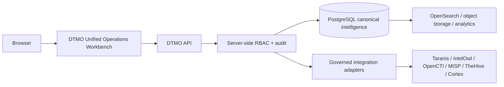

# DTMO — Dutch Threat Monitoring for Education

DTMO is an open Cyber Threat Intelligence (CTI) platform for education-sector security teams. It combines governed threat-source operations, canonical intelligence, provenance, vulnerability intelligence, investigation, visual analytics, role-based administration and governance evidence in one controlled application.

> **Software baseline:** `16.0.0rc12` with accepted post-RC13, E8 and Phase 11 repository enhancements  
> **Engineering baseline:** Phases 1–7 `PASS`  
> **Functional acceptance:** RC13 `PASS / OWNER_ACCEPTED`  
> **Product evolution:** E8.1–E8.10 `PASS / REPOSITORY_COMPLETE`  
> **Historical staging evidence:** Phase 8 `PASS / OWNER_ACCEPTED — HISTORICAL CANDIDATE`  
> **Historical independent assurance:** Phase 9 `PASS / EXTERNAL_ASSURANCE_ACCEPTED — HISTORICAL CANDIDATE`  
> **Phase 10 production decision:** `NO-GO / BLOCKED — PLATFORM INDUSTRIALISATION REQUIRED`  
> **Phase 11.1–11.9:** `PASS / REPOSITORY_COMPLETE`  
> **Phase 11.10:** `IN PROGRESS / FRESH CANDIDATE-BOUND EVIDENCE REQUIRED`  
> **Phase 11.10a frontend architecture/design:** `PASS / REPOSITORY_COMPLETE`  
> **Phase 11.10b canonical application shell:** `PASS / REPOSITORY_COMPLETE`  
> **Phase 11.10c Command Center:** `PASS / REPOSITORY_COMPLETE`  
> **Phase 11.10d Unified Intelligence Workspace:** `PASS / REPOSITORY_COMPLETE`  
> **Phase 11.10e IntelOwl/Cortex integrated analysis:** `PASS / REPOSITORY_COMPLETE`  
> **Phase 11.10f OpenCTI graph/entity workspace:** `PASS / REPOSITORY_COMPLETE`  
> **Phase 11.10g MISP Sharing & Exchange:** `PASS / REPOSITORY_COMPLETE`  
> **Active bounded slice:** Phase 11.10h TheHive Investigations & Cases — `IN PROGRESS / EXACT-HEAD VALIDATION REQUIRED`  
> **Phase 11.10i Vulnerability & Exposure:** `NOT STARTED`  
> **Phase 11.10p fresh production-equivalent validation:** `NOT STARTED / CANDIDATE FREEZE REQUIRED`  
> **Phase 11.11 independent external assurance:** `NOT STARTED`  
> **Phase 12 production decision:** `NOT STARTED`  
> **Production status:** **not production authorized**

## Why DTMO

Education environments combine broad digital estates, sensitive information, cloud dependencies and a threat landscape ranging from opportunistic exploitation to targeted campaigns. DTMO turns heterogeneous governed intelligence into traceable, reviewable and operationally useful security intelligence while preserving authorization, privacy, provenance and publication controls.

DTMO is built around five principles: provenance first; fail closed; human authority remains human; least privilege by design; and evidence-based governance.

## Product capabilities

The accepted DTMO baseline provides **Sources & Catalog**, canonical Intelligence, **Visual Analytics**, vulnerability intelligence, governed case handoff, **Administration** and **Governance**. The accepted Phase 11 integration baseline adds Taranis AI collection/canonicalization, IntelOwl enrichment, OpenCTI STIX knowledge-graph integration, governed MISP exchange, human-authorized TheHive case handoff and a bounded Cortex analyzer connector.

The **DTMO Unified Operations Workbench** now has accepted frontend architecture, canonical application shell, Command Center, Unified Intelligence/IOC Explorer, Integrated Analysis, Knowledge Graph and Sharing & Exchange. Phase 11.10h is making **Investigations** functional by composing canonical DTMO evidence with the accepted human-authorized TheHive case-handoff and durable reconciliation boundary.

The accepted MISP workspace does not introduce a parallel sharing authority. The browser uses only same-origin DTMO APIs. Canonical sharing state is readable with `read:intelligence`; review remains `review:intelligence`; external share approval remains `approve:share` and must be performed by a different human principal than the reviewer. The exporter creates a deterministic MISP event with `published=false`; publication and synchronization remain outside that accepted boundary.

The active TheHive slice likewise introduces no parallel case authority. Investigation-state reads require `read:intelligence`; case mutation continues to require `handoff:case` and an explicit human principal. Canonical provenance and authoritative handling restrictions fail closed. The browser never receives TheHive credentials or directly invokes `/api/v1/case`.

Persisted `reserved` or `ambiguous` TheHive handoff evidence is treated as a manual-reconciliation condition in the canonical workspace, not as permission to retry blindly. The accepted Phase 11.6 persistence stores handoff state only, so Phase 11.10h does not fabricate TheHive alerts, tasks, case timeline, later case state or responder output.

Configuration is not runtime-health evidence. MISP transfer or TheHive case identity does **not prove** publication, synchronization, downstream remediation, local compromise or production readiness.

PostgreSQL remains canonical application truth. Redis, OpenSearch and S3-compatible object storage provide coordination, search and object persistence. Taranis AI, IntelOwl, Cortex, OpenCTI, MISP and TheHive remain separate service/licensing boundaries.

### Accepted Phase 11 service integration baseline

| Integration | Status | Authority boundary |
|---|---|---|
| Phase 11.3 IntelOwl | `PASS / REPOSITORY_COMPLETE` | Enrichment evidence only; no publication/share authority and no local-compromise inference |
| Phase 11.4 OpenCTI | `PASS / REPOSITORY_COMPLETE` | STIX knowledge graph remains a separate service/API/licensing boundary |
| Phase 11.5 MISP | `PASS / REPOSITORY_COMPLETE` | Governed exchange remains subject to DTMO human sharing approval and handling restrictions |
| Phase 11.6 TheHive | `PASS / REPOSITORY_COMPLETE` | Human case-handoff authority remains separate from publication/share authority |
| Phase 11.7 Cortex decision | `PASS / REPOSITORY_COMPLETE — HISTORICAL DECISION BASELINE` | Historical conditional decision remains immutable |
| Phase 11.7b Cortex analyzer connector | `PASS / REPOSITORY_COMPLETE` | Analyzer-only enrichment; responders and autonomous side effects remain excluded |

## Architecture

The canonical product trust path is:

Normal frontend operations follow **browser → DTMO API → governed integration adapter → upstream service**. The browser does not receive privileged upstream service credentials. Role-aware rendering is a usability function; **server-side RBAC** remains authoritative.

The Phase 11.8 platform baseline includes Kubernetes/Helm/GitOps, workload identity, **external secret** delivery, **ingress/TLS**, network segmentation, HA/disruption controls, observability, backup/recovery, supply-chain hardening, capacity planning and upgrade/rollback controls. Phase 11.9 adds the accepted connected migration graph and forward-first compatibility contract.

## Current maturity and release position

Phase 10 remains **`NO-GO / BLOCKED`**. Phase 11 is `IN PROGRESS` and DTMO is **not production authorized**.

Phase 11.10 candidate completion is sequenced before fresh external validation because the Unified Operations Workbench materially changes the candidate. The fixed sequence is:

**11.10a architecture/design → 11.10b shell → 11.10c Command Center → 11.10d Intelligence → 11.10e IntelOwl/Cortex → 11.10f OpenCTI → 11.10g MISP → 11.10h TheHive → 11.10i Vulnerability/Exposure → 11.10j Sources/Collection → 11.10k Automation → 11.10l Governance/Evidence → 11.10m Operations/Admin → 11.10n role-aware UX/accessibility → 11.10o consolidation/full functional acceptance → candidate freeze → 11.10p fresh production-equivalent validation**.

Phase 11.10h is the sole active bounded slice. The only permitted next slice after a fully green protected merge is **11.10i Vulnerability & Exposure**.

### Accepted Phase 11.10g MISP evidence boundary

`/workbench/sharing` reads canonical DTMO governance state and uses the accepted review, share-approval and MISP export APIs. The browser is not a privileged MISP client and never receives MISP credentials. The reviewer and external-share approver must be separate human principals. Export cannot create its own approval. The resulting MISP event remains unpublished and there is no Publish or Synchronize action.

### Active Phase 11.10h TheHive evidence boundary

`/workbench/investigations` reads canonical intelligence, provenance and durable TheHive handoff state through `GET /api/v1/thehive/items/{item_id}/investigation`. It invokes the accepted `POST /api/v1/thehive/items/{item_id}/cases` only after an explicit human action and server-side `handoff:case` authorization.

A delivered handoff proves only the stable case identity returned at creation time and persisted by DTMO. A `reserved` or `ambiguous` handoff requires manual reconciliation and blocks a blind new case request in the canonical workspace. Alerts, tasks, case timeline, subsequent upstream case status and responders are outside the accepted persistence/readback boundary and are not inferred.

Repository/browser CI validates this implementation contract only. It **does not prove** live TheHive connectivity or health, license entitlement, production credentials/RBAC, organization membership, real-data handling approval, upstream case completeness, responder/remediation execution, local compromise, production-equivalent deployment/continuity, independent assurance or production authorization.

## Product roadmap

Phase 11.10i–11.10o continue the Unified Operations Workbench one bounded PR at a time. After 11.10o, one immutable integrated candidate is frozen for 11.10p.

11.10p requires fresh evidence for candidate identity, migration/compatibility, upgrade, exact prior-digest rollback plus post-rollback health, health/readiness, representative saturation/capacity and recovery/continuity. All evidence must bind to the **same immutable** candidate and one production-equivalent environment. Historical Phase 8 and Phase 9 evidence remains audit history only and cannot satisfy the materially changed candidate.

Missing, inaccessible, historical-only, placeholder or mixed-candidate evidence must **fail closed**. Phase 11.11 remains `NOT STARTED` until 11.10 is explicitly `PASS / OWNER_ACCEPTED`. Phase 12 remains `NOT STARTED` until fresh external assurance has also been accepted.

## Documentation

Start with:

- [Documentation Portal](docs/README.md)
- [Current State](docs/project/CURRENT_STATE.md)
- [Executive Status](docs/project/EXECUTIVE_STATUS.md)
- [Production Readiness Report](docs/project/PRODUCTION_READINESS_REPORT.md)
- [Unified Operations Workbench](docs/ux/UNIFIED_OPERATIONS_WORKBENCH.md)
- [TheHive Investigations Workspace](docs/user/THEHIVE_INVESTIGATIONS_WORKSPACE.md)
- [Phase 11.10h TheHive Investigations Architecture](docs/architecture/PHASE11_10H_THEHIVE_INVESTIGATIONS_CASES.md)
- [Phase 11.10h TheHive Investigations Gate](docs/qa/PHASE11_10H_THEHIVE_INVESTIGATIONS_GATE.md)
- [MISP Sharing & Exchange Workspace](docs/user/MISP_SHARING_EXCHANGE_WORKSPACE.md)
- [Phase 11.10g MISP Sharing & Exchange Architecture](docs/architecture/PHASE11_10G_MISP_SHARING_EXCHANGE.md)
- [OpenCTI Graph / Entity Workspace](docs/user/OPENCTI_GRAPH_ENTITY_WORKSPACE.md)
- [Integrated Analysis Workspace](docs/user/INTEGRATED_ANALYSIS_WORKSPACE.md)
- [Unified Intelligence Workspace](docs/user/UNIFIED_INTELLIGENCE_WORKSPACE.md)
- [Frontend Architecture](docs/architecture/FRONTEND_ARCHITECTURE.md)
- [Evidence Index](docs/evidence/EVIDENCE_INDEX.md)
- [Platform Industrialisation Roadmap](docs/roadmap/PLATFORM_INDUSTRIALISATION_ROADMAP.md)

The governed screenshot catalogue contains UI-01 through UI-10. These are documentation illustrations, not evidence of live-source connectivity, staging acceptance or production readiness. No synthetic screenshot is promoted as operational, staging, assurance or production evidence.

## Open source and responsible use

DTMO is released under the **Apache License, Version 2.0**. Upstream products retain their own licenses, trademarks, service terms and operational boundaries. DTMO integrations must use authorized credentials and documented APIs and must not be used to bypass provider, organizational, privacy or legal controls.

Governance and contribution entry points include `LICENSE`, `NOTICE`, `SECURITY.md`, `CONTRIBUTING.md`, `CODE_OF_CONDUCT.md`, `SUPPORTED_VERSIONS.md`, `docs/legal/LICENSING.md` and `docs/legal/THIRD_PARTY.md`.

DTMO is defensive security software. Publication/share authority remains human-governed, TheHive case authority remains distinct, and enrichment/correlation/graph/case presence does not prove local compromise.
