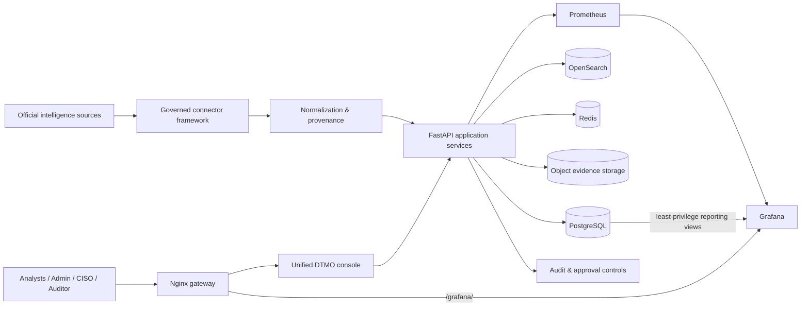

# DTMO

## Dutch Threat Monitoring for Education

**DTMO** is an open Cyber Threat Intelligence platform designed for the education sector. It brings vulnerability intelligence, vendor advisories, indicators, historical incidents, provenance, operational health and management insight together in one governed platform.

**Release candidate:** `16.0.0rc12`  
**Engineering status:** Phases 1–7 accepted  
**Next gate:** Phase 8 external staging validation  
**License:** Apache-2.0

---

## What DTMO provides

DTMO is built to support security operations, threat intelligence and governance teams without collapsing their responsibilities into one authority model.

- **Unified threat intelligence** — normalized intelligence from official public and vendor security sources.
- **Governed source framework** — registration, validation, scheduling and execution through bounded adapters with provenance retention.
- **Threat investigation** — searchable intelligence with severity, confidence, source and review context.
- **Operational administration** — source configuration and operational controls inside the canonical DTMO console.
- **Graphical analytics** — embedded Grafana operational and intelligence dashboards plus accessible native table/chart fallbacks.
- **Auditability and provenance** — explicit source identity, request correlation, evidence retention and controlled state transitions.
- **Separation of duties** — ingestion, analysis, review and external share approval remain distinct authorities.
- **Production-readiness engineering** — automated security, recovery, performance, accessibility, connector and observability gates.

## Architecture



The architecture deliberately separates **collection**, **normalization**, **application services**, **persistence/search**, **observability** and **human governance**. Technical execution never grants publication authority.

### Technology stack

| Layer | Technology |
|---|---|
| Application/API | Python 3.12+, FastAPI, Pydantic, SQLAlchemy |
| Database | PostgreSQL 17 |
| Search | OpenSearch 2.19 |
| Queue/cache | Redis 8 |
| Evidence/object storage | S3-compatible AIStor/MinIO interface |
| Metrics | Prometheus 3 |
| Dashboards | Grafana 13 |
| Gateway | Nginx |
| Migrations | Alembic |
| Test & quality | pytest, Playwright, Ruff, mypy, pip-audit |
| Packaging/runtime | Hatchling, Docker Compose |

For the detailed trust-boundary and deployment model, see [`docs/architecture/SYSTEM_ARCHITECTURE.md`](docs/architecture/SYSTEM_ARCHITECTURE.md).

## Intelligence source framework

The current operational catalog is connected through governed built-in or framework adapters. It includes official security publication channels from CISA, NIST/NVD, GitHub, NCSC-NL, CERT-EU, Microsoft, Cisco, Red Hat, Ubuntu, Debian, Apple, Chrome, Mozilla, Fortinet, Palo Alto Networks and Broadcom/VMware.

Research publications can remain visible as **research references** without being treated as executable high-frequency feeds. Credentialed adapters store only logical secret references; secret values are resolved at runtime and are not persisted in the source catalog.

See the authoritative [`Source Connection Matrix`](docs/qa/SOURCE_CONNECTION_MATRIX.md).

## Security and governance model

DTMO is designed around explicit trust and authority boundaries:

- role-based access control and least privilege;
- review and external share approval are separate human decisions;
- self-approval is prohibited where separation of duties applies;
- connectors, service accounts, CI jobs and staging access cannot authorize publication;
- provenance and confidence are preserved during normalization;
- logs and evidence follow privacy and data-minimization requirements;
- credentials, tokens and secret values are excluded from repository evidence;
- Grafana intelligence reporting uses dedicated least-privilege reporting views rather than the application database identity;
- anonymous Grafana access is disabled;
- successful automation is evidence of technical execution, not of human approval.

See [`SECURITY.md`](SECURITY.md) and the [`Security Overview`](docs/security/SECURITY_OVERVIEW.md).

## Engineering workflow

Every change is treated as a bounded release candidate and must pass the registered **exact-head** GitHub Actions gates before merge.

```mermaid
flowchart LR
    B[Feature / remediation branch] --> PR[Pull request]
    PR --> Q[Quality & governance]
    Q --> S[Security & connector contracts]
    S --> D[Data integrity & recovery]
    D --> P[Performance & scalability]
    P --> A[Browser & accessibility]
    A --> O[Observability & operations]
    O --> E[Staging-emulator readiness]
    E --> M[Expected-head protected merge]
```



| Workflow family | Purpose |
|---|---|
| Quality & governance | Tests, linting, typing, licensing and repository contracts |
| Security & identity | Authorization, token/session behavior and security invariants |
| Connector reliability | Contract, timeout, retry, replay, freshness, provenance and isolation gates |
| Data integrity & recovery | Storage migration, recovery and cross-store integrity validation |
| Performance | Ingestion, API/search reads, concurrency and degraded-dependency behavior |
| Browser & accessibility | Critical journeys, keyboard, responsive behavior, reflow, contrast and session semantics |
| Observability | Request/trace context, queue/storage/API/search alerting, dashboards and runbooks |
| Staging readiness | Repository-controlled deployment/emulator checks before external staging acceptance |

The engineering process distinguishes **repository-controlled evidence** from **external production acceptance**. Local containers, CI and emulators cannot substitute for real staging or independent assurance.

## Project status

| Phase | Scope | Status |
|---|---|---|
| 1 | CI and workflow integrity | ✅ `PASS` |
| 2 | Application security and identity | ✅ `PASS` |
| 3 | Data integrity and recovery | ✅ `PASS` |
| 4 | Connector reliability and provenance | ✅ `PASS` |
| 5 | Performance and scalability | ✅ `PASS` |
| 6 | Accessibility and operational UX | ✅ `PASS` — externally/manually accepted by the project owner on 2026-08-11 |
| 7 | Observability and incident operations | ✅ `PASS` |
| 8 | Real staging acceptance | 🟡 `READY_FOR_EXTERNAL_VALIDATION` |
| 9 | Independent external assurance | ⏳ `NOT COMPLETE` |
| 10 | Production go/no-go | ⏳ `NOT STARTED` |

The repository-controlled engineering programme through RC12 is complete. **DTMO is not yet production ready**: the next formal gate is external validation of a production-equivalent staging deployment against one immutable release/deployment identity.

See the authoritative [`Production Roadmap`](docs/roadmap/PRODUCTION_ROADMAP.md) and [`Current Project State`](docs/project/CURRENT_STATE.md).

## RC12 product baseline

`16.0.0rc12` establishes the current product baseline:

- one canonical DTMO application shell;
- governed source administration and execution in the same console;
- completed operational vendor source onboarding;
- embedded Grafana Operations and Intelligence dashboards;
- dedicated least-privilege intelligence reporting access;
- same-origin `/grafana/` browser integration;
- retained accessible native analytics fallbacks;
- repository-controlled RC12 acceptance completed through PR #148.

Release detail is maintained in [`docs/releases/16.0.0rc12.md`](docs/releases/16.0.0rc12.md).

## Repository structure

```text
backend/dtmo/              Application, APIs, source framework and console
backend/tests/             Unit, contract, browser and release-gate tests
database/migrations/       Versioned database migrations
infrastructure/            Gateway, Prometheus and Grafana configuration
docs/                      Architecture, governance, QA, evidence and roadmap
tools/                     Provisioning, verification and release utilities
.github/workflows/          Exact-head CI and production-readiness gates
```

## Documentation

Start with [`docs/README.md`](docs/README.md). Key project documents are:

- [`Current Project State`](docs/project/CURRENT_STATE.md)
- [`Executive Status`](docs/project/EXECUTIVE_STATUS.md)
- [`Production Roadmap`](docs/roadmap/PRODUCTION_ROADMAP.md)
- [`System Architecture`](docs/architecture/SYSTEM_ARCHITECTURE.md)
- [`Security Overview`](docs/security/SECURITY_OVERVIEW.md)
- [`Source Connection Matrix`](docs/qa/SOURCE_CONNECTION_MATRIX.md)
- [`Evidence Index`](docs/evidence/EVIDENCE_INDEX.md)
- [`Traceability Matrix`](docs/traceability/TRACEABILITY_MATRIX.md)
- [`Operations Manual`](docs/operations/OPERATIONS_MANUAL.md)

## Running and deployment

The repository includes a Docker Compose reference environment for engineering and validation. Deployment, secret material, platform hardening and production-equivalent staging acceptance are deliberately governed outside the README.

See the [`Operations Manual`](docs/operations/OPERATIONS_MANUAL.md) for environment setup and operational procedures.

## Open source and responsible use

DTMO is licensed under the **Apache License, Version 2.0** (`Apache-2.0`). Governance and contribution entry points are maintained in `LICENSE`, `NOTICE`, `SECURITY.md`, `CONTRIBUTING.md`, `CODE_OF_CONDUCT.md`, `SUPPORTED_VERSIONS.md`, `docs/legal/LICENSING.md` and `docs/legal/THIRD_PARTY.md`.

Use DTMO only with lawful access to intelligence sources and infrastructure. A technically successful connector does not itself establish legal permission to collect, process or redistribute third-party material.
