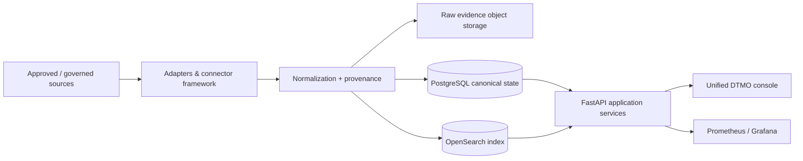

# DTMO — Dutch Threat Monitoring for Education

DTMO is an open Cyber Threat Intelligence (CTI) platform for education-sector security teams. It combines governed threat-source operations, canonical intelligence, provenance, vulnerability intelligence, investigation, visual analytics, role-based administration and governance evidence in one controlled application.

> **Software baseline:** `16.0.0rc12` with accepted post-RC13 and E8 repository enhancements  
> **Engineering baseline:** Phases 1–7 `PASS`  
> **Functional acceptance:** RC13 `PASS / OWNER_ACCEPTED`  
> **Product evolution:** E8.1–E8.10 `PASS / REPOSITORY_COMPLETE`  
> **Production-equivalent staging:** Phase 8 `PASS / OWNER_ACCEPTED`  
> **Independent assurance:** Phase 9 `PASS / EXTERNAL_ASSURANCE_ACCEPTED`  
> **Production authorization:** Phase 10 `IN PROGRESS / GO-NO-GO DECISION REQUIRED`  
> **Production status:** **not production authorized until Phase 10 GO**

## Why DTMO

Education environments combine broad digital estates, sensitive information, cloud dependencies and a threat landscape ranging from opportunistic exploitation to targeted campaigns. DTMO is designed to turn heterogeneous public and governed intelligence sources into traceable, reviewable and operationally useful security intelligence while preserving authorization, privacy, provenance and publication controls.

DTMO is built around five principles:

1. **Provenance first** — source identity and evidence remain traceable through ingestion, normalization, correlation and presentation.
2. **Fail closed** — missing evidence, invalid contracts, incomplete acceptance or unknown state never become implicit success.
3. **Human authority remains human** — ingestion, analytics, Administration, CI and staging access do not grant publication or external-sharing authority.
4. **Least privilege by design** — human and service identities are separated and privileged operations remain auditable.
5. **Evidence-based governance** — framework relationships are explicit, versioned and provenance-backed; mappings are not inferred from free text or semantic similarity.

## Product capabilities

### Unified security console

The canonical web application provides one operator experience for:

- **Overview** — security/intelligence KPIs, severity, source state, vulnerability trends and recent intelligence;
- **Intelligence** — normalized records with provenance, classification, vulnerability/CTI context and investigation support;
- **Sources & Catalog** — curated sources, governed registration, activation and execution;
- **Visual Analytics** — native severity, source, connector, review, CVSS/EPSS/KEV and vulnerability trend analytics;
- **Administration** — governed principals, roles, permissions and privileged-action protections;
- **Governance** — versioned framework knowledge, explicit mappings and evidence boundaries.

### Intelligence and CTI ecosystem

The repository-complete product baseline includes governed integrations and semantics for OpenCVE, CIRCL Vulnerability-Lookup, MISP and AIL, together with vulnerability prioritization and analytics. MISP outbound sharing remains separately governed and human-approved; AIL integration remains bounded to governed read/enrichment/correlation behavior rather than autonomous crawling or mutation.

### Intelligence pipeline

PostgreSQL is the canonical application truth. OpenSearch is the search/index representation, object storage preserves raw evidence, Redis supports coordination, and Prometheus/Grafana provide operational observability.

### Security and governance

DTMO preserves server-side RBAC, least privilege, human/service-account separation, bearer-token trust validation, privileged Administration safeguards, request correlation, auditable security-relevant actions, provenance/confidence preservation, data minimization and distinct review/external-share authority.

The governance model includes explicit versioned relationships to Normenkader IBP, MITRE ATT&CK, NIST CSF and vulnerability-scoring/context semantics such as CVSS. E8.10 adds repository-backed vulnerability-management evidence mapping, including Normenkader IBP SM.07, while explicitly avoiding broader compliance, maturity or certification claims.

## Architecture

The reference platform consists of Python 3.12+, FastAPI/Uvicorn, SQLAlchemy/Alembic, PostgreSQL, Redis, OpenSearch, S3-compatible object storage, Prometheus, separately authenticated Grafana, Nginx and a Docker Compose reference topology.

See [System Architecture](docs/architecture/SYSTEM_ARCHITECTURE.md) and [Security Overview](docs/security/SECURITY_OVERVIEW.md) for component responsibilities, trust boundaries and deployment/security assumptions.

## Current maturity and release position

| Stage | Scope | Status |
|---|---|---|
| Phases 1–7 | Repository-controlled engineering baseline | `PASS` |
| RC13 | Unified-console functional acceptance | `PASS / OWNER_ACCEPTED` |
| E8.1–E8.10 | Vulnerability & CTI product evolution | `PASS / REPOSITORY_COMPLETE` |
| Phase 8 | Production-equivalent staging validation and accountable acceptance | `PASS / OWNER_ACCEPTED` |
| Phase 9 | Independent external assurance | `PASS / EXTERNAL_ASSURANCE_ACCEPTED` |
| Phase 10 | Formal production go/no-go | `IN PROGRESS / DECISION REQUIRED` |

Phase 8 and Phase 9 are now accepted prerequisites. The active release gate is Phase 10: accountable production authorization covering the production environment/owner, immutable production release identity, IAM/secrets/network controls, backup/recovery/rollback, monitoring/on-call/escalation, incident-response handover, privacy/data/legal requirements, open findings/residual risk and the formal change/release decision.

Repository CI remains engineering evidence and is not represented as the source of the completed external Phase 8 or independent Phase 9 decisions.

## Product roadmap

The current priority sequence is:

1. assemble the Phase 10 production decision package from accepted Phase 8 and Phase 9 evidence;
2. approve the production environment, ownership/support and immutable release identity;
3. confirm IAM/secrets/network, recovery/rollback, monitoring/on-call, incident-response and privacy/legal readiness;
4. disposition open findings and residual risk;
5. record the accountable Phase 10 `GO` or `NO-GO / BLOCKED` decision;
6. on `GO`, perform controlled deployment and post-deployment verification against the approved release identity.

See the [Production Roadmap](docs/roadmap/PRODUCTION_ROADMAP.md), [Production Readiness Report](docs/project/PRODUCTION_READINESS_REPORT.md) and [Phase 10 Production Go/No-Go](docs/production/PHASE10_PRODUCTION_GO_NO_GO.md).

## Documentation

Professional product, user, administrator, architecture, security, governance and visual documentation is maintained under `docs/`. Runtime screenshots are governed, provenance-backed documentation illustrations and do not independently prove live production state. Historical development/run records remain scoped to the candidate and evidence state they originally covered.