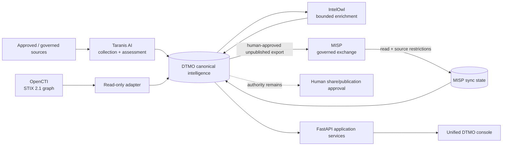

# DTMO — Dutch Threat Monitoring for Education

DTMO is an open Cyber Threat Intelligence (CTI) platform for education-sector security teams. It combines governed threat-source operations, canonical intelligence, provenance, vulnerability intelligence, investigation, visual analytics, role-based administration and governance evidence in one controlled application.

> **Software baseline:** `16.0.0rc12` with accepted post-RC13, E8 and Phase 11 repository enhancements  
> **Engineering baseline:** Phases 1–7 `PASS`  
> **Functional acceptance:** RC13 `PASS / OWNER_ACCEPTED`  
> **Product evolution:** E8.1–E8.10 `PASS / REPOSITORY_COMPLETE`  
> **Production-equivalent staging:** Phase 8 `PASS / OWNER_ACCEPTED`  
> **Independent assurance:** Phase 9 `PASS / EXTERNAL_ASSURANCE_ACCEPTED`  
> **Phase 10 production decision:** `NO-GO / BLOCKED — PLATFORM INDUSTRIALISATION REQUIRED`  
> **Phase 11.1 Taranis architecture/contract:** `PASS / REPOSITORY_COMPLETE`  
> **Phase 11.2 Taranis adapter:** `PASS / REPOSITORY_COMPLETE`  
> **Phase 11.3 IntelOwl integration:** `PASS / REPOSITORY_COMPLETE`  
> **Phase 11.4 OpenCTI integration:** `PASS / REPOSITORY_COMPLETE`  
> **Phase 11.5 MISP consolidation contract:** `PASS / REPOSITORY_COMPLETE`  
> **Active bounded priority:** Phase 11.5 MISP synchronization-state/persistence + authority enforcement `IN PROGRESS / EXACT-HEAD VALIDATION REQUIRED`  
> **Next production authorization:** Phase 12 `NOT STARTED`  
> **Production status:** **not production authorized**

## Why DTMO

Education environments combine broad digital estates, sensitive information, cloud dependencies and a threat landscape ranging from opportunistic exploitation to targeted campaigns. DTMO turns heterogeneous governed intelligence into traceable, reviewable and operationally useful security intelligence while preserving authorization, privacy, provenance and publication controls.

DTMO is built around five principles: provenance first; fail closed; human authority remains human; least privilege by design; and evidence-based governance.

## Product capabilities

The canonical web application provides one operator experience for Overview, Intelligence, Sources & Catalog, Visual Analytics, Administration and Governance. The repository-complete baseline includes governed OpenCVE, CIRCL Vulnerability-Lookup, MISP and AIL semantics plus Phase 11 Taranis collection/canonicalization, IntelOwl enrichment and OpenCTI graph integration.

Phase 11.5 consolidates the existing MISP read and governed-export capabilities into one explicit authority and synchronization model. DTMO remains authoritative for education-sector relevance, canonical review state, local exposure/compromise semantics, governance evidence and human publication/share approval.

## Phase 11 composed intelligence pipeline



PostgreSQL remains canonical DTMO application truth. IntelOwl, OpenCTI and MISP provide attributable context/exchange services; none independently establishes local compromise or grants DTMO external-share/publication authority.

## Phase 11.5 MISP consolidation

The reviewed upstream contract baseline is **MISP v2.5.44**. MISP remains a separate **AGPL-3.0** service/API boundary; DTMO does not vendor MISP core source. The consolidation contract is repository-complete.

Existing DTMO MISP capabilities are deliberately reused rather than duplicated. The inbound connector uses `POST /events/restSearch` and preserves event/attribute/object identities, distribution, sharing-group, TLP/tag, galaxy and raw provenance context. The outbound path uses `POST /events/add` only after attributable human review/share approval, creates unpublished destination events and uses durable replay protection.

The active implementation adds `misp_synchronization_state`, binding a DTMO canonical item to its stable MISP event UUID and authoritative distribution/sharing-group/TLP envelope. Accepted restrictions are projected to canonical `metadata_json.misp_restrictions`, allowing the existing governed export path to enforce the same source restrictions. Identity collisions, unknown distribution, incomplete sharing-group semantics and attempts to import share authority fail closed.

Migration `0013_misp_synchronization_state` follows the accepted OpenCTI persistence migration. Database constraints enforce known distribution semantics, sharing-group requirements and `external_share_authorized=false`.

Automatic MISP server push/pull synchronization, automatic OpenCTI↔MISP synchronization and automatic MISP publication remain excluded. Repository CI is not live-MISP, deployment, assurance or production evidence.

See [MISP → DTMO Consolidation Contract](docs/architecture/MISP_DTMO_CONSOLIDATION_CONTRACT.md), [MISP Read Integration](docs/integrations/MISP_READ_INTEGRATION.md), [MISP Governed Export](docs/intelligence/MISP_GOVERNED_EXPORT.md) and [Phase 11.5 MISP Consolidation State Gate](docs/qa/PHASE11_5_MISP_CONSOLIDATION_STATE_GATE.md).

## Architecture

The current DTMO reference platform consists of Python 3.12+, FastAPI/Uvicorn, SQLAlchemy/Alembic, PostgreSQL, Redis, OpenSearch, S3-compatible object storage, Prometheus/Grafana, Nginx and a Docker Compose reference topology. The Phase 11 target is a composed service architecture: Taranis AI for collection/assessment, IntelOwl for IOC enrichment, OpenCTI for STIX graph, MISP for governed exchange and TheHive for incident/case handoff.

## Current maturity and release position

| Stage | Scope | Status |
|---|---|---|
| Phases 1–7 | Repository-controlled engineering baseline | `PASS` |
| RC13 | Unified-console functional acceptance | `PASS / OWNER_ACCEPTED` |
| E8.1–E8.10 | Vulnerability & CTI product evolution | `PASS / REPOSITORY_COMPLETE` |
| Phase 8 | Production-equivalent staging validation | `PASS / OWNER_ACCEPTED` |
| Phase 9 | Independent assurance | `PASS / EXTERNAL_ASSURANCE_ACCEPTED` |
| Phase 10 | Formal production go/no-go | `NO-GO / BLOCKED — PLATFORM INDUSTRIALISATION REQUIRED` |
| Phase 11.1 | Taranis architecture/API/data-model/identity/licensing | `PASS / REPOSITORY_COMPLETE` |
| Phase 11.2 | Taranis→DTMO canonical adapter | `PASS / REPOSITORY_COMPLETE` |
| Phase 11.3 | IntelOwl enrichment integration | `PASS / REPOSITORY_COMPLETE` |
| Phase 11.4 | OpenCTI STIX knowledge-graph integration | `PASS / REPOSITORY_COMPLETE` |
| Phase 11.5 contract | MISP consolidation authority/service/API/licensing model | `PASS / REPOSITORY_COMPLETE` |
| Phase 11.5 implementation | MISP synchronization state/persistence and authority enforcement | `IN PROGRESS / EXACT-HEAD VALIDATION REQUIRED` |
| Phase 12 | New formal production go/no-go | `NOT STARTED` |

Historical Phase 8/9 evidence remains bound to the earlier candidate. Fresh Phase 11.10 production-equivalent validation and Phase 11.11 independent external assurance remain required before Phase 12.

## Product roadmap

The fixed sequence is MISP consolidation → TheHive → conditional Cortex → Kubernetes/Helm/GitOps hardening → migration/compatibility → new validation → new independent assurance → Phase 12.

See the [Platform Industrialisation Roadmap](docs/roadmap/PLATFORM_INDUSTRIALISATION_ROADMAP.md), [Current Project State](docs/project/CURRENT_STATE.md), [QA and Release Gates](docs/qa/QA_AND_RELEASE_GATES.md) and [Evidence Index](docs/evidence/EVIDENCE_INDEX.md).

## Documentation

The authoritative documentation portal is [docs/README.md](docs/README.md). Historical point-in-time records remain historical and are not rewritten to claim later Phase 11 evidence.

## Local reference environment

```bash
git clone https://github.com/GJvManen/dtmo.git
cd dtmo
python3 tools/bootstrap_local.py
docker compose up --build
```

The local Compose topology is a development/reference environment only.

## Open source and responsible use

DTMO is licensed under the **Apache License, Version 2.0**. Canonical governance and legal entry points remain:

- `LICENSE`
- `NOTICE`
- `SECURITY.md`
- `CONTRIBUTING.md`
- `CODE_OF_CONDUCT.md`
- `SUPPORTED_VERSIONS.md`
- `docs/legal/LICENSING.md`
- `docs/legal/THIRD_PARTY.md`

Taranis AI remains a separate service behind its own licensing boundary. IntelOwl and pyIntelOwl remain separate AGPL-3.0 services. OpenCTI Community Edition is Apache-2.0 and OpenCTI Enterprise Edition is separately licensed. MISP core remains a separate AGPL-3.0 service/API boundary. Phase 11 integrations do not vendor upstream platform source into DTMO without explicit licensing approval.

Use DTMO only with lawful access to intelligence sources and infrastructure. Technical connectivity does not itself establish legal authority to collect, process, enrich, synchronize, publish or redistribute third-party material.
