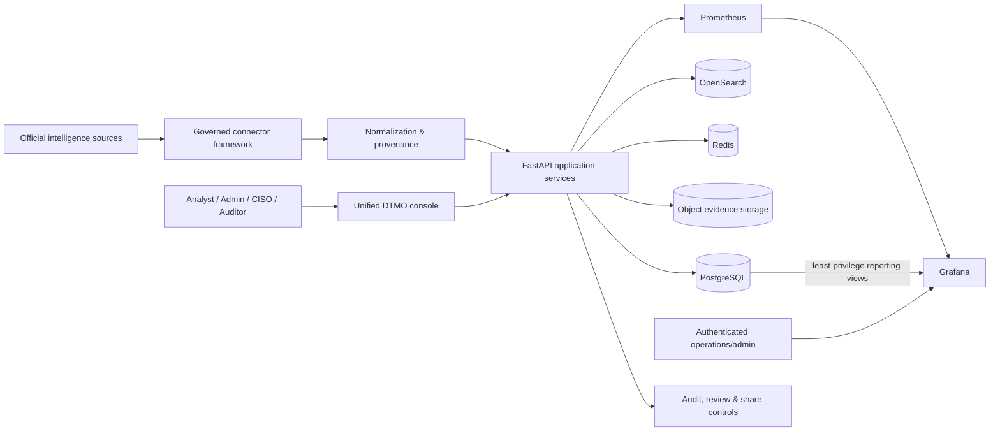

# DTMO

## Dutch Threat Monitoring for Education

**DTMO** is an open Cyber Threat Intelligence platform for the education sector. It combines vulnerability intelligence, vendor advisories, provenance, operational health, investigation and governance in one controlled platform.

**Release candidate:** `16.0.0rc12`  
**Engineering status:** Phases 1–7 accepted; RC13 functional acceptance in progress  
**External staging:** paused until RC13 functional acceptance is complete  
**License:** Apache-2.0

> **Current release decision:** DTMO is not production ready and is not yet ready for external staging/pentest acceptance. A project-owner functional test on 2026-08-11 reopened product acceptance because the canonical console did not yet provide a complete usable source → ingest → intelligence → analytics → administration → governance journey.

## Product scope

DTMO is designed for security operations, threat intelligence, administration and governance teams while preserving explicit authority boundaries.

- **Unified threat intelligence** — normalized records from official public and vendor security sources.
- **Governed source framework** — bounded adapters, registration, execution, provenance and connector health.
- **Threat investigation** — canonical recent intelligence plus governed OpenSearch-backed search.
- **Operational administration** — source configuration and execution in the canonical console.
- **Visual analytics** — native DTMO statistics and charts inside the canonical DTMO session. Grafana remains an authenticated operational/advanced deployment component and is not a prerequisite for normal product analytics.
- **Auditability and provenance** — source identity, request correlation, retained evidence and controlled state transitions.
- **Separation of duties** — ingestion, analysis, review and external share approval remain distinct authorities.

## Architecture



The architecture separates **collection**, **normalization**, **application services**, **persistence/search**, **observability** and **human governance**. Technical execution never grants publication authority. Normal console analytics are native DTMO views; Grafana is retained behind its own authenticated operational boundary unless a future deployment proves a safe shared-session integration.

### Technology stack

| Layer | Technology |
|---|---|
| Application/API | Python 3.12+, FastAPI, Pydantic, SQLAlchemy |
| Database | PostgreSQL 17 |
| Search | OpenSearch 2.19 |
| Queue/cache | Redis 8 |
| Evidence/object storage | S3-compatible AIStor/MinIO interface |
| Metrics | Prometheus 3 |
| Dashboards | Native DTMO analytics + authenticated Grafana 13 operations layer |
| Gateway | Nginx |
| Migrations | Alembic |
| Test & quality | pytest, Playwright, Ruff, mypy, pip-audit |
| Runtime | Docker Compose reference environment |

See [`docs/architecture/SYSTEM_ARCHITECTURE.md`](docs/architecture/SYSTEM_ARCHITECTURE.md).

## Intelligence source framework

The operational catalog contains governed built-in or framework adapters for CISA, NIST/NVD, GitHub, NCSC-NL, CERT-EU, Microsoft, Cisco, Red Hat, Ubuntu, Debian, Apple, Chrome, Mozilla, Fortinet, Palo Alto Networks and Broadcom/VMware. Research publications can remain visible as non-executable reference sources.

Credentialed adapters persist only logical secret references. Runtime secret values are not stored in the catalog or registry.

Authoritative source status: [`docs/qa/SOURCE_CONNECTION_MATRIX.md`](docs/qa/SOURCE_CONNECTION_MATRIX.md).

## RC13 functional acceptance

The RC12 implementation passed its repository-controlled tests, but the project-owner functional test identified gaps that the previous presence/contract tests did not catch. RC13 therefore adds browser-tested functional acceptance before Phase 8.

Current RC13 programme:

1. **RC13.1 — source-to-intelligence path — PASS within its slice boundary.** PR #151 merged on 2026-08-11 as `95c4a5b072d141f50a02d23f8bf9abb862d6f8e2` after the complete exact-head workflow set passed. The canonical console now browser-proves register/enable/run → ingest/index → recent intelligence → updated Overview behavior.
2. **RC13.2 — single-session visual analytics — CURRENT / PENDING_CI.** Native severity, source, connector-health and review-status analytics must work in the DTMO console without a second Grafana login. The canonical user journey must not request `/grafana/`; Grafana anonymous access remains disabled.
3. **RC13.3 — Administration/RBAC**: governed user/role assignment administration.
4. **RC13.4 — Governance knowledge surface**: Normenkader IBP, MITRE ATT&CK, CVSS and related mappings/control context.
5. **RC13.5 — full functional browser acceptance**: one complete canonical-console journey on an exact head.

Tracking: [issue #150](https://github.com/GJvManen/dtmo/issues/150) and [`docs/qa/RC13_FUNCTIONAL_CONSOLE_ACCEPTANCE_GATE.md`](docs/qa/RC13_FUNCTIONAL_CONSOLE_ACCEPTANCE_GATE.md).

## Security and governance model

DTMO is built around these invariants:

- role-based access control and least privilege;
- review and external share approval are separate human decisions;
- self-approval is prohibited where separation of duties applies;
- connectors, service accounts, CI jobs and staging access cannot authorize publication;
- provenance and confidence are preserved during normalization;
- logs and evidence follow privacy and data-minimization requirements;
- credentials, tokens and secret values are excluded from repository evidence;
- successful automation is evidence of technical execution, not of human approval;
- analytics convenience never justifies anonymous Grafana access or an authentication bypass.

See [`SECURITY.md`](SECURITY.md) and [`docs/security/SECURITY_OVERVIEW.md`](docs/security/SECURITY_OVERVIEW.md).

## Engineering workflow

Every change is delivered as a bounded pull request and must pass the registered **exact-head** workflow set before merge.

```mermaid
flowchart LR
    B[Feature / remediation branch] --> PR[Pull request]
    PR --> Q[Quality & governance]
    Q --> S[Security & connector contracts]
    S --> D[Data integrity & recovery]
    D --> P[Performance]
    P --> A[Browser & accessibility]
    A --> O[Observability & operations]
    O --> F[Functional browser acceptance]
    F --> M[Expected-head protected merge]
```



| Workflow family | Purpose |
|---|---|
| Quality & governance | Unit tests, linting, typing, licensing and repository contracts |
| Security & identity | Authorization, token/session behavior and security invariants |
| Connector reliability | Contract, timeout, retry, replay, freshness, provenance and isolation |
| Data integrity & recovery | Storage migration, recovery and cross-store integrity |
| Performance | Ingestion, API/search reads, concurrency and degraded dependencies |
| Browser & accessibility | Critical user journeys, keyboard, responsive and accessibility behavior |
| Observability | Request/trace context, alerts, dashboards and runbooks |
| Functional console | End-to-end UI interaction: source operations → ingest → intelligence → statistics |
| RC13 single-session analytics | Chromium proof that native analytics render without a Grafana request/login dependency |

Configured or queued workflows are not acceptance evidence. Missing, failed, cancelled, skipped, stale or inferred evidence is never `PASS`.

## Project status

| Phase | Scope | Status |
|---|---|---|
| 1 | CI and workflow integrity | ✅ `PASS` |
| 2 | Application security and identity | ✅ `PASS` |
| 3 | Data integrity and recovery | ✅ `PASS` |
| 4 | Connector reliability and provenance | ✅ `PASS` |
| 5 | Performance and scalability | ✅ `PASS` |
| 6 | Accessibility and operational UX | ✅ `PASS` — owner accepted 2026-08-11 |
| 7 | Observability and incident operations | ✅ `PASS` |
| RC13 | Functional unified-console acceptance | 🔴 `BLOCKED_INTERNAL` / in remediation |
| 8 | Real staging acceptance | ⏸ `PAUSED_PENDING_RC13` |
| 9 | Independent external assurance | ⏳ `NOT COMPLETE` |
| 10 | Production go/no-go | ⏳ `NOT STARTED` |

The only current priority is **RC13.2 — single-session visual analytics**. External staging validation and penetration testing resume only after the complete RC13 functional gate is accepted.

## Repository structure

```text
backend/dtmo/              Application, APIs, source framework and console
backend/tests/             Unit, contract, browser and release-gate tests
database/migrations/       Versioned database migrations
infrastructure/            Gateway, Prometheus and Grafana configuration
docs/                      Architecture, governance, QA, evidence and roadmap
tools/                     Provisioning, verification and release utilities
.github/workflows/          Exact-head CI and product-readiness gates
```

## Documentation

Start with [`docs/README.md`](docs/README.md). Key records:

- [`docs/project/CURRENT_STATE.md`](docs/project/CURRENT_STATE.md)
- [`docs/project/EXECUTIVE_STATUS.md`](docs/project/EXECUTIVE_STATUS.md)
- [`docs/roadmap/PRODUCTION_ROADMAP.md`](docs/roadmap/PRODUCTION_ROADMAP.md)
- [`docs/qa/RC13_FUNCTIONAL_CONSOLE_ACCEPTANCE_GATE.md`](docs/qa/RC13_FUNCTIONAL_CONSOLE_ACCEPTANCE_GATE.md)
- [`docs/qa/SOURCE_CONNECTION_MATRIX.md`](docs/qa/SOURCE_CONNECTION_MATRIX.md)
- [`docs/architecture/SYSTEM_ARCHITECTURE.md`](docs/architecture/SYSTEM_ARCHITECTURE.md)
- [`docs/evidence/EVIDENCE_INDEX.md`](docs/evidence/EVIDENCE_INDEX.md)
- [`docs/traceability/TRACEABILITY_MATRIX.md`](docs/traceability/TRACEABILITY_MATRIX.md)
- [`docs/operations/OPERATIONS_MANUAL.md`](docs/operations/OPERATIONS_MANUAL.md)

## Running and deployment

The repository includes a Docker Compose reference environment for engineering and validation. Deployment, secret material, platform hardening and production-equivalent staging acceptance are governed separately. See [`docs/operations/OPERATIONS_MANUAL.md`](docs/operations/OPERATIONS_MANUAL.md).

## Open source and responsible use

DTMO is licensed under the **Apache License, Version 2.0** (`Apache-2.0`). Governance and contribution entry points are maintained in `LICENSE`, `NOTICE`, `SECURITY.md`, `CONTRIBUTING.md`, `CODE_OF_CONDUCT.md`, `SUPPORTED_VERSIONS.md`, `docs/legal/LICENSING.md` and `docs/legal/THIRD_PARTY.md`.

Use DTMO only with lawful access to intelligence sources and infrastructure. A technically successful connector does not itself establish legal permission to collect, process or redistribute third-party material.
