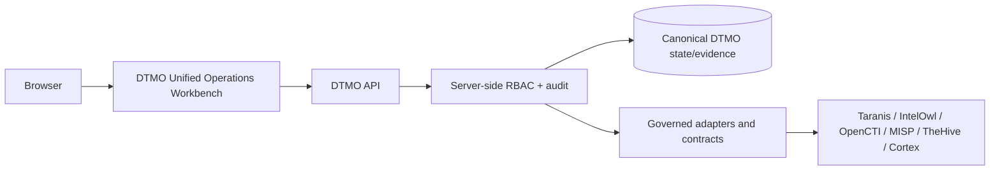

# DTMO — Dutch Threat Monitoring for Education

DTMO is an open Cyber Threat Intelligence (CTI) platform for education-sector security teams. It combines governed threat-source operations, canonical intelligence, provenance, vulnerability intelligence, investigation, visual analytics, role-based administration and governance evidence in one controlled application.

> **Software baseline:** `16.0.0rc12` with accepted post-RC13, E8 and Phase 11 repository enhancements  
> **Engineering baseline:** Phases 1–7 `PASS`  
> **Functional acceptance:** RC13 `PASS / OWNER_ACCEPTED`  
> **Product evolution:** E8.1–E8.10 `PASS / REPOSITORY_COMPLETE`  
> **Historical staging evidence:** Phase 8 `PASS / OWNER_ACCEPTED — HISTORICAL CANDIDATE`  
> **Historical independent assurance:** Phase 9 `PASS / EXTERNAL_ASSURANCE_ACCEPTED — HISTORICAL CANDIDATE`  
> **Phase 10 production decision:** `NO-GO / BLOCKED — PLATFORM INDUSTRIALISATION REQUIRED`  
> **Phase 11.1–11.9:** `PASS / REPOSITORY_COMPLETE`  
> **Phase 11.10:** `IN PROGRESS / FRESH CANDIDATE-BOUND EVIDENCE REQUIRED`  
> **Phase 11.10a–11.10k:** `PASS / REPOSITORY_COMPLETE`  
> **Active bounded slice:** Phase 11.10l Governance & Evidence — `IN PROGRESS / EXACT-HEAD VALIDATION REQUIRED`  
> **Phase 11.10m–11.10o:** `NOT STARTED`  
> **Phase 11.10p fresh production-equivalent validation:** `NOT STARTED / CANDIDATE FREEZE REQUIRED`  
> **Phase 11.11 independent external assurance:** `NOT STARTED`  
> **Phase 12 production decision:** `NOT STARTED`  
> **Production status:** **not production authorized**

## Why DTMO

Education environments combine broad digital estates, sensitive information, cloud dependencies and threats ranging from opportunistic exploitation to targeted campaigns. DTMO turns heterogeneous governed intelligence into traceable, reviewable and operationally useful security intelligence while preserving authorization, privacy, provenance and publication controls.

DTMO is built around five principles: **provenance first; fail closed; human authority remains human; least privilege by design; evidence-based governance**.

## Unified Operations Workbench

The canonical workbench now has repository-complete slices for frontend architecture, application shell, Command Center, Unified Intelligence/IOC Explorer, IntelOwl/Cortex Analysis, OpenCTI Graph/Entity, MISP Sharing & Exchange, TheHive Investigations & Cases, Vulnerability & Exposure, Sources & Collection and Automation & Playbooks.

**Phase 11.10l Governance & Evidence is active.** `/workbench/governance` consumes DTMO-owned same-origin governance APIs under server-side RBAC. It reuses the existing explicit repository-backed governance crosswalk rather than inventing a parallel compliance store.

The governance crosswalk contains scoped typed relationships for **Normenkader IBP**, **MITRE ATT&CK**, **NIST CSF 2.0** and **CVSS 4.0 context**. These are partial evidence relationships, not certification, blanket compliance, semantic equivalence, control-effectiveness proof or production authorization. Unrecorded framework objects remain unmapped and unavailable evidence fails closed.

Normal frontend operations follow:

The browser does not receive privileged upstream credentials. Role-aware presentation is a usability function; **server-side RBAC remains authoritative**.

## Authority and evidence boundaries

Human intelligence review, external-share approval, publication, TheHive case handoff, connector execution, administration and production authorization remain separate authority domains. Service accounts, connectors, analyzers, CI identities and browser controls cannot self-grant human approval powers.

Enrichment output does not prove compromise. Graph presence does not prove exposure. MISP transfer does not prove publication. TheHive case identity does not prove remediation. CVSS/EPSS/KEV do not prove local exposure. Source/automation success does not prove source truth. Governance mappings do not prove compliance or environment effectiveness.

Repository CI is exact-head engineering evidence only. It does **not** prove production-equivalent operation, owner acceptance, independent assurance or production authorization.

## Platform baseline

PostgreSQL remains canonical application truth. Redis, OpenSearch and S3-compatible object storage provide coordination, search and object persistence. Taranis AI, IntelOwl, Cortex, OpenCTI, MISP and TheHive remain separate governed service/licensing boundaries.

The accepted Phase 11.8 platform baseline includes Kubernetes/Helm/GitOps, workload identity, external-secret delivery, ingress/TLS, network segmentation, HA/disruption controls, observability, backup/recovery, supply-chain hardening, capacity planning and upgrade/rollback. Phase 11.9 adds the connected forward-first migration/compatibility contract. Application rollback does not authorize automatic database down migration.

## Release sequence

Phase 11.10l must first reach one final unchanged exact head with every registered workflow `completed/success`, synchronized professional documentation, a mergeable PR and ready-for-review state. Merge uses squash plus expected-head protection. Only then may **11.10m Operations & Administration** start, followed by 11.10n role-aware UX/accessibility and 11.10o consolidation/full functional acceptance.

After 11.10o, one immutable candidate is frozen for **11.10p fresh production-equivalent validation**. Historical Phase 8/9 evidence cannot be reused for this materially changed candidate. Fresh **Phase 11.11 independent external assurance** follows against the same candidate, then **Phase 12** makes the formal accountable production GO/NO-GO.

## Documentation

Start with [`docs/README.md`](docs/README.md), [`docs/project/CURRENT_STATE.md`](docs/project/CURRENT_STATE.md), [`docs/roadmap/PLATFORM_INDUSTRIALISATION_ROADMAP.md`](docs/roadmap/PLATFORM_INDUSTRIALISATION_ROADMAP.md), [`docs/security/SECURITY_OVERVIEW.md`](docs/security/SECURITY_OVERVIEW.md), [`docs/governance/GOVERNANCE_MAPPING_REGISTRY.md`](docs/governance/GOVERNANCE_MAPPING_REGISTRY.md) and [`docs/evidence/EVIDENCE_INDEX.md`](docs/evidence/EVIDENCE_INDEX.md).

The active 11.10l package is documented in [`docs/architecture/PHASE11_10L_GOVERNANCE_EVIDENCE.md`](docs/architecture/PHASE11_10L_GOVERNANCE_EVIDENCE.md), [`docs/user/GOVERNANCE_EVIDENCE_WORKSPACE.md`](docs/user/GOVERNANCE_EVIDENCE_WORKSPACE.md) and [`docs/qa/PHASE11_10L_GOVERNANCE_EVIDENCE_GATE.md`](docs/qa/PHASE11_10L_GOVERNANCE_EVIDENCE_GATE.md).
