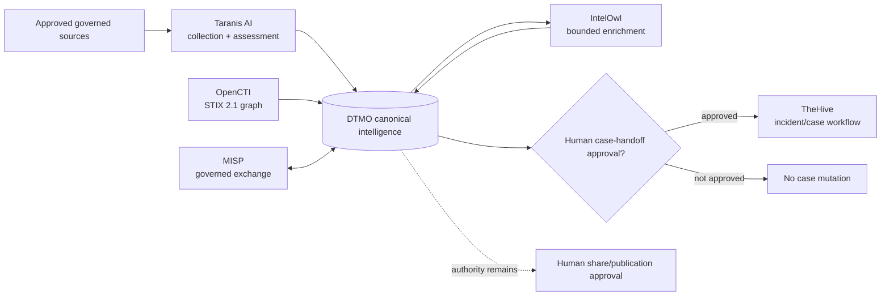

# DTMO — Dutch Threat Monitoring for Education

DTMO is an open Cyber Threat Intelligence (CTI) platform for education-sector security teams. It combines governed threat-source operations, canonical intelligence, provenance, vulnerability intelligence, investigation, visual analytics, role-based administration and governance evidence in one controlled application.

> **Software baseline:** `16.0.0rc12` with accepted post-RC13, E8 and Phase 11 repository enhancements  
> **Engineering baseline:** Phases 1–7 `PASS`  
> **Functional acceptance:** RC13 `PASS / OWNER_ACCEPTED`  
> **Product evolution:** E8.1–E8.10 `PASS / REPOSITORY_COMPLETE`  
> **Production-equivalent staging:** Phase 8 `PASS / OWNER_ACCEPTED`  
> **Independent assurance:** Phase 9 `PASS / EXTERNAL_ASSURANCE_ACCEPTED`  
> **Phase 10 production decision:** `NO-GO / BLOCKED — PLATFORM INDUSTRIALISATION REQUIRED`  
> **Phase 11.3 IntelOwl integration:** `PASS / REPOSITORY_COMPLETE`  
> **Phase 11.4 OpenCTI integration:** `PASS / REPOSITORY_COMPLETE`  
> **Phase 11.5 MISP consolidation:** `PASS / REPOSITORY_COMPLETE`  
> **Active bounded priority:** Phase 11.6 TheHive handoff contract `IN PROGRESS / EXACT-HEAD VALIDATION REQUIRED`  
> **Next production authorization:** Phase 12 `NOT STARTED`  
> **Production status:** **not production authorized**

## Why DTMO

Education environments combine broad digital estates, sensitive information, cloud dependencies and a threat landscape ranging from opportunistic exploitation to targeted campaigns. DTMO turns heterogeneous governed intelligence into traceable, reviewable and operationally useful security intelligence while preserving authorization, privacy, provenance and publication controls.

DTMO is built around five principles: provenance first; fail closed; human authority remains human; least privilege by design; and evidence-based governance.

## Product capabilities

The canonical web application provides one operator experience for Overview, Intelligence, Sources & Catalog, Visual Analytics, Administration and Governance. The repository-complete baseline includes governed OpenCVE, CIRCL Vulnerability-Lookup, MISP and AIL semantics plus Phase 11 Taranis AI collection/canonicalization, Phase 11.3 IntelOwl enrichment, Phase 11.4 OpenCTI graph integration and Phase 11.5 governed MISP consolidation.

Phase 11.6 introduces TheHive only as a separate incident/case-management service boundary. The current slice is contract-only: no automatic case creation or runtime mutation adapter is accepted yet.

## Phase 11 composed intelligence pipeline



PostgreSQL remains canonical DTMO application truth. Taranis AI, IntelOwl, OpenCTI, MISP and TheHive are separate service boundaries. None independently establishes local compromise or grants DTMO external-share/publication authority.

## Phase 11.6 TheHive handoff contract

The reviewed upstream baseline is **TheHive 5.5.16** using public **API v1 (`/api/v1`)**. Public API v0 is deprecated. The initial mutation candidate is `POST /api/v1/case`, but a canonical DTMO intelligence item never creates a case by itself.

A later implementation must require explicit human-authorized case handoff under dedicated server-side RBAC, a dedicated least-privilege non-human TheHive identity, stable DTMO↔TheHive identity mapping, durable idempotency/replay state and fail-closed TLP/PAP/access handling. Case-handoff approval and publication/share approval are distinct authorities.

TheHive 5.3+ requires an activated Community, Gold or Platinum license for continued write functionality. Repository CI does not prove that deployment entitlement. Attachments, raw source bodies, credentials, private enrichment results and unrelated personal data are excluded by default.

TheHive case state remains operational incident-response state; it does not replace canonical CTI truth, prove local compromise or grant external-share authority. Responders, Cortex execution, automatic MISP→TheHive automation, external sharing and administration remain outside this contract slice.

See [TheHive → DTMO Handoff Contract](docs/architecture/THEHIVE_DTMO_HANDOFF_CONTRACT.md), [TheHive Handoff Integration](docs/integrations/THEHIVE_HANDOFF.md), [TheHive Handoff Operations Runbook](docs/operations/THEHIVE_HANDOFF_RUNBOOK.md) and [Phase 11.6 TheHive Handoff Contract Gate](docs/qa/PHASE11_6_THEHIVE_HANDOFF_CONTRACT_GATE.md).

## Architecture

The current DTMO reference platform consists of Python 3.12+, FastAPI/Uvicorn, SQLAlchemy/Alembic, PostgreSQL, Redis, OpenSearch, S3-compatible object storage, Prometheus/Grafana, Nginx and a Docker Compose reference topology. The Phase 11 target is a composed service architecture: Taranis AI for collection/assessment, IntelOwl for IOC enrichment, OpenCTI for STIX graph, MISP for governed exchange and TheHive for incident/case handoff.

## Current maturity and release position

| Stage | Scope | Status |
|---|---|---|
| Phases 1–7 | Repository-controlled engineering baseline | `PASS` |
| RC13 | Unified-console functional acceptance | `PASS / OWNER_ACCEPTED` |
| E8.1–E8.10 | Vulnerability & CTI product evolution | `PASS / REPOSITORY_COMPLETE` |
| Phase 8 | Production-equivalent staging validation | `PASS / OWNER_ACCEPTED` |
| Phase 9 | Independent assurance | `PASS / EXTERNAL_ASSURANCE_ACCEPTED` |
| Phase 10 | Formal production go/no-go | `NO-GO / BLOCKED — PLATFORM INDUSTRIALISATION REQUIRED` |
| Phase 11.1 | Taranis architecture/API/data-model/identity/licensing | `PASS / REPOSITORY_COMPLETE` |
| Phase 11.2 | Taranis→DTMO canonical adapter | `PASS / REPOSITORY_COMPLETE` |
| Phase 11.3 | IntelOwl enrichment integration | `PASS / REPOSITORY_COMPLETE` |
| Phase 11.4 | OpenCTI STIX knowledge-graph integration | `PASS / REPOSITORY_COMPLETE` |
| Phase 11.5 | MISP consolidation and authority state | `PASS / REPOSITORY_COMPLETE` |
| Phase 11.6 contract | TheHive incident/case handoff service/API/identity/licensing boundary | `IN PROGRESS / EXACT-HEAD VALIDATION REQUIRED` |
| Phase 12 | New formal production go/no-go | `NOT STARTED` |

Historical Phase 8/9 evidence remains bound to the earlier candidate. Fresh Phase 11.10 production-equivalent validation and Phase 11.11 independent external assurance remain required before Phase 12.

## Product roadmap

The fixed sequence is TheHive → conditional Cortex → Kubernetes/Helm/GitOps hardening → migration/compatibility → new production-equivalent validation → new independent external assurance → Phase 12.

See the [Platform Industrialisation Roadmap](docs/roadmap/PLATFORM_INDUSTRIALISATION_ROADMAP.md), [Current Project State](docs/project/CURRENT_STATE.md), [QA and Release Gates](docs/qa/QA_AND_RELEASE_GATES.md) and [Evidence Index](docs/evidence/EVIDENCE_INDEX.md).

## Documentation

The authoritative documentation portal is [docs/README.md](docs/README.md). Historical point-in-time records remain historical and are not rewritten to claim later Phase 11 evidence.

## Local reference environment

```bash
git clone https://github.com/GJvManen/dtmo.git
cd dtmo
python3 tools/bootstrap_local.py
docker compose up --build
```

The local Compose topology is a development/reference environment only.

## Open source and responsible use

DTMO is licensed under the **Apache License, Version 2.0**. Canonical governance and legal entry points remain:

- `LICENSE`
- `NOTICE`
- `SECURITY.md`
- `CONTRIBUTING.md`
- `CODE_OF_CONDUCT.md`
- `SUPPORTED_VERSIONS.md`
- `docs/legal/LICENSING.md`
- `docs/legal/THIRD_PARTY.md`

Taranis AI, IntelOwl, OpenCTI, MISP and TheHive remain separate services under their applicable licensing boundaries. IntelOwl and MISP remain separate AGPL-3.0 services; OpenCTI Community Edition is Apache-2.0 while Enterprise Edition is separately licensed; TheHive license entitlement is deployment-specific. Phase 11 integrations do not vendor upstream platform source without explicit licensing approval.

Use DTMO only with lawful access to intelligence sources and infrastructure. Technical connectivity does not itself establish legal authority to collect, process, enrich, synchronize, create cases, publish or redistribute third-party material.
