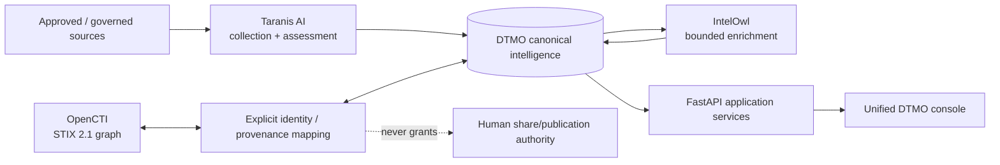

# DTMO — Dutch Threat Monitoring for Education

DTMO is an open Cyber Threat Intelligence (CTI) platform for education-sector security teams. It combines governed threat-source operations, canonical intelligence, provenance, vulnerability intelligence, investigation, visual analytics, role-based administration and governance evidence in one controlled application.

> **Software baseline:** `16.0.0rc12` with accepted post-RC13, E8 and Phase 11 repository enhancements  
> **Engineering baseline:** Phases 1–7 `PASS`  
> **Functional acceptance:** RC13 `PASS / OWNER_ACCEPTED`  
> **Product evolution:** E8.1–E8.10 `PASS / REPOSITORY_COMPLETE`  
> **Production-equivalent staging:** Phase 8 `PASS / OWNER_ACCEPTED`  
> **Independent assurance:** Phase 9 `PASS / EXTERNAL_ASSURANCE_ACCEPTED`  
> **Phase 10 production decision:** `NO-GO / BLOCKED — PLATFORM INDUSTRIALISATION REQUIRED`  
> **Phase 11.1 Taranis architecture/contract:** `PASS / REPOSITORY_COMPLETE`  
> **Phase 11.2 Taranis adapter:** `PASS / REPOSITORY_COMPLETE`  
> **Phase 11.3 IntelOwl integration:** `PASS / REPOSITORY_COMPLETE`  
> **Phase 11.4 OpenCTI contract:** `PASS / REPOSITORY_COMPLETE`  
> **Active bounded priority:** Phase 11.4 OpenCTI read-only STIX/identity adapter `IN PROGRESS / EXACT-HEAD VALIDATION REQUIRED`  
> **Next production authorization:** Phase 12 `NOT STARTED`  
> **Production status:** **not production authorized**

## Why DTMO

Education environments combine broad digital estates, sensitive information, cloud dependencies and a threat landscape ranging from opportunistic exploitation to targeted campaigns. DTMO turns heterogeneous governed intelligence into traceable, reviewable and operationally useful security intelligence while preserving authorization, privacy, provenance and publication controls.

DTMO is built around five principles:

1. **Provenance first** — source identity and evidence remain traceable through ingestion, normalization, correlation and presentation.
2. **Fail closed** — missing evidence, invalid contracts, incomplete acceptance or unknown state never become implicit success.
3. **Human authority remains human** — ingestion, enrichment, graph synchronization, analytics, Administration, CI and staging access do not grant publication or external-sharing authority.
4. **Least privilege by design** — human and service identities are separated and privileged operations remain auditable.
5. **Evidence-based governance** — framework relationships are explicit, versioned and provenance-backed; mappings are not inferred from free text or semantic similarity.

## Product capabilities

The canonical web application provides one operator experience for Overview, Intelligence, Sources & Catalog, Visual Analytics, Administration and Governance. The repository-complete baseline includes governed OpenCVE, CIRCL Vulnerability-Lookup, MISP and AIL semantics plus Phase 11 Taranis collection/canonicalization and IntelOwl enrichment integration.

Phase 11.4 integrates OpenCTI as a separate STIX knowledge-graph service while DTMO remains authoritative for education-sector relevance, local vulnerability/exposure semantics, governance, review and publication/share authority.

## Phase 11 composed intelligence pipeline



PostgreSQL remains canonical DTMO application truth. IntelOwl results and OpenCTI graph context remain attributable evidence/context; neither becomes proof of local compromise or external-share/publication authority.

## Phase 11.4 OpenCTI read-only adapter

The reviewed compatibility baseline is **OpenCTI 7.260811.0**. The accepted contract distinguishes Community Edition under Apache-2.0 from separately licensed Enterprise Edition functionality and keeps OpenCTI behind a service/API boundary with no source vendoring.

The active bounded adapter performs only GraphQL `stixCoreObjects` reads. It preserves OpenCTI and STIX identities, entity type, markings, confidence, timestamps and external references, applies an explicit entity-type allowlist and adds provenance markers that cannot grant external-share authority or local-compromise proof.

Pagination is bounded by page size and maximum page count. Durable checkpoint state advances only after the caller has successfully persisted a returned page and explicitly calls `commit_page(page)`. Invalid GraphQL responses, identity/type/marking/confidence/page/cursor/checkpoint state fail closed. Production enablement requires HTTPS, a runtime token, explicit entity-type allowlist and an absolute durable checkpoint path.

The adapter does not authorize OpenCTI connector registration, MISP synchronization, external enrichment, arbitrary GraphQL mutations, TheHive case creation or report publication.

See [OpenCTI → DTMO Integration Contract](docs/architecture/OPENCTI_DTMO_INTEGRATION_CONTRACT.md), [OpenCTI Integration](docs/integrations/OPENCTI_INTEGRATION.md) and [OpenCTI Integration Operations Runbook](docs/operations/OPENCTI_INTEGRATION_RUNBOOK.md).

## Architecture

The current DTMO reference platform consists of Python 3.12+, FastAPI/Uvicorn, SQLAlchemy/Alembic, PostgreSQL, Redis, OpenSearch, S3-compatible object storage, Prometheus/Grafana, Nginx and a Docker Compose reference topology. The Phase 11 target is a composed service architecture: Taranis AI for collection/assessment, IntelOwl for IOC enrichment, OpenCTI for STIX graph, MISP for governed exchange and TheHive for incident/case handoff.

## Current maturity and release position

| Stage | Scope | Status |
|---|---|---|
| Phases 1–7 | Repository-controlled engineering baseline | `PASS` |
| RC13 | Unified-console functional acceptance | `PASS / OWNER_ACCEPTED` |
| E8.1–E8.10 | Vulnerability & CTI product evolution | `PASS / REPOSITORY_COMPLETE` |
| Phase 8 | Production-equivalent staging validation | `PASS / OWNER_ACCEPTED` |
| Phase 9 | Independent external assurance | `PASS / EXTERNAL_ASSURANCE_ACCEPTED` |
| Phase 10 | Formal production go/no-go | `NO-GO / BLOCKED — PLATFORM INDUSTRIALISATION REQUIRED` |
| Phase 11.1 | Taranis architecture/API/data-model/identity/licensing | `PASS / REPOSITORY_COMPLETE` |
| Phase 11.2 | Taranis→DTMO canonical adapter | `PASS / REPOSITORY_COMPLETE` |
| Phase 11.3 | IntelOwl enrichment integration | `PASS / REPOSITORY_COMPLETE` |
| Phase 11.4 contract | OpenCTI service/API/STIX/identity/security/licensing | `PASS / REPOSITORY_COMPLETE` |
| Phase 11.4 adapter | Read-only GraphQL/STIX identity adapter | `IN PROGRESS / EXACT-HEAD VALIDATION REQUIRED` |
| Phase 12 | New formal production go/no-go | `NOT STARTED` |

Historical Phase 8/9 evidence remains bound to the earlier candidate. The materially changed integrated platform requires fresh Phase 11.10 production-equivalent validation and Phase 11.11 independent external assurance before Phase 12.

## Product roadmap

The fixed sequence is OpenCTI → MISP consolidation → TheHive → conditional Cortex → Kubernetes/Helm/GitOps hardening → migration/compatibility → new validation → new independent assurance → Phase 12.

See the [Platform Industrialisation Roadmap](docs/roadmap/PLATFORM_INDUSTRIALISATION_ROADMAP.md), [Current Project State](docs/project/CURRENT_STATE.md), [QA and Release Gates](docs/qa/QA_AND_RELEASE_GATES.md) and [Evidence Index](docs/evidence/EVIDENCE_INDEX.md).

## Documentation

The authoritative documentation portal is [docs/README.md](docs/README.md). Historical point-in-time records remain historical and are not rewritten to claim later Phase 11 evidence.

## Local reference environment

```bash
git clone https://github.com/GJvManen/dtmo.git
cd dtmo
python3 tools/bootstrap_local.py
docker compose up --build
```

The local Compose topology is a development/reference environment only.

## Open source and responsible use

DTMO is licensed under the **Apache License, Version 2.0**. Canonical governance and legal entry points remain:

- `LICENSE`
- `NOTICE`
- `SECURITY.md`
- `CONTRIBUTING.md`
- `CODE_OF_CONDUCT.md`
- `SUPPORTED_VERSIONS.md`
- `docs/legal/LICENSING.md`
- `docs/legal/THIRD_PARTY.md`

Taranis AI remains a separate service behind its own licensing boundary. IntelOwl and pyIntelOwl remain separate AGPL-3.0 services. OpenCTI Community Edition is Apache-2.0 and OpenCTI Enterprise Edition is separately licensed; Enterprise Edition-only dependencies require explicit entitlement/legal review before acceptance. Phase 11 integrations do not vendor upstream platform source into DTMO.

Use DTMO only with lawful access to intelligence sources and infrastructure. Technical connectivity does not itself establish legal authority to collect, process, enrich, synchronize, publish or redistribute third-party material.
