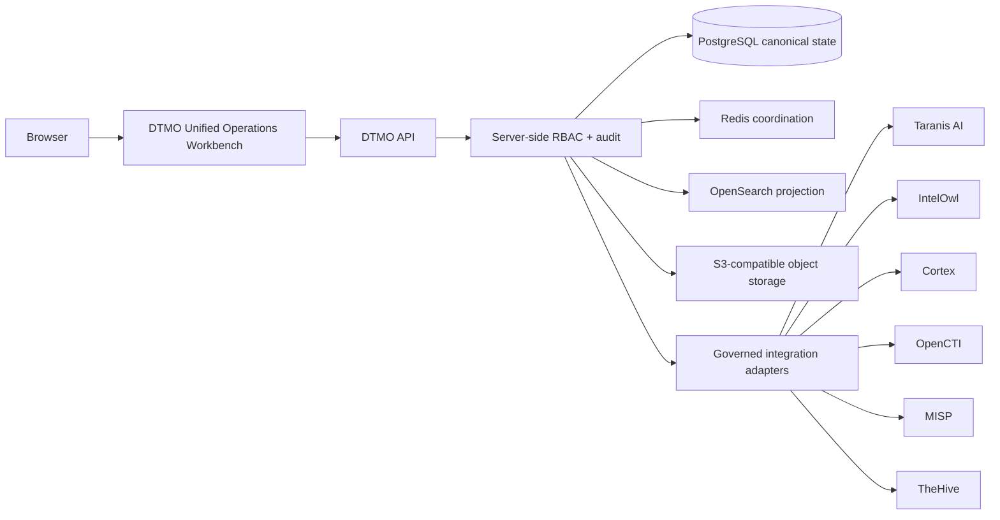

# DTMO — Dutch Threat Monitoring for Education

DTMO is an open Cyber Threat Intelligence platform for education-sector security teams. It brings governed threat collection, canonical intelligence, IOC exploration, enrichment, knowledge graphs, vulnerability intelligence, investigations, controlled sharing, automation, operational analytics and governance evidence together in one security-focused application.

DTMO is designed around five principles: **provenance first**, **fail closed**, **human authority remains human**, **least privilege by design**, and **evidence-based governance**.

> **Release position:** DTMO is under active platform validation and is **not production authorized**. Repository CI demonstrates engineering controls for an exact source revision; it does not by itself establish production-equivalent operation, independent assurance or production approval. See [Current State](docs/project/CURRENT_STATE.md) for the authoritative lifecycle status.

## Why DTMO

Education-sector security teams need to combine diverse threat sources without losing provenance, operational control or accountable human decision-making. DTMO provides one governed workspace for turning external intelligence into traceable, reviewable and actionable security evidence while preserving authorization boundaries between collection, analysis, investigation, sharing and production decisions.

## Product capabilities

The Unified Operations Workbench supports the operational CTI lifecycle through:

- **Command Center & Unified Intelligence** — intelligence discovery, IOC triage, provenance, severity and operational trends.
- **Sources & Catalog / Collection** — governed source registration, validation and collection control while keeping credentials server-side.
- **Analysis & Enrichment** — bounded IntelOwl and Cortex analyzer workflows whose output remains evidence rather than an automated compromise verdict.
- **Knowledge Graph** — OpenCTI-backed entity and relationship exploration using persisted, provenance-aware topology.
- **Vulnerability & Exposure** — CVSS, EPSS, KEV and canonical vulnerability intelligence without inferring local exposure from public vulnerability data alone.
- **Investigations & Cases** — governed TheHive case handoff with explicit human authority and durable reconciliation evidence.
- **Sharing & Exchange** — controlled MISP exchange under explicit review, handling and publication authority.
- **Automation & Playbooks** — policy-controlled orchestration that cannot self-grant review, sharing or publication authority.
- **Visual Analytics** — governed operational and trend views inside the canonical application shell.
- **Operations & Administration** — role-aware operational controls, observability and integration readiness.
- **Governance** — repository-backed framework mappings, evidence interpretation and authority boundaries.

## Architecture

DTMO separates browser presentation, canonical application state and upstream integration boundaries. PostgreSQL is the canonical application store; Redis provides coordination, OpenSearch provides search projection, and S3-compatible storage provides governed object persistence. External CTI and analysis platforms remain separate service, trust and licensing boundaries.

The browser never receives privileged upstream credentials. UI visibility is not authorization: server-side RBAC remains authoritative. Human intelligence review, external sharing, publication, case handoff, connector execution, administration and production authorization remain distinct authority domains.

## Security and trust model

DTMO deliberately distinguishes **evidence** from **authority** and **observation** from **conclusion**. Enrichment does not prove compromise; graph presence does not prove exposure; MISP transfer does not prove publication; a TheHive case does not prove remediation; CVSS, EPSS and KEV do not prove local exposure; successful automation does not prove source truth; governance mappings do not prove compliance.

The platform uses provenance-aware records, server-side authorization, controlled connector boundaries and fail-closed interpretation throughout the intelligence lifecycle. Security architecture, threat modelling, responsible disclosure and supported-version information are maintained separately from product documentation.

## Getting started

For deployment and operation, start with the documentation portal rather than the development roadmap:

1. Read the [Documentation Portal](docs/README.md) for audience-oriented navigation.
2. Review the [Product Guide](docs/product/PRODUCT_GUIDE.md) and [User Guide](docs/user/USER_GUIDE.md) for functional use.
3. Use the [Administrator Guide](docs/administration/ADMINISTRATOR_GUIDE.md) and [Operations Manual](docs/operations/OPERATIONS_MANUAL.md) for configuration and operations.
4. Review the [Security Overview](docs/security/SECURITY_OVERVIEW.md), [Threat Model](docs/security/THREAT_MODEL.md) and [Governance Mapping Registry](docs/governance/GOVERNANCE_MAPPING_REGISTRY.md) before connecting operational sources.
5. Consult [Current State](docs/project/CURRENT_STATE.md) and [Production Readiness Report](docs/project/PRODUCTION_READINESS_REPORT.md) for current release and validation status.

## Documentation

The professional documentation set is organized by audience and responsibility:

| Area | Entry point |
|---|---|
| Product and user experience | [Product Guide](docs/product/PRODUCT_GUIDE.md) · [User Guide](docs/user/USER_GUIDE.md) |
| Administration | [Administrator Guide](docs/administration/ADMINISTRATOR_GUIDE.md) |
| Operations | [Operations Manual](docs/operations/OPERATIONS_MANUAL.md) |
| Architecture | [System Architecture](docs/architecture/SYSTEM_ARCHITECTURE.md) · [UI/API Contract](docs/architecture/UI_API_CONTRACT.md) |
| Security | [Security Overview](docs/security/SECURITY_OVERVIEW.md) · [Threat Model](docs/security/THREAT_MODEL.md) · [Risk Register](docs/security/RISK_REGISTER.md) |
| Governance | [Governance Mapping Registry](docs/governance/GOVERNANCE_MAPPING_REGISTRY.md) · [Framework Governance](docs/governance/FRAMEWORK_GOVERNANCE.md) |
| Quality and evidence | [QA & Release Gates](docs/qa/QA_AND_RELEASE_GATES.md) · [Evidence Index](docs/evidence/EVIDENCE_INDEX.md) |
| Current project status | [Current State](docs/project/CURRENT_STATE.md) · [Executive Status](docs/project/EXECUTIVE_STATUS.md) |
| Roadmaps | [Roadmap directory](docs/roadmap/) |

Detailed phase history, implementation sequencing and product roadmaps deliberately live under `docs/` rather than dominating this repository entry point.

## Deployment and platform engineering

The repository contains container and Kubernetes/Helm deployment assets, GitOps-oriented runtime controls, workload identity and external secret integration, ingress/TLS and network segmentation controls, availability/disruption policy, observability, backup/recovery, supply-chain controls, capacity planning and forward-first migration compatibility.

Production-equivalent validation and production authorization are separate lifecycle decisions. Do not interpret repository configuration or a successful CI run as proof that a specific external environment has passed those decisions.

## Current maturity and release position

The detailed lifecycle ledger remains authoritative in [Current State](docs/project/CURRENT_STATE.md). In compact form: earlier accepted engineering and owner baselines remain recorded as `PASS / OWNER_ACCEPTED`; the accepted E8.1–E8.10 capability baseline remains `REPOSITORY_COMPLETE`; historical Phase 9 evidence remains `EXTERNAL_ASSURANCE_ACCEPTED` for its historical candidate; Phase 10 remains `NO-GO / BLOCKED`; Phase 11 remains `IN PROGRESS` while fresh candidate-bound validation is completed; and Phase 12 remains `NOT STARTED`. These labels are lifecycle references, not a substitute for the authoritative status documents.

## Product roadmap

Product roadmaps and implementation sequencing are maintained in the dedicated [roadmap directory](docs/roadmap/). They are intentionally not reproduced on the repository homepage.

## Contributing and responsible disclosure

Contributions are welcome within the project's security, provenance and authority boundaries. Before contributing, read [CONTRIBUTING.md](CONTRIBUTING.md), [CODE_OF_CONDUCT.md](CODE_OF_CONDUCT.md) and the relevant architecture and security documentation.

Report security vulnerabilities according to [SECURITY.md](SECURITY.md). Do not disclose sensitive vulnerability details through public issues.

## Open source and responsible use

DTMO is released under the **Apache License, Version 2.0**. `LICENSE` and `NOTICE` are the canonical licensing notices; additional licensing and third-party information is maintained in [Licensing](docs/legal/LICENSING.md) and [Third-party Notices](docs/legal/THIRD_PARTY.md).

Use DTMO only with authorized data sources, infrastructure and testing scopes. Preserve provenance, handling restrictions, privacy obligations and accountable human decision-making throughout the intelligence lifecycle.
