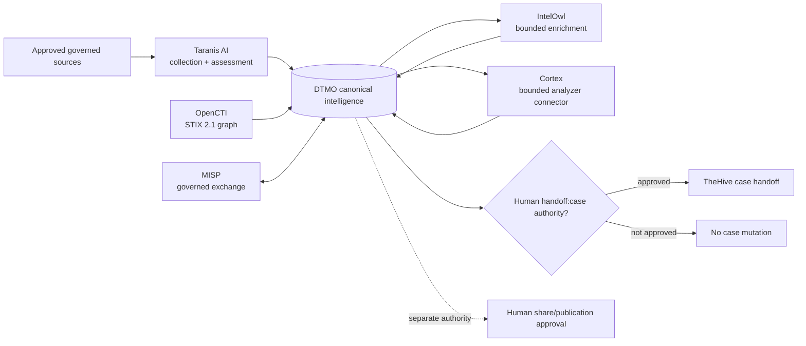
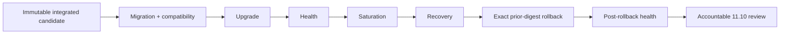
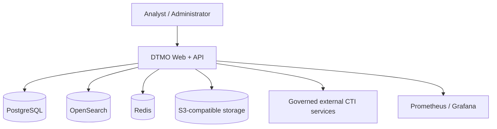

# DTMO — Dutch Threat Monitoring for Education

DTMO is an open Cyber Threat Intelligence (CTI) platform for education-sector security teams. It combines governed threat-source operations, canonical intelligence, provenance, vulnerability intelligence, investigation, visual analytics, role-based administration and governance evidence in one controlled application.

> **Software baseline:** `16.0.0rc12` with accepted post-RC13, E8 and Phase 11 repository enhancements  
> **Engineering baseline:** Phases 1–7 `PASS`  
> **Functional acceptance:** RC13 `PASS / OWNER_ACCEPTED`  
> **Product evolution:** E8.1–E8.10 `PASS / REPOSITORY_COMPLETE`  
> **Historical staging evidence:** Phase 8 `PASS / OWNER_ACCEPTED — HISTORICAL CANDIDATE`  
> **Historical independent assurance:** Phase 9 `PASS / EXTERNAL_ASSURANCE_ACCEPTED — HISTORICAL CANDIDATE`  
> **Phase 10 production decision:** `NO-GO / BLOCKED — PLATFORM INDUSTRIALISATION REQUIRED`  
> **Phase 11.1–11.9:** `PASS / REPOSITORY_COMPLETE`  
> **Phase 11.10 production-equivalent validation:** `IN PROGRESS / FRESH CANDIDATE-BOUND EVIDENCE REQUIRED`  
> **Phase 11.11 independent external assurance:** `NOT STARTED`  
> **Phase 12 production decision:** `NOT STARTED`  
> **Production status:** **not production authorized**

## Why DTMO

Education environments combine broad digital estates, sensitive information, cloud dependencies and a threat landscape ranging from opportunistic exploitation to targeted campaigns. DTMO turns heterogeneous governed intelligence into traceable, reviewable and operationally useful security intelligence while preserving authorization, privacy, provenance and publication controls.

DTMO is built around five principles: provenance first; fail closed; human authority remains human; least privilege by design; and evidence-based governance.

## Product capabilities

The canonical web application provides one operator experience for **Overview**, **Intelligence**, **Sources & Catalog**, **Visual Analytics**, **Administration** and **Governance**. The accepted repository baseline integrates governed OpenCVE and CIRCL Vulnerability-Lookup semantics with Taranis AI collection/canonicalization, IntelOwl enrichment, OpenCTI STIX knowledge-graph integration, governed MISP exchange, human-authorized TheHive case handoff and the bounded Cortex analyzer connector.

PostgreSQL remains canonical DTMO application truth. Redis, OpenSearch and S3-compatible object storage support coordination, search and object persistence. Taranis AI, IntelOwl, Cortex, OpenCTI, MISP and TheHive remain separate service and licensing boundaries; none independently establishes local compromise or grants DTMO publication/share authority.

## Phase 11 composed intelligence pipeline



The original Phase 11.7 decision did not adopt Cortex because no validated IntelOwl capability gap existed at that time. The later owner-required Phase 11.7b analyzer connector was accepted separately; the historical decision record remains immutable.

## Phase 11 platform industrialisation baseline

Phase 11.8 is `PASS / REPOSITORY_COMPLETE`. Its bounded controls cover:

- Kubernetes/Helm/GitOps runtime foundations;
- workload identity and external secret delivery;
- ingress/TLS and network segmentation;
- HA and disruption controls;
- observability boundaries;
- backup, restore and recovery controls;
- software supply-chain hardening with SBOM, vulnerability and signed-provenance mechanisms;
- capacity and resource planning;
- exercised upgrade and exact prior-digest rollback contracts.

Phase 11.9 migration/compatibility is also `PASS / REPOSITORY_COMPLETE`. The accepted contract requires one connected Alembic migration chain, forward-first migration, backward-compatible rolling overlap, expand/migrate/contract for destructive schema evolution, and no automatic database down migration during application rollback.

These are repository engineering controls. They do not by themselves establish production-equivalent behavior, independent assurance or production authorization.

## Active Phase 11.10 production-equivalent validation

Phase 11.10 is the sole active production-readiness objective. It requires **fresh external evidence against one immutable integrated deployment identity** for:

1. immutable candidate identity;
2. migration/compatibility;
3. upgrade;
4. rollback to the exact prior immutable digest plus post-rollback health;
5. health/readiness;
6. representative saturation/capacity behavior;
7. recovery/continuity.



Every accepted evidence item must bind to the same production-equivalent environment and candidate fingerprint. Missing, placeholder, inaccessible, historical-only or mixed-candidate evidence fails closed. Historical Phase 8/9 evidence is preserved as audit history and cannot satisfy Phase 11.10 or Phase 11.11 for the materially changed candidate.

Repository CI validates only the evidence contract, manifest structure and repository-controlled behavior. It does **not** prove that the production-equivalent environment has been deployed or exercised. Phase 11.10 completes only after the full real-environment evidence package is reviewed and explicitly accepted by the accountable owner. Phase 11.11 remains blocked until then.

Execution material:

- [Phase 11.10 validation gate](docs/qa/PHASE11_10_PRODUCTION_EQUIVALENT_VALIDATION_GATE.md)
- [Phase 11.10 execution runbook](docs/operations/PHASE11_10_PRODUCTION_EQUIVALENT_VALIDATION_RUNBOOK.md)
- [Phase 11.10 evidence template](docs/evidence/PHASE11_10_PRODUCTION_EQUIVALENT_EVIDENCE.template.json)
- [Evidence Index](docs/evidence/EVIDENCE_INDEX.md)
- [Platform Industrialisation Roadmap](docs/roadmap/PLATFORM_INDUSTRIALISATION_ROADMAP.md)

## Architecture

The current reference platform uses Python 3.12+, FastAPI/Uvicorn, SQLAlchemy/Alembic, PostgreSQL, Redis, OpenSearch, S3-compatible object storage, Prometheus/Grafana and Nginx. The industrialised runtime adds governed Kubernetes/Helm/GitOps deployment while preserving service identities, workload identity, external secret delivery, ingress/TLS boundaries, RBAC, provenance and human authority.



## Current maturity and release position

| Stage | Scope | Status |
|---|---|---|
| Phases 1–7 | Repository-controlled engineering baseline | `PASS` |
| RC13 | Unified-console functional acceptance | `PASS / OWNER_ACCEPTED` |
| E8.1–E8.10 | Vulnerability & CTI product evolution | `PASS / REPOSITORY_COMPLETE` |
| Phase 8 | Production-equivalent validation | `PASS / OWNER_ACCEPTED — HISTORICAL CANDIDATE` |
| Phase 9 | Independent assurance | `PASS / EXTERNAL_ASSURANCE_ACCEPTED — HISTORICAL CANDIDATE` |
| Phase 10 | Formal production go/no-go | `NO-GO / BLOCKED — PLATFORM INDUSTRIALISATION REQUIRED` |
| Phase 11.1–11.7b | Service integration programme | `PASS / REPOSITORY_COMPLETE` |
| Phase 11.8 | Integrated runtime industrialisation | `PASS / REPOSITORY_COMPLETE` |
| Phase 11.9 | Migration and compatibility | `PASS / REPOSITORY_COMPLETE` |
| Phase 11.10 | Fresh production-equivalent validation | `IN PROGRESS / FRESH CANDIDATE-BOUND EVIDENCE REQUIRED` |
| Phase 11.11 | Fresh independent external assurance | `NOT STARTED` |
| Phase 12 | Formal production GO/NO-GO | `NOT STARTED` |

## Product roadmap

The controlled sequence is now: **Phase 11.10 fresh production-equivalent validation → Phase 11.11 fresh independent external assurance → Phase 12 formal production GO/NO-GO**. Phase 11.11 must use the same immutable candidate accepted in Phase 11.10. A material candidate change requires a new evidence binding.

See the [Platform Industrialisation Roadmap](docs/roadmap/PLATFORM_INDUSTRIALISATION_ROADMAP.md), [Production Roadmap](docs/roadmap/PRODUCTION_ROADMAP.md), [Current Project State](docs/project/CURRENT_STATE.md), [QA and Release Gates](docs/qa/QA_AND_RELEASE_GATES.md) and [Evidence Index](docs/evidence/EVIDENCE_INDEX.md).

## Documentation

The authoritative professional documentation portal is [docs/README.md](docs/README.md). Current-state documentation is maintained separately from immutable historical evidence. Historical point-in-time records are not rewritten to manufacture later acceptance.

Key current-state documents include:

- [Current Project State](docs/project/CURRENT_STATE.md)
- [Executive Status](docs/project/EXECUTIVE_STATUS.md)
- [Executive Decision View](docs/project/EXECUTIVE_DECISION_VIEW.md)
- [Production Readiness Report](docs/project/PRODUCTION_READINESS_REPORT.md)
- [Production Readiness Checklist](docs/project/PRODUCTION_CHECKLIST.md)
- [Documentation Status and Authority](docs/project/DOCUMENTATION_STATUS.md)

## Local reference environment

```bash
git clone https://github.com/GJvManen/dtmo.git
cd dtmo
python3 tools/bootstrap_local.py
docker compose up --build
```

The local Compose topology is a development/reference environment only. It is not Phase 11.10 production-equivalent evidence.

## Open source and responsible use

DTMO is licensed under the **Apache License, Version 2.0**. Canonical governance and legal entry points remain:

- `LICENSE`
- `NOTICE`
- `SECURITY.md`
- `CONTRIBUTING.md`
- `CODE_OF_CONDUCT.md`
- `SUPPORTED_VERSIONS.md`
- `docs/legal/LICENSING.md`
- `docs/legal/THIRD_PARTY.md`

Taranis AI, IntelOwl, Cortex, OpenCTI, MISP and TheHive remain separate services under their applicable licensing and provider boundaries. IntelOwl and MISP remain separate AGPL-3.0 services; OpenCTI Community Edition is Apache-2.0 while Enterprise Edition is separately licensed; TheHive license entitlement is deployment-specific. Cortex itself remains a separate open-source service while individual analyzers and external providers can impose separate licensing, subscription or data-handling terms. DTMO integrations do not vendor upstream platform source without explicit licensing approval.

Use DTMO only with lawful access to intelligence sources and infrastructure. Technical connectivity does not itself establish legal authority to collect, process, enrich, synchronize, create cases, publish or redistribute third-party material.
