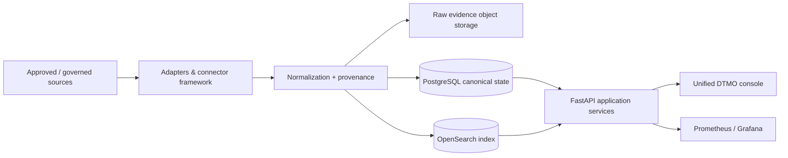

# DTMO — Dutch Threat Monitoring for Education

DTMO is an open Cyber Threat Intelligence (CTI) platform for education-sector security teams. It combines governed threat-source operations, canonical intelligence, provenance, vulnerability intelligence, investigation, visual analytics, role-based administration and governance evidence in one controlled application.

> **Software baseline:** `16.0.0rc12` with accepted post-RC13 and E8 repository enhancements  
> **Engineering baseline:** Phases 1–7 `PASS`  
> **Functional acceptance:** RC13 `PASS / OWNER_ACCEPTED`  
> **Product evolution:** E8.1–E8.10 `PASS / REPOSITORY_COMPLETE`  
> **Production-equivalent staging:** Phase 8 `PASS / OWNER_ACCEPTED`  
> **Independent assurance:** Phase 9 `PASS / EXTERNAL_ASSURANCE_ACCEPTED`  
> **Production authorization:** Phase 10 `NO-GO / INDUSTRIALISATION REQUIRED`  
> **Active programme:** Phase 11 `ACTIVE / HIGHEST PRIORITY`  
> **Next production decision:** Phase 12 `PLANNED`  
> **Production status:** **not production authorized**

## Why DTMO

Education environments combine broad digital estates, sensitive information, cloud dependencies and a threat landscape ranging from opportunistic exploitation to targeted campaigns. DTMO is designed to turn heterogeneous public and governed intelligence sources into traceable, reviewable and operationally useful security intelligence while preserving authorization, privacy, provenance and publication controls.

DTMO is built around five principles:

1. **Provenance first** — source identity and evidence remain traceable through ingestion, normalization, correlation and presentation.
2. **Fail closed** — missing evidence, invalid contracts, incomplete acceptance or unknown state never become implicit success.
3. **Human authority remains human** — ingestion, analytics, Administration, CI and staging access do not grant publication or external-sharing authority.
4. **Least privilege by design** — human and service identities are separated and privileged operations remain auditable.
5. **Evidence-based governance** — framework relationships are explicit, versioned and provenance-backed; mappings are not inferred from free text or semantic similarity.

## Product capabilities

### Unified security console

The canonical web application provides one operator experience for:

- **Overview** — security/intelligence KPIs, severity, source state, vulnerability trends and recent intelligence;
- **Intelligence** — normalized records with provenance, classification, vulnerability/CTI context and investigation support;
- **Sources & Catalog** — curated sources, governed registration, activation and execution;
- **Visual Analytics** — native severity, source, connector, review, CVSS/EPSS/KEV and vulnerability trend analytics;
- **Administration** — governed principals, roles, permissions and privileged-action protections;
- **Governance** — versioned framework knowledge, explicit mappings and evidence boundaries.

### Intelligence and CTI ecosystem

The repository-complete product baseline includes governed integrations and semantics for OpenCVE, CIRCL Vulnerability-Lookup, MISP and AIL, together with vulnerability prioritization and analytics. MISP outbound sharing remains separately governed and human-approved; AIL integration remains bounded to governed read/enrichment/correlation behavior rather than autonomous crawling or mutation.

### Intelligence pipeline



PostgreSQL is the canonical application truth. OpenSearch is the search/index representation, object storage preserves raw evidence, Redis supports coordination, and Prometheus/Grafana provide operational observability.

### Security and governance

DTMO preserves server-side RBAC, least privilege, human/service-account separation, bearer-token trust validation, privileged Administration safeguards, request correlation, auditable security-relevant actions, provenance/confidence preservation, data minimization and distinct review/external-share authority.

The governance model includes explicit versioned relationships to Normenkader IBP, MITRE ATT&CK, NIST CSF and vulnerability-scoring/context semantics such as CVSS. E8.10 adds repository-backed vulnerability-management evidence mapping, including Normenkader IBP SM.07, while explicitly avoiding broader compliance, maturity or certification claims.

## Architecture

The current DTMO reference platform consists of Python 3.12+, FastAPI/Uvicorn, SQLAlchemy/Alembic, PostgreSQL, Redis, OpenSearch, S3-compatible object storage, Prometheus, separately authenticated Grafana, Nginx and a Docker Compose reference topology.

Phase 11 intentionally industrialises this architecture through service integration with mature open-source platforms rather than expanding DTMO into a monolith. The target responsibility split is Taranis AI for OSINT collection/analyst workflow, IntelOwl for generic IOC enrichment, OpenCTI for STIX knowledge-graph functions, MISP for governed CTI exchange and TheHive for incident/case handoff. DTMO remains the education-sector CTI, vulnerability, governance, provenance-policy and assurance layer.

See [System Architecture](docs/architecture/SYSTEM_ARCHITECTURE.md), [Taranis/DTMO Gap Assessment](docs/architecture/TARANIS_DTMO_GAP_ASSESSMENT.md) and [Security Overview](docs/security/SECURITY_OVERVIEW.md).

## Current maturity and release position

| Stage | Scope | Status |
|---|---|---|
| Phases 1–7 | Repository-controlled engineering baseline | `PASS` |
| RC13 | Unified-console functional acceptance | `PASS / OWNER_ACCEPTED` |
| E8.1–E8.10 | Vulnerability & CTI product evolution | `PASS / REPOSITORY_COMPLETE` |
| Phase 8 | Production-equivalent staging validation and accountable acceptance | `PASS / OWNER_ACCEPTED` |
| Phase 9 | Independent external assurance | `PASS / EXTERNAL_ASSURANCE_ACCEPTED` |
| Phase 10 | Formal production go/no-go | `NO-GO / INDUSTRIALISATION REQUIRED` |
| Phase 11 | Platform industrialisation | `ACTIVE / HIGHEST PRIORITY` |
| Phase 12 | Production go/no-go after industrialisation | `PLANNED` |

The current architecture has not received production authorization. Phase 11 is now the sole active strategic product programme. Previous Phase 8/9 evidence remains historical evidence for the candidate that was assessed and must not be silently reused for the materially changed integrated architecture.

## Phase 11 priority sequence

1. Taranis AI architecture/gap assessment and adapter;
2. IntelOwl enrichment subsystem;
3. OpenCTI knowledge graph integration;
4. MISP consolidation;
5. TheHive incident/case handoff;
6. Cortex only if IntelOwl leaves a demonstrated gap;
7. integrated platform hardening;
8. migration/compatibility;
9. production-equivalent integrated validation;
10. independent external assurance;
11. Phase 12 formal production go/no-go.

All unrelated product expansion is paused. Exceptions are security/CVE fixes, defects blocking Phase 11 and documentation/tests required for the active Phase 11 increment.

See the [Production Roadmap](docs/roadmap/PRODUCTION_ROADMAP.md) and [Phase 11 Platform Industrialisation Roadmap](docs/roadmap/PHASE11_PLATFORM_INDUSTRIALISATION.md).

## Documentation

The authoritative professional documentation portal is [docs/README.md](docs/README.md). Key documents are:

- [Current Project State](docs/project/CURRENT_STATE.md)
- [Executive Status](docs/project/EXECUTIVE_STATUS.md)
- [Executive Decision View](docs/project/EXECUTIVE_DECISION_VIEW.md)
- [System Architecture](docs/architecture/SYSTEM_ARCHITECTURE.md)
- [Taranis/DTMO Gap Assessment](docs/architecture/TARANIS_DTMO_GAP_ASSESSMENT.md)
- [Security Overview](docs/security/SECURITY_OVERVIEW.md)
- [Governance Mapping Registry](docs/governance/GOVERNANCE_MAPPING_REGISTRY.md)
- [Production Readiness Report](docs/project/PRODUCTION_READINESS_REPORT.md)
- [Production Checklist](docs/project/PRODUCTION_CHECKLIST.md)
- [QA and Release Gates](docs/qa/QA_AND_RELEASE_GATES.md)
- [Evidence Index](docs/evidence/EVIDENCE_INDEX.md)
- [Production Roadmap](docs/roadmap/PRODUCTION_ROADMAP.md)
- [Phase 11 Platform Industrialisation](docs/roadmap/PHASE11_PLATFORM_INDUSTRIALISATION.md)

Point-in-time PR/CI/run chronology remains under `docs/development/`, GitHub issues/pull requests and CI artifacts. Historical evidence is retained rather than rewritten to match later decisions.

## Local reference environment

```bash
git clone https://github.com/GJvManen/dtmo.git
cd dtmo
python3 tools/bootstrap_local.py
docker compose up --build
```

The local Compose topology is a development/reference environment only. Development credentials, compatibility exceptions and bootstrap identities must not be propagated into staging or production.

## Open source and responsible use

DTMO is licensed under the **Apache License, Version 2.0**. The canonical open-source governance and legal entry points are:

- [`LICENSE`](LICENSE)
- [`NOTICE`](NOTICE)
- [`SECURITY.md`](SECURITY.md)
- [`CONTRIBUTING.md`](CONTRIBUTING.md)
- [`CODE_OF_CONDUCT.md`](CODE_OF_CONDUCT.md)
- [`SUPPORTED_VERSIONS.md`](SUPPORTED_VERSIONS.md)
- [`docs/legal/LICENSING.md`](docs/legal/LICENSING.md)
- [`docs/legal/THIRD_PARTY.md`](docs/legal/THIRD_PARTY.md)

Taranis AI is evaluated as an independently deployed EUPL-1.2 service. No Taranis source should be copied or vendored into DTMO before explicit licensing review. Service/API separation is the default integration model.

Use DTMO only with lawful access to intelligence sources and infrastructure. Technical connectivity does not itself establish legal authority to collect, process, publish or redistribute third-party material.
