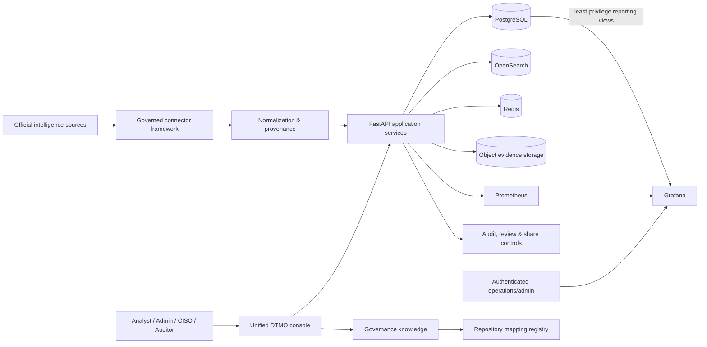

# DTMO

## Dutch Threat Monitoring for Education

**DTMO** is an open Cyber Threat Intelligence platform for the education sector. It combines vulnerability intelligence, vendor advisories, provenance, operational health, investigation and governance in one controlled platform.

**Release candidate:** `16.0.0rc12`  
**Engineering status:** Phases 1–7 accepted; RC13.1–RC13.4 accepted; RC13.5 functional acceptance in progress  
**External staging:** `PAUSED_PENDING_RC13`  
**License:** Apache-2.0

> **Current release decision:** DTMO is not production ready and is not yet ready for external staging/pentest acceptance. RC13.5 must prove the complete repaired canonical-console journey on one exact head, followed by an accountable project-owner functional retest.

## Product scope

DTMO is designed for security operations, threat intelligence, administration and governance teams while preserving explicit authority boundaries.

- **Unified threat intelligence** — normalized records from official public and vendor security sources.
- **Governed source framework** — bounded adapters, registration, execution, provenance and connector health.
- **Threat investigation** — canonical recent intelligence plus governed OpenSearch-backed search.
- **Operational administration** — source configuration/execution plus governed principal/role assignment management in the canonical console.
- **Visual analytics** — native DTMO statistics and charts inside the canonical DTMO session. Grafana remains an authenticated operational/advanced component and is not a prerequisite for normal product analytics.
- **Governance knowledge** — repository-backed framework coverage, internal mappings and authority boundaries without inferred external framework equivalence.
- **Auditability and provenance** — source identity, request correlation, retained evidence and controlled state transitions.
- **Separation of duties** — ingestion, analysis, review and external share approval remain distinct authorities.

## Architecture

The architecture separates collection, normalization, application services, persistence/search, observability and human governance. Technical execution never grants publication authority. Normal console analytics are native DTMO views; Grafana remains behind its own authenticated operational boundary.

See [`docs/architecture/SYSTEM_ARCHITECTURE.md`](docs/architecture/SYSTEM_ARCHITECTURE.md).

## Intelligence source framework

The operational catalog contains governed built-in or framework adapters for CISA, NIST/NVD, GitHub, NCSC-NL, CERT-EU, Microsoft, Cisco, Red Hat, Ubuntu, Debian, Apple, Chrome, Mozilla, Fortinet, Palo Alto Networks and Broadcom/VMware. Research publications can remain visible as non-executable reference sources.

Credentialed adapters persist only logical secret references. Runtime secret values are not stored in the catalog or registry.

Authoritative source status: [`docs/qa/SOURCE_CONNECTION_MATRIX.md`](docs/qa/SOURCE_CONNECTION_MATRIX.md).

## RC13 functional acceptance

Project-owner testing on 2026-08-11 showed that repository-controlled component success did not yet prove a usable product journey. RC13 therefore adds browser-tested functional acceptance before Phase 8.

1. **RC13.1 — source-to-intelligence path — PASS.** PR #151 merged as `95c4a5b072d141f50a02d23f8bf9abb862d6f8e2`.
2. **RC13.2 — single-session visual analytics — PASS.** PR #152 merged as `b8c254c5d099cde5dca624aa85b17c320594847e`; native analytics are canonical and normal product use performs no Grafana request/login journey.
3. **RC13.3 — Administration/RBAC — PASS.** PR #153 merged as `2e1029a43f7b44d8525fb89197d0a10458a3e992`; governed managed-principal/role administration and token-reconciliation boundaries are accepted.
4. **RC13.4 — Governance knowledge surface — PASS.** PR #154 merged as `21672aaf1cf097228699810660eaac167da842d6` after complete exact-head success on `0a227cb9f3972504287a6f7f064d6df18b76fbed`, including RC4 Quality Gate #813, RC13 Governance Knowledge Surface Gate #3 and Open Source Governance Gate #278.
5. **RC13.5 — full functional browser acceptance — CURRENT / PENDING_CI.** `RC13 Full Functional Console Acceptance Gate` must execute one Chromium browser context across Overview → Intelligence → Sources & Catalog → source register/enable/run → Intelligence update → Visual analytics → Administration → Governance → Overview state confirmation.

RC13.5 CI remains synthetic repository-controlled evidence. After exact-head success and merge, the accountable project owner must functionally retest the repaired local product. Phase 8 cannot reopen before that explicit owner acceptance.

Tracking: issue #150 and [`docs/qa/RC13_FUNCTIONAL_CONSOLE_ACCEPTANCE_GATE.md`](docs/qa/RC13_FUNCTIONAL_CONSOLE_ACCEPTANCE_GATE.md).

## Governance mapping model

[`docs/governance/GOVERNANCE_MAPPING_REGISTRY.md`](docs/governance/GOVERNANCE_MAPPING_REGISTRY.md) is the repository authority for Governance coverage and mapping claims.

- **Normenkader IBP:** `UNMAPPED` — no control-level repository crosswalk exists yet.
- **MITRE ATT&CK:** `UNMAPPED` — no technique-level repository mapping dataset exists yet.
- **CVSS:** `CONTEXT_ONLY` — canonical ingest exposes severity/free metadata but no first-class CVSS vector/base-score field.
- **DTMO security & release governance:** `MAPPED_INTERNAL` — internal governance mappings point to explicit repository evidence.

Missing mappings are visible evidence. DTMO does not infer framework/control/technique equivalence from semantic similarity, tags or free metadata.

## Security and governance model

DTMO preserves:

- role-based access control and least privilege;
- code-controlled built-in roles;
- human-admin authorization for managed role assignments;
- strict service-account/human-role separation;
- administrator self-management and final-admin protections;
- separate human review and external share approval;
- provenance, confidence, privacy and data minimization;
- tamper-evident auditability and request correlation;
- no publication authority from connectors, CI, dashboards, Administration, Governance or staging access;
- no anonymous Grafana access or authentication bypass for convenience.

See [`SECURITY.md`](SECURITY.md) and [`docs/security/SECURITY_OVERVIEW.md`](docs/security/SECURITY_OVERVIEW.md).

## Engineering workflow

Every change is delivered as a bounded pull request and must pass the registered **exact-head** workflow set before expected-head protected merge. Configured, queued, cancelled, failed, skipped, stale or inferred evidence is never `PASS`.

RC13.5 adds **RC13 Full Functional Console Acceptance Gate**, whose evidence records the exact PR head, one Chromium browser context, the complete canonical journey and the explicit requirement for a separate project-owner functional retest.

## Project status

| Phase | Scope | Status |
|---|---|---|
| 1–7 | Repository-controlled engineering | ✅ `PASS` |
| RC13 | Functional unified-console acceptance | 🔴 `BLOCKED_INTERNAL` — RC13.1–RC13.4 accepted; RC13.5 current |
| 8 | Real staging acceptance | ⏸ `PAUSED_PENDING_RC13` |
| 9 | Independent external assurance | ⏳ `NOT COMPLETE` |
| 10 | Production go/no-go | ⏳ `NOT STARTED` |

The only current priority is **RC13.5 — exact-head full canonical-console browser acceptance, followed by accountable project-owner functional retest**.

## Documentation

Start with [`docs/README.md`](docs/README.md). Key records include [`docs/project/CURRENT_STATE.md`](docs/project/CURRENT_STATE.md), [`docs/roadmap/PRODUCTION_ROADMAP.md`](docs/roadmap/PRODUCTION_ROADMAP.md), [`docs/qa/RC13_FUNCTIONAL_CONSOLE_ACCEPTANCE_GATE.md`](docs/qa/RC13_FUNCTIONAL_CONSOLE_ACCEPTANCE_GATE.md), [`docs/governance/GOVERNANCE_MAPPING_REGISTRY.md`](docs/governance/GOVERNANCE_MAPPING_REGISTRY.md), [`docs/architecture/SYSTEM_ARCHITECTURE.md`](docs/architecture/SYSTEM_ARCHITECTURE.md) and [`docs/traceability/TRACEABILITY_MATRIX.md`](docs/traceability/TRACEABILITY_MATRIX.md).

## Running and deployment

The repository includes a Docker Compose reference environment for engineering and validation. Deployment, secret material, platform hardening and production-equivalent staging acceptance are governed separately. See [`docs/operations/OPERATIONS_MANUAL.md`](docs/operations/OPERATIONS_MANUAL.md).

## Open source and responsible use

DTMO is licensed under the **Apache License, Version 2.0** (`Apache-2.0`). The repository governance entry points are `LICENSE`, `NOTICE`, `SECURITY.md`, `CONTRIBUTING.md`, `CODE_OF_CONDUCT.md`, `SUPPORTED_VERSIONS.md`, `docs/legal/LICENSING.md` and `docs/legal/THIRD_PARTY.md`.

Use DTMO only with lawful access to intelligence sources and infrastructure. A technically successful connector does not itself establish legal permission to collect, process or redistribute third-party material.
