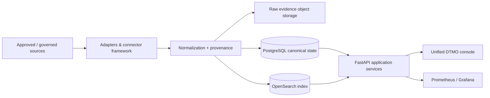

# DTMO — Dutch Threat Monitoring for Education

DTMO is an open Cyber Threat Intelligence (CTI) platform for education-sector security teams. It combines governed threat-source operations, canonical intelligence, provenance, vulnerability intelligence, investigation, visual analytics, role-based administration and governance evidence in one controlled application.

> **Software baseline:** `16.0.0rc12` with accepted post-RC13 and E8 repository enhancements  
> **Engineering baseline:** Phases 1–7 `PASS`  
> **Functional acceptance:** RC13 `PASS / OWNER_ACCEPTED`  
> **Product evolution:** E8.1–E8.10 `PASS / REPOSITORY_COMPLETE`  
> **Production-readiness position:** Phase 8 repository contracts complete; accountable external Phase 8 acceptance still required  
> **Independent assurance:** Phase 9 `NOT COMPLETE`  
> **Production status:** **not production ready**

## Why DTMO

Education environments combine broad digital estates, sensitive information, cloud dependencies and a threat landscape ranging from opportunistic exploitation to targeted campaigns. DTMO is designed to turn heterogeneous public and governed intelligence sources into traceable, reviewable and operationally useful security intelligence while preserving authorization, privacy, provenance and publication controls.

DTMO is built around five principles:

1. **Provenance first** — source identity and evidence remain traceable through ingestion, normalization, correlation and presentation.
2. **Fail closed** — missing evidence, invalid contracts, incomplete acceptance or unknown state never become implicit success.
3. **Human authority remains human** — ingestion, analytics, Administration, CI and staging access do not grant publication or external-sharing authority.
4. **Least privilege by design** — human and service identities are separated and privileged operations remain auditable.
5. **Evidence-based governance** — framework relationships are explicit, versioned and provenance-backed; mappings are not inferred from free text or semantic similarity.

## Product capabilities

### Unified security console

The canonical web application provides one operator experience for:

- **Overview** — security/intelligence KPIs, severity, source state, vulnerability trends and recent intelligence;
- **Intelligence** — normalized records with provenance, classification, vulnerability/CTI context and investigation support;
- **Sources & Catalog** — curated sources, governed registration, activation and execution;
- **Visual Analytics** — native severity, source, connector, review, CVSS/EPSS/KEV and vulnerability trend analytics;
- **Administration** — governed principals, roles, permissions and privileged-action protections;
- **Governance** — versioned framework knowledge, explicit mappings and evidence boundaries.

### Intelligence and CTI ecosystem

The repository-complete product baseline includes governed integrations and semantics for OpenCVE, CIRCL Vulnerability-Lookup, MISP and AIL, together with vulnerability prioritization and analytics. MISP outbound sharing remains separately governed and human-approved; AIL integration remains bounded to governed read/enrichment/correlation behavior rather than autonomous crawling or mutation.

### Intelligence pipeline



PostgreSQL is the canonical application truth. OpenSearch is the search/index representation, object storage preserves raw evidence, Redis supports coordination, and Prometheus/Grafana provide operational observability.

### Security and governance

DTMO preserves server-side RBAC, least privilege, human/service-account separation, bearer-token trust validation, privileged Administration safeguards, request correlation, auditable security-relevant actions, provenance/confidence preservation, data minimization and distinct review/external-share authority.

The governance model includes explicit versioned relationships to Normenkader IBP, MITRE ATT&CK, NIST CSF and vulnerability-scoring/context semantics such as CVSS. E8.10 adds repository-backed vulnerability-management evidence mapping, including Normenkader IBP SM.07, while explicitly avoiding broader compliance, maturity or certification claims.

## Architecture

The reference platform consists of Python 3.12+, FastAPI/Uvicorn, SQLAlchemy/Alembic, PostgreSQL, Redis, OpenSearch, S3-compatible object storage, Prometheus, separately authenticated Grafana, Nginx and a Docker Compose reference topology.

See [System Architecture](docs/architecture/SYSTEM_ARCHITECTURE.md) and [Security Overview](docs/security/SECURITY_OVERVIEW.md) for component responsibilities, trust boundaries and deployment/security assumptions.

## Current maturity and release position

| Stage | Scope | Status |
|---|---|---|
| Phases 1–7 | Repository-controlled engineering baseline | `PASS` |
| RC13 | Unified-console functional acceptance | `PASS / OWNER_ACCEPTED` |
| E8.1–E8.10 | Vulnerability & CTI product evolution | `PASS / REPOSITORY_COMPLETE` |
| Post-E8 staging deployment | Externally deployed/tested production-equivalent staging environment | `PASS / OWNER_VERIFIED_EXTERNAL_EVIDENCE` |
| Phase 8.2–8.4 | Platform/identity, source-to-intelligence and operations/recovery contracts | `REPOSITORY CONTRACT COMPLETE / EXTERNAL ACCEPTANCE REQUIRED` |
| Phase 8.5 | Accountable staging acceptance contract | `REPOSITORY CONTRACT COMPLETE / EXTERNAL OWNER DECISION REQUIRED` |
| Phase 9 | Independent external assurance | `NOT COMPLETE` |
| Phase 10 | Formal production go/no-go | `NOT STARTED` |

The remaining Phase 8 requirement is not more repository feature development. It is completion and accountable acceptance of the external evidence package against one immutable staging deployment identity, including exact deployed commit/release, image digests, runtime identity, configuration/security evidence and the external validation results covered by the 8.2–8.4 contracts.

Repository CI, Docker Compose, staging emulators and synthetic browser fixtures are supporting engineering evidence only. They cannot substitute for accountable external Phase 8 acceptance or independent Phase 9 assurance.

## Product roadmap

The current priority sequence is:

1. complete and accept the Phase 8 external evidence package against one immutable staging identity;
2. record Phase 8.5 accountable staging acceptance;
3. execute Phase 9 independent external assurance, including penetration testing and agreed hardening/resilience/IAM reviews;
4. remediate/retest release-blocking findings and disposition residual risk;
5. conduct the formal Phase 10 production go/no-go decision.

See the [Production Roadmap](docs/roadmap/PRODUCTION_ROADMAP.md) and [Production Readiness Report](docs/project/PRODUCTION_READINESS_REPORT.md).

## Documentation

The authoritative professional documentation portal is [docs/README.md](docs/README.md). Key documents are:

- [Current Project State](docs/project/CURRENT_STATE.md)
- [Executive Status](docs/project/EXECUTIVE_STATUS.md)
- [Executive Decision View](docs/project/EXECUTIVE_DECISION_VIEW.md)
- [System Architecture](docs/architecture/SYSTEM_ARCHITECTURE.md)
- [Security Overview](docs/security/SECURITY_OVERVIEW.md)
- [Governance Mapping Registry](docs/governance/GOVERNANCE_MAPPING_REGISTRY.md)
- [Production Readiness Report](docs/project/PRODUCTION_READINESS_REPORT.md)
- [Production Checklist](docs/project/PRODUCTION_CHECKLIST.md)
- [QA and Release Gates](docs/qa/QA_AND_RELEASE_GATES.md)
- [Evidence Index](docs/evidence/EVIDENCE_INDEX.md)
- [Production Roadmap](docs/roadmap/PRODUCTION_ROADMAP.md)

Point-in-time PR/CI/run chronology remains under `docs/development/`, GitHub issues/pull requests and CI artifacts. Historical evidence is retained rather than rewritten to match later decisions.

## Local reference environment

```bash
git clone https://github.com/GJvManen/dtmo.git
cd dtmo
python3 tools/bootstrap_local.py
docker compose up --build
```

The local Compose topology is a development/reference environment only. Development credentials, compatibility exceptions and bootstrap identities must not be propagated into staging or production.

## Open source and responsible use

DTMO is licensed under the **Apache License, Version 2.0**. The canonical open-source governance and legal entry points are:

- [`LICENSE`](LICENSE)
- [`NOTICE`](NOTICE)
- [`SECURITY.md`](SECURITY.md)
- [`CONTRIBUTING.md`](CONTRIBUTING.md)
- [`CODE_OF_CONDUCT.md`](CODE_OF_CONDUCT.md)
- [`SUPPORTED_VERSIONS.md`](SUPPORTED_VERSIONS.md)
- [`docs/legal/LICENSING.md`](docs/legal/LICENSING.md)
- [`docs/legal/THIRD_PARTY.md`](docs/legal/THIRD_PARTY.md)

Use DTMO only with lawful access to intelligence sources and infrastructure. Technical connectivity does not itself establish legal authority to collect, process, publish or redistribute third-party material.
