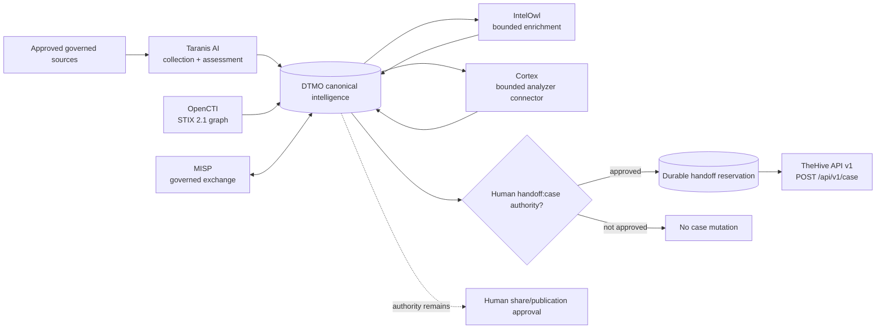
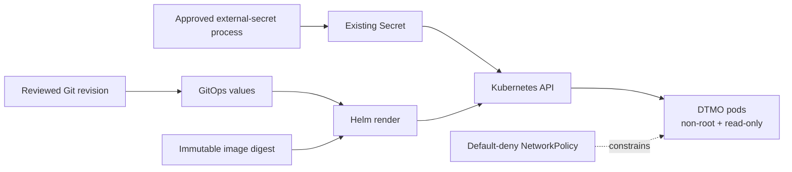

# DTMO — Dutch Threat Monitoring for Education

DTMO is an open Cyber Threat Intelligence (CTI) platform for education-sector security teams. It combines governed threat-source operations, canonical intelligence, provenance, vulnerability intelligence, investigation, visual analytics, role-based administration and governance evidence in one controlled application.

> **Software baseline:** `16.0.0rc12` with accepted post-RC13, E8 and Phase 11 repository enhancements  
> **Engineering baseline:** Phases 1–7 `PASS`  
> **Functional acceptance:** RC13 `PASS / OWNER_ACCEPTED`  
> **Product evolution:** E8.1–E8.10 `PASS / REPOSITORY_COMPLETE`  
> **Historical staging evidence:** Phase 8 `PASS / OWNER_ACCEPTED`  
> **Historical independent assurance:** Phase 9 `PASS / EXTERNAL_ASSURANCE_ACCEPTED`  
> **Phase 10 production decision:** `NO-GO / BLOCKED — PLATFORM INDUSTRIALISATION REQUIRED`  
> **Phase 11.3 IntelOwl integration:** `PASS / REPOSITORY_COMPLETE`  
> **Phase 11.4 OpenCTI integration:** `PASS / REPOSITORY_COMPLETE`  
> **Phase 11.5 MISP consolidation:** `PASS / REPOSITORY_COMPLETE`  
> **Phase 11.6 TheHive:** `PASS / REPOSITORY_COMPLETE`  
> **Phase 11.7 Cortex decision:** `PASS / REPOSITORY_COMPLETE — HISTORICAL DECISION BASELINE`  
> **Phase 11.7b Cortex analyzer connector:** `PASS / REPOSITORY_COMPLETE`  
> **Active bounded priority:** Phase 11.8a Kubernetes/Helm/GitOps runtime foundation `IN PROGRESS / EXACT-HEAD VALIDATION REQUIRED`  
> **Next production authorization:** Phase 12 `NOT STARTED`  
> **Production status:** **not production authorized**

## Why DTMO

Education environments combine broad digital estates, sensitive information, cloud dependencies and a threat landscape ranging from opportunistic exploitation to targeted campaigns. DTMO turns heterogeneous governed intelligence into traceable, reviewable and operationally useful security intelligence while preserving authorization, privacy, provenance and publication controls.

DTMO is built around five principles: provenance first; fail closed; human authority remains human; least privilege by design; and evidence-based governance.

## Product capabilities

The canonical web application provides one operator experience for Overview, Intelligence, Sources & Catalog, Visual Analytics, Administration and Governance. The repository-complete baseline includes governed OpenCVE, CIRCL Vulnerability-Lookup, MISP and AIL semantics plus Phase 11 Taranis AI collection/canonicalization, IntelOwl enrichment, OpenCTI graph integration, governed MISP consolidation, human-authorized TheHive case handoff and the accepted bounded Cortex analyzer connector.

The original Phase 11.7 decision did not adopt Cortex because no validated IntelOwl capability gap existed at that time. The later owner-required Phase 11.7b connector was accepted separately without rewriting that historical decision.

## Phase 11 composed intelligence pipeline



PostgreSQL remains canonical DTMO application truth. Taranis AI, IntelOwl, Cortex, OpenCTI, MISP and TheHive are separate service boundaries. None independently establishes local compromise or grants DTMO external-share/publication authority.

## Phase 11.8a Kubernetes/Helm/GitOps runtime foundation

The active bounded slice introduces `deploy/helm/dtmo` plus GitOps-owned overrides under `deploy/gitops/phase11-8`. The chart requires an immutable image digest, consumes an existing runtime Secret instead of storing secrets in Git, runs DTMO non-root with a read-only root filesystem and dropped capabilities, disables service-account token automounting, defines probes/resources, supplies a PodDisruptionBudget and enables fail-closed NetworkPolicy with explicit external CIDR allowlisting.



This foundation is not evidence of stateful/multi-zone HA, live workload identity, secret-provider entitlement, ingress/TLS, centralized observability, backup/recovery objectives, SBOM/scanning/signing/attestation, capacity or exercised upgrade/rollback. Those remain later bounded Phase 11.8 slices.

See [Phase 11.8 Runtime Foundation Architecture](docs/architecture/PHASE11_8_RUNTIME_FOUNDATION.md), [Kubernetes Runtime Configuration](docs/administration/KUBERNETES_RUNTIME_CONFIGURATION.md), [Runtime Foundation Runbook](docs/operations/PHASE11_8_RUNTIME_FOUNDATION_RUNBOOK.md) and [Phase 11.8 Runtime Foundation Gate](docs/qa/PHASE11_8_RUNTIME_FOUNDATION_GATE.md).

## Architecture

The current DTMO reference platform consists of Python 3.12+, FastAPI/Uvicorn, SQLAlchemy/Alembic, PostgreSQL, Redis, OpenSearch, S3-compatible object storage, Prometheus/Grafana, Nginx and a Docker Compose reference topology. Phase 11 industrialisation adds a governed Kubernetes/Helm/GitOps runtime target while preserving the separate Taranis AI, IntelOwl, Cortex, OpenCTI, MISP and TheHive service boundaries.

## Current maturity and release position

| Stage | Scope | Status |
|---|---|---|
| Phases 1–7 | Repository-controlled engineering baseline | `PASS` |
| RC13 | Unified-console functional acceptance | `PASS / OWNER_ACCEPTED` |
| E8.1–E8.10 | Vulnerability & CTI product evolution | `PASS / REPOSITORY_COMPLETE` |
| Phase 8 | Production-equivalent staging validation | `PASS / OWNER_ACCEPTED — HISTORICAL CANDIDATE` |
| Phase 9 | Independent assurance | `PASS / EXTERNAL_ASSURANCE_ACCEPTED — HISTORICAL CANDIDATE` |
| Phase 10 | Formal production go/no-go | `NO-GO / BLOCKED — PLATFORM INDUSTRIALISATION REQUIRED` |
| Phase 11.1–11.2 | Taranis architecture + canonical adapter | `PASS / REPOSITORY_COMPLETE` |
| Phase 11.3 | IntelOwl enrichment integration | `PASS / REPOSITORY_COMPLETE` |
| Phase 11.4 | OpenCTI STIX knowledge-graph integration | `PASS / REPOSITORY_COMPLETE` |
| Phase 11.5 | MISP consolidation and authority state | `PASS / REPOSITORY_COMPLETE` |
| Phase 11.6 | TheHive incident/case handoff | `PASS / REPOSITORY_COMPLETE` |
| Phase 11.7 | Cortex conditional decision | `PASS / REPOSITORY_COMPLETE — HISTORICAL DECISION BASELINE` |
| Phase 11.7b | Owner-required Cortex analyzer connector | `PASS / REPOSITORY_COMPLETE` |
| Phase 11.8a | Kubernetes/Helm/GitOps runtime foundation | `IN PROGRESS / EXACT-HEAD VALIDATION REQUIRED` |
| Phase 12 | New formal production go/no-go | `NOT STARTED` |

Historical Phase 8/9 evidence remains bound to the earlier candidate. Fresh Phase 11.10 production-equivalent validation and Phase 11.11 independent external assurance remain required before Phase 12.

## Product roadmap

The controlled sequence is accepted service integration → Phase 11.8 runtime industrialisation → 11.9 migration/compatibility → 11.10 new production-equivalent validation → 11.11 new independent external assurance → Phase 12.

See the [Platform Industrialisation Roadmap](docs/roadmap/PLATFORM_INDUSTRIALISATION_ROADMAP.md), [Current Project State](docs/project/CURRENT_STATE.md), [QA and Release Gates](docs/qa/QA_AND_RELEASE_GATES.md) and [Evidence Index](docs/evidence/EVIDENCE_INDEX.md).

## Documentation

The authoritative documentation portal is [docs/README.md](docs/README.md). Historical point-in-time records remain historical and are not rewritten to claim later Phase 11 evidence.

## Local reference environment

```bash
git clone https://github.com/GJvManen/dtmo.git
cd dtmo
python3 tools/bootstrap_local.py
docker compose up --build
```

The local Compose topology is a development/reference environment only.

## Open source and responsible use

DTMO is licensed under the **Apache License, Version 2.0**. Canonical governance and legal entry points remain:

- `LICENSE`
- `NOTICE`
- `SECURITY.md`
- `CONTRIBUTING.md`
- `CODE_OF_CONDUCT.md`
- `SUPPORTED_VERSIONS.md`
- `docs/legal/LICENSING.md`
- `docs/legal/THIRD_PARTY.md`

Taranis AI, IntelOwl, Cortex, OpenCTI, MISP and TheHive remain separate services under their applicable licensing and provider boundaries. IntelOwl and MISP remain separate AGPL-3.0 services; OpenCTI Community Edition is Apache-2.0 while Enterprise Edition is separately licensed; TheHive license entitlement is deployment-specific. Cortex itself remains a separate open-source service while individual analyzers and external providers can impose separate licensing, subscription or data-handling terms. Phase 11 integrations do not vendor upstream platform source without explicit licensing approval.

Use DTMO only with lawful access to intelligence sources and infrastructure. Technical connectivity does not itself establish legal authority to collect, process, enrich, synchronize, create cases, publish or redistribute third-party material.
