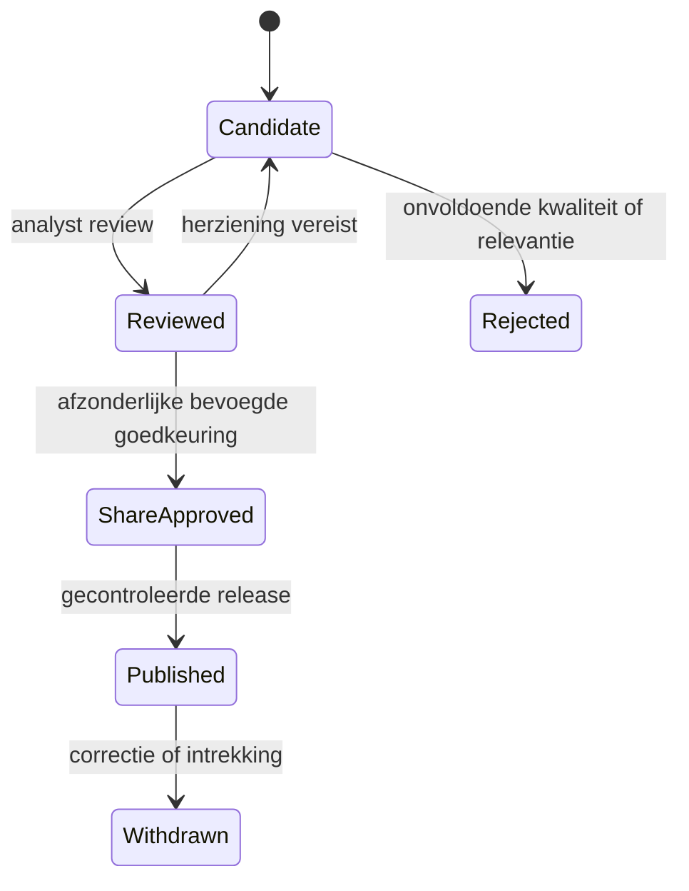
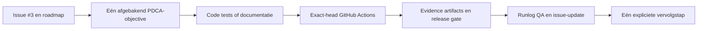

# DTMO

**Dutch Threat Monitoring for Education**

DTMO is een open, onderwijsgericht Cyber Threat Intelligence-platform voor historische incidenten, actuele intelligence, kwetsbaarheden, IOC's, leveranciersrisico en bestuurlijke rapportage.

## Actuele implementatiestatus

DTMO is ontwikkeld van RC4.1 tot en met RC6.1. De oorspronkelijke RC4-platformbasis is inmiddels uitgebreid met een canoniek intelligencemodel, productiegerichte identity- en securitycontrols, tamper-evidente auditing, privacy- en bewaartermijncontroles en aantoonbare PostgreSQL-backup en clean-environment restore.

### RC4-platformbasis

- **RC4.1:** FastAPI-platformbasis, configuratie, logging, scheduler, metrics, Docker Compose en CI;
- **RC4.2:** PostgreSQL/SQLAlchemy-persistentiemodellen, provenance en gecontroleerde share approval;
- **RC4.3:** immutable Intelligence Lake met SHA-256-receipts en integriteitscontrole;
- **RC4.4:** beheerde connectorcatalogus, reliabilityvalidatie en health snapshots;
- **RC4.5:** evidence-backed Knowledge Graph en begrensde attack-pathqueries;
- **RC4.6:** responsieve SOC/CTI-workspace voor intelligence, CVE's, IOC's, graph en hunting;
- **RC4.7:** RBAC, scheiding van review en share approval, evidence-gated reporting en exports;
- **RC4.8:** migraties, MinIO, OpenSearch en beveiligde intelligence-ingestion/search API.

### RC5 application security, identity en privacy

RC5.1 tot en met RC5.12 zijn aantoonbaar groen en gemerged. De implementatie bevat onder meer:

- canonieke intelligenceclassificatie en deterministische confidence scoring;
- least-privilege RBAC en scheiding van review, share approval en beheer;
- trusted principal JWT-validatie met asymmetric JWKS-keyrotatie;
- tokenrevocation, replay-state enforcement en herstel uit durable evidence;
- persistente append-only en cryptografisch gekoppelde security-auditrecords;
- transactionele auditregistratie van review-, publicatie- en autorisatiebeslissingen;
- privacy-minimalisatie, purpose-bound pseudonimisering, retention en legal hold;
- storage-layer purge van geminimaliseerde projecties zonder immutable bronauditrecords te verwijderen.

**Phase 2 — Application security, identity en privacy: `PASS`.**

### RC6 data-integriteit, backup en recovery

**RC6.1** levert aantoonbare PostgreSQL-backup en clean-environment restore:

- custom-format `pg_dump` met SHA-256-digest;
- herstel naar een aantoonbaar lege PostgreSQL-database;
- fail-fast `pg_restore`;
- deterministische vergelijking van intelligence, provenance, auditrecords en Alembic-state;
- cryptografische verificatie van de herstelde auditketen en tail-hash;
- behoud van provenance-contenthashes, reviewstatus en human share approval;
- gemeten restoreduur en machine-readable recovery-evidence;
- releaseblokkerende `postgres-restore` Quality Gate.

Quality Gate **#229** is geslaagd op exacte head `d1d0e809ffcee6458cb8a8f31ad2d10d481fefb0`. PR **#22** is gemerged naar `main` als `3441e5be486fd9bcca8ab1d8f531ca8e5d38958b`.

**RC6.1: `PASS`.**

## Roadmapstatus

| Fase | Status |
|---|---|
| 1. CI en workflow-integriteit | `PASS` |
| 2. Applicatiebeveiliging, identity en privacy | `PASS` |
| 3. Data-integriteit, backup en recovery | `IN PROGRESS` — PostgreSQL restore is bewezen; MinIO, OpenSearch en gecombineerde recovery ontbreken nog |
| 4. Live connectorbetrouwbaarheid en provenance | `NOT STARTED` |
| 5. Performance en schaalbaarheid | `NOT STARTED` |
| 6. Frontend accessibility en operationele UX | `NOT STARTED` |
| 7. Observability en incident operations | `NOT STARTED` |
| 8. Staging acceptance | `NOT STARTED` |
| 9. External assurance | `NOT STARTED` |
| 10. Production go/no-go | `BLOCKED` totdat alle voorgaande productiegates aantoonbaar zijn afgerond |

**Actuele volgende prioriteit:** clean-environment MinIO object backup en restore evidence met objectdigest- en provenance-referenceverificatie.

Zie voor de formele status:

- `docs/roadmap/PRODUCTION_ROADMAP.md`
- `docs/development/RUN_LOG.md`
- `docs/development/runs/RUN-20260806-040.md`
- `docs/qa/QA_AND_RELEASE_GATES.md`
- GitHub issues **#2** en **#3**

## System workflows

DTMO gebruikt expliciete workflows om brondata, intelligence, analyse, review, publicatie en softwareontwikkeling van elkaar te scheiden. Elke workflow behoudt provenance, auditgegevens en afzonderlijke releasegates.

### Intelligence ingestion



```mermaid
flowchart LR
    A[Open bron of connector] --> B[Fetch met timeout en retry]
    B --> C[Raw payload naar Intelligence Lake]
    C --> D[SHA-256 receipt en provenance]
    D --> E[Schema-validatie en normalisatie]
    E --> F[Deduplicatie en entity resolution]
    F --> G[PostgreSQL candidate record]
    G --> H[OpenSearch indexing]
    H --> I[Candidate queue voor analyst review]
```

Belangrijke invarianten:

- de originele bronpayload wordt vóór normalisatie bewaard;
- ieder raw object krijgt een hash en opslagreceipt;
- nieuwe intelligence start altijd als `candidate`;
- een indexeringsfout verwijdert geen raw of genormaliseerde data;
- bron, externe identifier, confidence en timestamps blijven herleidbaar.

### Analyst review en publicatie



Governancegrenzen:

- `reviewed` is nooit automatisch `share approved`;
- review en share approval zijn afzonderlijke RBAC-permissions;
- dezelfde principal mag niet zowel review als share approval uitvoeren;
- serviceaccounts mogen niet reviewen, delen goedkeuren of tokens intrekken;
- publicatie vereist een bevoegde menselijke beslissing;
- statusovergangen en autorisatieweigeringen worden append-only geaudit.

### Continuous development en Quality Gates



Een geconfigureerde maar niet uitgevoerde test is nooit `PASS`. Elke branch vereist eigen exact-head evidence. De aggregate release gate faalt gesloten wanneer een verplichte job of artifact ontbreekt.

## Beveiligde API

De versioned API verbindt raw storage, persistence en search. Relevante routes omvatten onder meer:

- `POST /api/v1/intelligence`
- `GET /api/v1/intelligence/search`
- review- en share-approvalroutes met functiescheiding;
- `/api/v1/security/tokens/revoke` voor bevoegde operationele tokenrevocation.

Productie gebruikt trusted bearer principals, route-level RBAC, fail-closed tokenstate en human share approval. Ingestion levert uitsluitend candidate intelligence op.

## Snel starten

```bash
git clone https://github.com/GJvManen/dtmo.git
cd dtmo
cp .env.example .env
docker compose up --build
```

Daarna:

- API: `http://localhost:8000`
- OpenAPI: `http://localhost:8000/docs`
- Health: `http://localhost:8000/health`
- Metrics: `http://localhost:8000/metrics`
- MinIO Console: `http://localhost:9001`
- Prometheus: `http://localhost:9090`

Live connectoren staan standaard uit. Productie vereist onder meer sterke secret-managed identity-, signing-, pseudonymization-, storage- en databaseconfiguratie. Zie `.env.example` en de productievalidatie in `backend/dtmo/config.py`.

## Repositorystructuur

```text
backend/dtmo/                 API, auth, audit, privacy, connectors, persistence, lake, graph en reporting
backend/tests/                unit-, contract-, security- en regressietests
frontend/                     SOC/CTI-workspace
infrastructure/               monitoring en geplande operationele taken
database/migrations/          Alembic-databasemigraties
tools/                        verificatie- en recoverytools
.github/workflows/            releasekritieke CI en onafhankelijke CI-observer
docs/                         roadmap, QA, architectuur, governance en PDCA-runlogs
releases/                     release-evidence en historische release-informatie
```

## Quality Gates

GitHub Actions controleert aantoonbaar:

1. Ruff-linting;
2. strict MyPy typing;
3. Pytest met coverage-drempel;
4. security-, governance-, privacy- en workflowcontracten;
5. Alembic upgrade/downgrade/re-upgrade tegen PostgreSQL;
6. Python compile checks;
7. containerbuild en `/health` smoketest;
8. dependency audit met retained JSON-evidence;
9. clean-target PostgreSQL backup, restore en integriteitsverificatie;
10. fail-closed aggregate release gate met retained evidence-artifact.

## Productiestatus

DTMO is nog niet productiegereed. Productie blijft geblokkeerd totdat de resterende recovery-, connector-, performance-, accessibility-, observability-, staging- en assurancegates aantoonbaar zijn afgerond. De actuele voortgang en precies één volgende prioriteit worden bijgehouden in issue **#3**, gecoördineerd met issue **#2** en de repositorydocumentatie.
