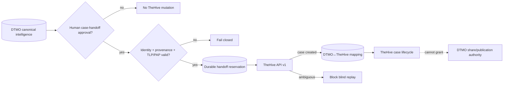

# DTMO Documentation Portal

This directory contains the authoritative professional documentation for Dutch Threat Monitoring for Education (DTMO). Stable product, architecture, security, governance and readiness documentation is separated from immutable operational history and CI evidence.

## Current controlled baseline

| Area | Current state |
|---|---|
| Software baseline | `16.0.0rc12` plus accepted post-RC13/E8/Phase-11 repository enhancements |
| Phases 1–7 | `PASS` |
| RC13 functional product acceptance | `PASS / OWNER_ACCEPTED` |
| E8.1–E8.10 | `PASS / REPOSITORY_COMPLETE` |
| Phase 8 production-equivalent staging | `PASS / OWNER_ACCEPTED` |
| Phase 9 independent assurance | `PASS / EXTERNAL_ASSURANCE_ACCEPTED` |
| Phase 10 production go/no-go | `NO-GO / BLOCKED — PLATFORM INDUSTRIALISATION REQUIRED` |
| Phase 11.1–11.5 | `PASS / REPOSITORY_COMPLETE` |
| Phase 11.6 TheHive handoff contract | `IN PROGRESS / EXACT-HEAD VALIDATION REQUIRED` |
| Phase 12 production go/no-go | `NOT STARTED` |
| Production readiness | **not production authorized** |

The active bounded programme step is **Phase 11.6 TheHive incident/case handoff contract**. Phase 10 did not grant production authorization. Fresh Phase 11.10 production-equivalent validation and Phase 11.11 independent external assurance remain required before Phase 12.

## Start here

| Audience | Primary documents |
|---|---|
| Executive / sponsor | [Executive Status](project/EXECUTIVE_STATUS.md), [Executive Decision View](project/EXECUTIVE_DECISION_VIEW.md), [Production Readiness Report](project/PRODUCTION_READINESS_REPORT.md) |
| Product / delivery | [Product Guide](product/PRODUCT_GUIDE.md), [Platform Industrialisation Roadmap](roadmap/PLATFORM_INDUSTRIALISATION_ROADMAP.md), [Current State](project/CURRENT_STATE.md), [Production Roadmap](roadmap/PRODUCTION_ROADMAP.md) |
| Analyst / reviewer | [User Guide](user/USER_GUIDE.md), [IntelOwl Governed Enrichment Workflow](user/INTELOWL_ENRICHMENT_WORKFLOW.md), [TheHive Handoff Integration](integrations/THEHIVE_HANDOFF.md), [System Workflows](architecture/SYSTEM_WORKFLOWS.md), [Screenshot Catalogue](visual/screenshots/README.md) |
| Administrator | [Administrator Guide](administration/ADMINISTRATOR_GUIDE.md), [IntelOwl Enrichment Runbook](operations/INTELOWL_ENRICHMENT_RUNBOOK.md), [OpenCTI Integration Runbook](operations/OPENCTI_INTEGRATION_RUNBOOK.md), [TheHive Handoff Operations Runbook](operations/THEHIVE_HANDOFF_RUNBOOK.md), [Security Overview](security/SECURITY_OVERVIEW.md) |
| Architecture / engineering | [TheHive → DTMO Handoff Contract](architecture/THEHIVE_DTMO_HANDOFF_CONTRACT.md), [MISP → DTMO Consolidation Contract](architecture/MISP_DTMO_CONSOLIDATION_CONTRACT.md), [OpenCTI → DTMO Integration Contract](architecture/OPENCTI_DTMO_INTEGRATION_CONTRACT.md), [OpenCTI Integration](integrations/OPENCTI_INTEGRATION.md), [IntelOwl → DTMO Integration Contract](architecture/INTELOWL_DTMO_INTEGRATION_CONTRACT.md), [Taranis → DTMO Contract](architecture/TARANIS_DTMO_INTEGRATION_CONTRACT.md) |
| Security / CISO | [Security Overview](security/SECURITY_OVERVIEW.md), [Threat Model](security/THREAT_MODEL.md), [Risk Register](security/RISK_REGISTER.md), [TheHive → DTMO Handoff Contract](architecture/THEHIVE_DTMO_HANDOFF_CONTRACT.md) |
| Governance / compliance | [Governance Mapping Registry](governance/GOVERNANCE_MAPPING_REGISTRY.md), [Data Classification & Retention](governance/DATA_CLASSIFICATION_RETENTION.md) |
| QA / release | [QA and Release Gates](qa/QA_AND_RELEASE_GATES.md), [Phase 11.4 OpenCTI Contract Gate](qa/PHASE11_4_OPENCTI_CONTRACT_GATE.md), [Phase 11.5 MISP Consolidation Contract Gate](qa/PHASE11_5_MISP_CONSOLIDATION_CONTRACT_GATE.md), [Phase 11.6 TheHive Handoff Contract Gate](qa/PHASE11_6_THEHIVE_HANDOFF_CONTRACT_GATE.md), [Production Checklist](project/PRODUCTION_CHECKLIST.md), [Evidence Index](evidence/EVIDENCE_INDEX.md) |
| Operations | [Operating Model](operations/OPERATING_MODEL.md), [Operations Manual](operations/OPERATIONS_MANUAL.md), [IntelOwl Enrichment Runbook](operations/INTELOWL_ENRICHMENT_RUNBOOK.md), [OpenCTI Integration Runbook](operations/OPENCTI_INTEGRATION_RUNBOOK.md), [TheHive Handoff Operations Runbook](operations/THEHIVE_HANDOFF_RUNBOOK.md) |

The governed screenshot catalogue now contains UI-01 through UI-10 and remains the controlled visual reference for accepted operator journeys. These governed screenshots are documentation illustrations rather than proof of live-source connectivity, staging acceptance or production readiness.

No synthetic screenshot is promoted for the Phase 11.6 contract slice because no accepted TheHive operator GUI or live handoff surface exists yet; creating one would falsely imply deployed functionality.

## Phase 11 programme documentation

- [Platform Industrialisation Roadmap](roadmap/PLATFORM_INDUSTRIALISATION_ROADMAP.md) defines the fixed Taranis → IntelOwl → OpenCTI → MISP → TheHive → conditional Cortex → runtime-industrialisation sequence.
- Phase 11.3 IntelOwl, Phase 11.4 OpenCTI and Phase 11.5 MISP are `PASS / REPOSITORY_COMPLETE` and remain accepted repository engineering boundaries only.
- [TheHive → DTMO Handoff Contract](architecture/THEHIVE_DTMO_HANDOFF_CONTRACT.md) defines the active Phase 11.6 service/API/identity/licensing/authority baseline.
- [TheHive Handoff Integration](integrations/THEHIVE_HANDOFF.md) explains the contract-only integration surface and candidate `POST /api/v1/case` path.
- [TheHive Handoff Operations Runbook](operations/THEHIVE_HANDOFF_RUNBOOK.md) defines prerequisites, fail-closed operation and ambiguous-delivery reconciliation before any runtime enablement.
- [Phase 11.6 TheHive Handoff Contract Gate](qa/PHASE11_6_THEHIVE_HANDOFF_CONTRACT_GATE.md) defines exact-head acceptance for the contract slice.
- [Evidence Index](evidence/EVIDENCE_INDEX.md) keeps repository evidence separate from deployment, assurance and production authorization evidence.

## Phase 11.6 TheHive trust boundary

## Security and authority invariants

- server-side RBAC and least privilege remain authoritative;
- human and service identities remain separate;
- credentials/tokens never belong in repository evidence, logs or screenshots;
- case-handoff approval is separate from publication/share approval;
- TheHive uses a dedicated least-privilege non-human service identity in any later runtime implementation;
- TheHive 5.3+ license entitlement is a deployment prerequisite and cannot be inferred from CI;
- stable DTMO and TheHive identities plus durable idempotency/reconciliation state are required before mutation retries;
- TLP/PAP/access restrictions cannot be broadened during handoff;
- blind replay after ambiguous mutation delivery is prohibited;
- TheHive case state never grants DTMO sharing authority or proves local compromise;
- responders, Cortex, automatic MISP→TheHive automation, external sharing and administration remain outside this slice;
- Taranis, IntelOwl, OpenCTI, MISP and TheHive remain separate services under their applicable licensing boundaries.

## Evidence and history model

Professional current-state documentation describes the present controlled state. Historical records under `docs/development/` and earlier Phase 8/9 evidence remain scoped to the candidate and moment they originally covered; they are not rewritten or reused as evidence for the materially changed Phase 11 candidate.

Repository CI and documentation-contract tests are engineering evidence only. They do not prove live TheHive connectivity, deployed credentials/roles, license entitlement, privacy approval, staging acceptance, independent assurance or production readiness.

## Maintenance rule

Whenever lifecycle state, architecture, security boundary, product scope or governance claims materially change, affected professional documents and documentation-contract tests must be reconciled in the same bounded PR before merge. See [Documentation Status and Authority](project/DOCUMENTATION_STATUS.md), [Documentation Standard](project/DOCUMENTATION_STANDARD.md) and [Visual Documentation Standard](visual/DOCUMENTATION_VISUAL_STANDARD.md).
