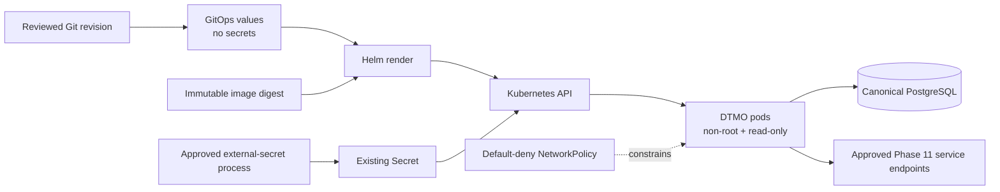

# DTMO Documentation Portal

This directory contains the authoritative professional documentation for Dutch Threat Monitoring for Education (DTMO). Stable product, architecture, security, governance and readiness documentation is separated from immutable operational history and CI evidence.

## Current controlled baseline

| Area | Current state |
|---|---|
| Software baseline | `16.0.0rc12` plus accepted post-RC13/E8/Phase-11 repository enhancements |
| Phases 1–7 | `PASS` |
| RC13 functional product acceptance | `PASS / OWNER_ACCEPTED` |
| E8.1–E8.10 | `PASS / REPOSITORY_COMPLETE` |
| Phase 8 production-equivalent staging | `PASS / OWNER_ACCEPTED — HISTORICAL CANDIDATE` |
| Phase 9 independent assurance | `PASS / EXTERNAL_ASSURANCE_ACCEPTED — HISTORICAL CANDIDATE` |
| Phase 10 production go/no-go | `NO-GO / BLOCKED — PLATFORM INDUSTRIALISATION REQUIRED` |
| Phase 11.3 IntelOwl integration | `PASS / REPOSITORY_COMPLETE` |
| Phase 11.4 OpenCTI integration | `PASS / REPOSITORY_COMPLETE` |
| Phase 11.5 MISP consolidation | `PASS / REPOSITORY_COMPLETE` |
| Phase 11.6 TheHive | `PASS / REPOSITORY_COMPLETE` |
| Phase 11.7 Cortex decision gate | `PASS / REPOSITORY_COMPLETE — HISTORICAL DECISION BASELINE` |
| Phase 11.7b Cortex analyzer connector | `PASS / REPOSITORY_COMPLETE` |
| Phase 11.8a runtime foundation | `IN PROGRESS / EXACT-HEAD VALIDATION REQUIRED` |
| Phase 12 production go/no-go | `NOT STARTED` |
| Production readiness | **not production authorized** |

The active bounded programme step is **Phase 11.8a Kubernetes/Helm/GitOps runtime foundation**. Earlier Phase 8/9 evidence remains historical and candidate-bound. Fresh Phase 11.10 production-equivalent validation and Phase 11.11 independent external assurance remain required before Phase 12.

## Start here

| Audience | Primary documents |
|---|---|
| Executive / sponsor | [Current State](project/CURRENT_STATE.md), [Platform Industrialisation Roadmap](roadmap/PLATFORM_INDUSTRIALISATION_ROADMAP.md), [Production Readiness Report](project/PRODUCTION_READINESS_REPORT.md) |
| Product / delivery | [Product Guide](product/PRODUCT_GUIDE.md), [Platform Industrialisation Roadmap](roadmap/PLATFORM_INDUSTRIALISATION_ROADMAP.md), [Current State](project/CURRENT_STATE.md) |
| Analyst / reviewer | [User Guide](user/USER_GUIDE.md), [IntelOwl Governed Enrichment Workflow](user/INTELOWL_ENRICHMENT_WORKFLOW.md), [TheHive Case Handoff Workflow](user/THEHIVE_CASE_HANDOFF.md), [System Workflows](architecture/SYSTEM_WORKFLOWS.md), [Screenshot Catalogue](visual/screenshots/README.md) |
| Administrator | [Administrator Guide](administration/ADMINISTRATOR_GUIDE.md), [Kubernetes Runtime Configuration](administration/KUBERNETES_RUNTIME_CONFIGURATION.md), [TheHive Handoff Configuration](administration/THEHIVE_HANDOFF_CONFIGURATION.md), [Security Overview](security/SECURITY_OVERVIEW.md) |
| Architecture / engineering | [Phase 11.8 Runtime Foundation](architecture/PHASE11_8_RUNTIME_FOUNDATION.md), [Cortex → DTMO Integration Contract](architecture/CORTEX_DTMO_INTEGRATION_CONTRACT.md), [TheHive → DTMO Handoff Contract](architecture/THEHIVE_DTMO_HANDOFF_CONTRACT.md), [MISP → DTMO Consolidation Contract](architecture/MISP_DTMO_CONSOLIDATION_CONTRACT.md), [OpenCTI → DTMO Integration Contract](architecture/OPENCTI_DTMO_INTEGRATION_CONTRACT.md), [IntelOwl → DTMO Integration Contract](architecture/INTELOWL_DTMO_INTEGRATION_CONTRACT.md), [Taranis → DTMO Contract](architecture/TARANIS_DTMO_INTEGRATION_CONTRACT.md) |
| Security / CISO | [Security Overview](security/SECURITY_OVERVIEW.md), [Threat Model](security/THREAT_MODEL.md), [Risk Register](security/RISK_REGISTER.md), [Phase 11.8 Runtime Foundation](architecture/PHASE11_8_RUNTIME_FOUNDATION.md) |
| Governance / compliance | [Governance Mapping Registry](governance/GOVERNANCE_MAPPING_REGISTRY.md), [Data Classification & Retention](governance/DATA_CLASSIFICATION_RETENTION.md) |
| QA / release | [QA and Release Gates](qa/QA_AND_RELEASE_GATES.md), [Phase 11.8 Runtime Foundation Gate](qa/PHASE11_8_RUNTIME_FOUNDATION_GATE.md), [Phase 11.7b Cortex Connector Gate](qa/PHASE11_7B_CORTEX_CONNECTOR_GATE.md), [Evidence Index](evidence/EVIDENCE_INDEX.md) |
| Operations | [Operating Model](operations/OPERATING_MODEL.md), [Operations Manual](operations/OPERATIONS_MANUAL.md), [Phase 11.8 Runtime Foundation Runbook](operations/PHASE11_8_RUNTIME_FOUNDATION_RUNBOOK.md), [Cortex Analyzer Runbook](operations/CORTEX_ANALYZER_RUNBOOK.md), [TheHive Handoff Operations Runbook](operations/THEHIVE_HANDOFF_RUNBOOK.md) |

The governed screenshot catalogue remains the controlled visual reference for accepted operator journeys. No synthetic Kubernetes, GitOps or Cortex screenshot is promoted as runtime evidence because this slice has no accepted live cluster operator surface. Mermaid architecture/trust-boundary diagrams are documentation models, not production evidence.

## Phase 11.8 programme documentation

- [Platform Industrialisation Roadmap](roadmap/PLATFORM_INDUSTRIALISATION_ROADMAP.md) defines the fixed sequence and active Phase 11.8 programme.
- [Phase 11.8 Runtime Foundation](architecture/PHASE11_8_RUNTIME_FOUNDATION.md) defines the first bounded Kubernetes/Helm/GitOps trust and deployment boundary.
- [Kubernetes Runtime Configuration](administration/KUBERNETES_RUNTIME_CONFIGURATION.md) defines administrator configuration and secret/network requirements.
- [Phase 11.8 Runtime Foundation Runbook](operations/PHASE11_8_RUNTIME_FOUNDATION_RUNBOOK.md) defines render, review, deployment and fail-closed rollback behavior.
- [Phase 11.8 Runtime Foundation Gate](qa/PHASE11_8_RUNTIME_FOUNDATION_GATE.md) defines exact-head repository acceptance and explicitly deferred 11.8 controls.
- [Evidence Index](evidence/EVIDENCE_INDEX.md) keeps repository evidence separate from live deployment, assurance and production authorization evidence.

## Phase 11.8a trust boundary

## Security and authority invariants

- server-side RBAC and least privilege remain authoritative;
- human and service identities remain separate;
- publication/share authority remains human-controlled;
- TheHive case-handoff authority remains distinct from publication/share authority;
- IntelOwl and Cortex enrichment do not grant share authority or prove local compromise;
- Kubernetes placement does not collapse Taranis, IntelOwl, OpenCTI, MISP, TheHive or Cortex licensing/service boundaries;
- runtime image identity is immutable-digest based;
- secret material is not committed to Git-owned values;
- default-deny network controls require explicit external egress approval;
- repository CI remains engineering evidence only.

## Evidence and history model

Professional current-state documentation describes the present controlled state. Historical records under `docs/development/` and earlier Phase 8/9 evidence remain scoped to the candidate and moment they originally covered; they are not rewritten or reused as evidence for the materially changed Phase 11 candidate. The accepted Phase 11.7 Cortex decision record also remains historical.

Repository CI and documentation-contract tests do not prove live Kubernetes admission, cloud IAM, external-secret permissions, CNI policy enforcement, production availability, recovery objectives, independent assurance or production readiness.

## Maintenance rule

Whenever lifecycle state, architecture, security boundary, product scope or governance claims materially change, affected professional documents and documentation-contract tests must be reconciled in the same bounded PR before merge. See [Documentation Status and Authority](project/DOCUMENTATION_STATUS.md), [Documentation Standard](project/DOCUMENTATION_STANDARD.md) and [Visual Documentation Standard](visual/DOCUMENTATION_VISUAL_STANDARD.md).
