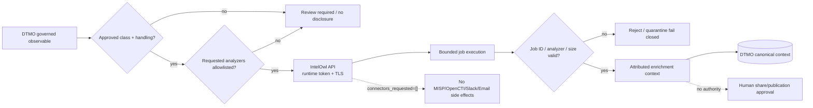

# DTMO Documentation Portal

This directory contains the authoritative professional documentation for Dutch Threat Monitoring for Education (DTMO). Stable product, architecture, security, governance and readiness documentation is separated from immutable operational history and CI evidence.

## Current controlled baseline

| Area | Current state |
|---|---|
| Software baseline | `16.0.0rc12` plus accepted post-RC13/E8/Phase-11 repository enhancements |
| Phases 1–7 | `PASS` |
| RC13 functional product acceptance | `PASS / OWNER_ACCEPTED` |
| E8.1–E8.10 | `PASS / REPOSITORY_COMPLETE` |
| Phase 8 production-equivalent staging | `PASS / OWNER_ACCEPTED` |
| Phase 9 independent assurance | `PASS / EXTERNAL_ASSURANCE_ACCEPTED` |
| Phase 10 production go/no-go | `NO-GO / BLOCKED — PLATFORM INDUSTRIALISATION REQUIRED` |
| Phase 11.1 Taranis architecture/contract | `PASS / REPOSITORY_COMPLETE` |
| Phase 11.2 Taranis adapter | `PASS / REPOSITORY_COMPLETE` |
| Phase 11.3 IntelOwl contract | `PASS / REPOSITORY_COMPLETE` |
| Phase 11.3 IntelOwl adapter | `IN PROGRESS / EXACT-HEAD VALIDATION REQUIRED` |
| Phase 12 production go/no-go | `NOT STARTED` |
| Production readiness | **Not production authorized** |

The active bounded programme step is Phase 11.3 IntelOwl enrichment-adapter validation. Phase 10 did not grant production authorization. Phase 12 remains the next formal production authorization decision only after fresh Phase 11.10 production-equivalent validation and Phase 11.11 independent external assurance for the materially changed integrated platform.

## Start here

| Audience | Primary documents |
|---|---|
| Executive / sponsor | [Executive Status](project/EXECUTIVE_STATUS.md), [Executive Decision View](project/EXECUTIVE_DECISION_VIEW.md), [Production Readiness Report](project/PRODUCTION_READINESS_REPORT.md) |
| Product / delivery | [Platform Industrialisation Roadmap](roadmap/PLATFORM_INDUSTRIALISATION_ROADMAP.md), [Current State](project/CURRENT_STATE.md), [Production Roadmap](roadmap/PRODUCTION_ROADMAP.md) |
| Analyst / reviewer | [User Guide](user/USER_GUIDE.md), [System Workflows](architecture/SYSTEM_WORKFLOWS.md), [Screenshot Catalogue](visual/screenshots/README.md) |
| Administrator | [Administrator Guide](administration/ADMINISTRATOR_GUIDE.md), [Security Overview](security/SECURITY_OVERVIEW.md), [System Workflows](architecture/SYSTEM_WORKFLOWS.md) |
| Architecture / engineering | [IntelOwl → DTMO Integration Contract](architecture/INTELOWL_DTMO_INTEGRATION_CONTRACT.md), [IntelOwl Integration](integrations/INTELOWL_INTEGRATION.md), [Taranis → DTMO Contract](architecture/TARANIS_DTMO_INTEGRATION_CONTRACT.md), [System Architecture](architecture/SYSTEM_ARCHITECTURE.md) |
| Security / CISO | [Security Overview](security/SECURITY_OVERVIEW.md), [Threat Model](security/THREAT_MODEL.md), [Risk Register](security/RISK_REGISTER.md), [IntelOwl → DTMO Integration Contract](architecture/INTELOWL_DTMO_INTEGRATION_CONTRACT.md) |
| Governance / compliance | [Governance Mapping Registry](governance/GOVERNANCE_MAPPING_REGISTRY.md), [Data Classification & Retention](governance/DATA_CLASSIFICATION_RETENTION.md) |
| QA / release | [QA and Release Gates](qa/QA_AND_RELEASE_GATES.md), [Production Checklist](project/PRODUCTION_CHECKLIST.md), [Evidence Index](evidence/EVIDENCE_INDEX.md) |
| Operations | [Operating Model](operations/OPERATING_MODEL.md), [Operations Manual](operations/OPERATIONS_MANUAL.md), [IntelOwl Integration](integrations/INTELOWL_INTEGRATION.md) |

## Phase 11 programme documentation

- [Platform Industrialisation Roadmap](roadmap/PLATFORM_INDUSTRIALISATION_ROADMAP.md) defines the fixed Taranis → IntelOwl → OpenCTI → MISP → TheHive → conditional Cortex → runtime-industrialisation sequence.
- [Taranis Platform Integration Assessment](architecture/TARANIS_PLATFORM_INTEGRATION_ASSESSMENT.md) and [Taranis → DTMO Contract](architecture/TARANIS_DTMO_INTEGRATION_CONTRACT.md) define the accepted Taranis service boundary.
- [IntelOwl → DTMO Integration Contract](architecture/INTELOWL_DTMO_INTEGRATION_CONTRACT.md) is the accepted Phase 11.3 service/API/security/licensing baseline.
- [IntelOwl Integration](integrations/INTELOWL_INTEGRATION.md) documents the active bounded adapter: approved observable classes, analyzer allowlisting, TLP/privacy disclosure controls, bounded job execution, result provenance and explicit no-share/no-local-compromise semantics.
- [Phase 10 Production Go/No-Go](production/PHASE10_PRODUCTION_GO_NO_GO.md) preserves the completed `NO-GO / BLOCKED` decision as historical decision evidence.

## Phase 11.3 trust-boundary workflow

This workflow is repository architecture/implementation documentation. It does not prove live IntelOwl connectivity, service-account permissions, provider credentials, analyzer quality or production-equivalent behavior.

## Operator and user documentation boundary

The adapter slice does not yet introduce a separately accepted end-user enrichment workflow or governed IntelOwl administration screen. Therefore existing User Guide and Administrator Guide claims are not expanded to imply runtime capability that has not been wired into governed execution/persistence. A screenshot is likewise not promoted for this slice: a synthetic image would falsely imply an accepted operator surface.

The next bounded Phase 11.3 step, after this adapter is green and merged, is governed execution/persistence and operational integration. User/admin documentation and governed visuals become mandatory in that step if a new operator-visible workflow is introduced.

## Security and authority invariants

Across the professional documentation set:

- server-side RBAC and least privilege remain authoritative;
- human and service identities remain separate;
- credentials/tokens never belong in repository evidence, logs or screenshots;
- TLP/privacy and analyzer allowlists are evaluated before IntelOwl disclosure;
- IntelOwl external Connectors remain excluded from the bounded enrichment path;
- unknown analyzer, malformed/oversized result or job-ID mismatch fails closed;
- enrichment context does not prove local compromise;
- IntelOwl success never grants DTMO external-share/publication authority;
- Taranis and IntelOwl remain separate services under their own licensing boundaries; no upstream source is vendored by this integration slice.

## Evidence and history model

Professional current-state documentation describes the present controlled state. Historical records under `docs/development/` and earlier Phase 8/9 evidence remain scoped to the candidate and moment they originally covered; they are not rewritten or reused as evidence for the materially changed Phase 11 candidate.

Repository CI, Docker Compose, emulators and synthetic fixtures are engineering evidence only. They do not substitute for future production-equivalent validation, independent assurance or Phase 12 production authorization.

## Maintenance rule

Whenever lifecycle state, architecture, security boundary, product scope or governance claims materially change, the affected professional documents and documentation-contract tests must be reconciled in the same bounded PR before merge. See [Documentation Status and Authority](project/DOCUMENTATION_STATUS.md), [Documentation Standard](project/DOCUMENTATION_STANDARD.md) and [Visual Documentation Standard](visual/DOCUMENTATION_VISUAL_STANDARD.md).
