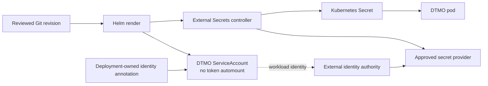

# DTMO Documentation Portal

This directory contains the authoritative professional documentation for Dutch Threat Monitoring for Education (DTMO). Stable product, architecture, security, governance and readiness documentation is separated from immutable operational history and CI evidence.

## Current controlled baseline

| Area | Current state |
|---|---|
| Software baseline | `16.0.0rc12` plus accepted post-RC13/E8/Phase-11 repository enhancements |
| Phases 1–7 | `PASS` |
| RC13 functional product acceptance | `PASS / OWNER_ACCEPTED` |
| E8.1–E8.10 | `PASS / REPOSITORY_COMPLETE` |
| Phase 8 production-equivalent staging | `PASS / OWNER_ACCEPTED — HISTORICAL CANDIDATE` |
| Phase 9 independent assurance | `PASS / EXTERNAL_ASSURANCE_ACCEPTED — HISTORICAL CANDIDATE` |
| Phase 10 production go/no-go | `NO-GO / BLOCKED — PLATFORM INDUSTRIALISATION REQUIRED` |
| Phase 11.3 IntelOwl integration | `PASS / REPOSITORY_COMPLETE` |
| Phase 11.4 OpenCTI integration | `PASS / REPOSITORY_COMPLETE` |
| Phase 11.5 MISP consolidation | `PASS / REPOSITORY_COMPLETE` |
| Phase 11.6 TheHive | `PASS / REPOSITORY_COMPLETE` |
| Phase 11.7 Cortex decision gate | `PASS / REPOSITORY_COMPLETE — HISTORICAL DECISION BASELINE` |
| Phase 11.7b Cortex analyzer connector | `PASS / REPOSITORY_COMPLETE` |
| Phase 11.8a runtime foundation | `PASS / REPOSITORY_COMPLETE` |
| Phase 11.8b workload identity / external secrets | `IN PROGRESS / EXACT-HEAD VALIDATION REQUIRED` |
| Phase 12 production go/no-go | `NOT STARTED` |
| Production readiness | **not production authorized** |

The active bounded programme step is **Phase 11.8b workload identity and external secret delivery**. Earlier Phase 8/9 evidence remains historical and candidate-bound. Fresh Phase 11.10 production-equivalent validation and Phase 11.11 independent external assurance remain required before Phase 12.

## Start here

| Audience | Primary documents |
|---|---|
| Executive / sponsor | [Current State](project/CURRENT_STATE.md), [Platform Industrialisation Roadmap](roadmap/PLATFORM_INDUSTRIALISATION_ROADMAP.md), [Production Readiness Report](project/PRODUCTION_READINESS_REPORT.md) |
| Product / delivery | [Product Guide](product/PRODUCT_GUIDE.md), [Platform Industrialisation Roadmap](roadmap/PLATFORM_INDUSTRIALISATION_ROADMAP.md), [Current State](project/CURRENT_STATE.md) |
| Analyst / reviewer | [User Guide](user/USER_GUIDE.md), [IntelOwl Governed Enrichment Workflow](user/INTELOWL_ENRICHMENT_WORKFLOW.md), [TheHive Case Handoff Workflow](user/THEHIVE_CASE_HANDOFF.md), [System Workflows](architecture/SYSTEM_WORKFLOWS.md), [Screenshot Catalogue](visual/screenshots/README.md) |
| Administrator | [Administrator Guide](administration/ADMINISTRATOR_GUIDE.md), [Workload Identity and External Secret Administration](administration/WORKLOAD_IDENTITY_EXTERNAL_SECRETS.md), [Kubernetes Runtime Configuration](administration/KUBERNETES_RUNTIME_CONFIGURATION.md), [TheHive Handoff Configuration](administration/THEHIVE_HANDOFF_CONFIGURATION.md), [Security Overview](security/SECURITY_OVERVIEW.md) |
| Architecture / engineering | [Phase 11.8b Workload Identity and External Secrets](architecture/PHASE11_8B_WORKLOAD_IDENTITY_SECRETS.md), [Phase 11.8 Runtime Foundation](architecture/PHASE11_8_RUNTIME_FOUNDATION.md), [Cortex → DTMO Integration Contract](architecture/CORTEX_DTMO_INTEGRATION_CONTRACT.md), [TheHive → DTMO Handoff Contract](architecture/THEHIVE_DTMO_HANDOFF_CONTRACT.md), [MISP → DTMO Consolidation Contract](architecture/MISP_DTMO_CONSOLIDATION_CONTRACT.md), [OpenCTI → DTMO Integration Contract](architecture/OPENCTI_DTMO_INTEGRATION_CONTRACT.md), [IntelOwl → DTMO Integration Contract](architecture/INTELOWL_DTMO_INTEGRATION_CONTRACT.md), [Taranis → DTMO Contract](architecture/TARANIS_DTMO_INTEGRATION_CONTRACT.md) |
| Security / CISO | [Security Overview](security/SECURITY_OVERVIEW.md), [Threat Model](security/THREAT_MODEL.md), [Risk Register](security/RISK_REGISTER.md), [Phase 11.8b Workload Identity and External Secrets](architecture/PHASE11_8B_WORKLOAD_IDENTITY_SECRETS.md) |
| Governance / compliance | [Governance Mapping Registry](governance/GOVERNANCE_MAPPING_REGISTRY.md), [Data Classification & Retention](governance/DATA_CLASSIFICATION_RETENTION.md) |
| QA / release | [QA and Release Gates](qa/QA_AND_RELEASE_GATES.md), [Phase 11.8b Workload Identity and External Secrets Gate](qa/PHASE11_8B_WORKLOAD_IDENTITY_SECRETS_GATE.md), [Phase 11.8 Runtime Foundation Gate](qa/PHASE11_8_RUNTIME_FOUNDATION_GATE.md), [Phase 11.7b Cortex Connector Gate](qa/PHASE11_7B_CORTEX_CONNECTOR_GATE.md), [Phase 11.7 Cortex Decision Gate](qa/PHASE11_7_CORTEX_DECISION_GATE.md), [Phase 11.6 TheHive Handoff Implementation Gate](qa/PHASE11_6_THEHIVE_HANDOFF_IMPLEMENTATION_GATE.md), [Phase 11.5 MISP Consolidation Contract Gate](qa/PHASE11_5_MISP_CONSOLIDATION_CONTRACT_GATE.md), [Phase 11.4 OpenCTI Contract Gate](qa/PHASE11_4_OPENCTI_CONTRACT_GATE.md), [Evidence Index](evidence/EVIDENCE_INDEX.md) |
| Operations | [Operating Model](operations/OPERATING_MODEL.md), [Operations Manual](operations/OPERATIONS_MANUAL.md), [Phase 11.8b Workload Identity and External Secrets Runbook](operations/PHASE11_8B_WORKLOAD_IDENTITY_SECRETS_RUNBOOK.md), [Phase 11.8 Runtime Foundation Runbook](operations/PHASE11_8_RUNTIME_FOUNDATION_RUNBOOK.md), [IntelOwl Enrichment Runbook](operations/INTELOWL_ENRICHMENT_RUNBOOK.md), [OpenCTI Integration Runbook](operations/OPENCTI_INTEGRATION_RUNBOOK.md), [Cortex Analyzer Runbook](operations/CORTEX_ANALYZER_RUNBOOK.md), [TheHive Handoff Operations Runbook](operations/THEHIVE_HANDOFF_RUNBOOK.md) |

The governed screenshot catalogue now contains UI-01 through UI-10 and remains the controlled visual reference for accepted operator journeys. These governed screenshots are documentation illustrations rather than proof of live-source connectivity, staging acceptance or production readiness. No synthetic screenshot is promoted for Kubernetes, GitOps, workload identity, external secrets, Cortex or any other integration without an accepted live operator surface; Mermaid architecture/trust-boundary diagrams are documentation models, not production evidence.

## Accepted Phase 11 integration reference paths

These stable references remain exposed while Phase 11.8 advances so earlier accepted integration contracts stay discoverable and regression gates do not confuse lifecycle progression with document removal.

- `architecture/CORTEX_DECISION_GATE.md`
- `architecture/CORTEX_DTMO_INTEGRATION_CONTRACT.md`
- `integrations/CORTEX_ANALYZER_CONNECTOR.md`
- `qa/PHASE11_7B_CORTEX_CONNECTOR_GATE.md`
- `architecture/INTELOWL_DTMO_INTEGRATION_CONTRACT.md`
- `operations/INTELOWL_ENRICHMENT_RUNBOOK.md`
- `user/INTELOWL_ENRICHMENT_WORKFLOW.md`
- `architecture/OPENCTI_DTMO_INTEGRATION_CONTRACT.md`
- `integrations/OPENCTI_INTEGRATION.md`
- `operations/OPENCTI_INTEGRATION_RUNBOOK.md`
- `qa/PHASE11_4_OPENCTI_CONTRACT_GATE.md`
- `architecture/MISP_DTMO_CONSOLIDATION_CONTRACT.md`
- `qa/PHASE11_5_MISP_CONSOLIDATION_CONTRACT_GATE.md`
- `architecture/THEHIVE_DTMO_HANDOFF_CONTRACT.md`
- `integrations/THEHIVE_HANDOFF.md`
- `operations/THEHIVE_HANDOFF_RUNBOOK.md`
- `user/THEHIVE_CASE_HANDOFF.md`
- `administration/THEHIVE_HANDOFF_CONFIGURATION.md`
- `qa/PHASE11_6_THEHIVE_HANDOFF_IMPLEMENTATION_GATE.md`

## Phase 11.8 programme documentation

- [Platform Industrialisation Roadmap](roadmap/PLATFORM_INDUSTRIALISATION_ROADMAP.md) defines the fixed sequence and active Phase 11.8 programme.
- [Phase 11.8 Runtime Foundation](architecture/PHASE11_8_RUNTIME_FOUNDATION.md) records accepted 11.8a repository engineering evidence.
- [Phase 11.8b Workload Identity and External Secrets](architecture/PHASE11_8B_WORKLOAD_IDENTITY_SECRETS.md) defines the active machine-identity and secret-delivery boundary.
- [Workload Identity and External Secret Administration](administration/WORKLOAD_IDENTITY_EXTERNAL_SECRETS.md) defines provider-neutral configuration and no-secret-in-Git rules.
- [Phase 11.8b Workload Identity and External Secrets Runbook](operations/PHASE11_8B_WORKLOAD_IDENTITY_SECRETS_RUNBOOK.md) defines rotation, revocation and fail-closed operations.
- [Phase 11.8b Workload Identity and External Secrets Gate](qa/PHASE11_8B_WORKLOAD_IDENTITY_SECRETS_GATE.md) defines exact-head repository acceptance.
- [Evidence Index](evidence/EVIDENCE_INDEX.md) keeps repository evidence separate from live deployment, assurance and production authorization evidence.

## Phase 11.8b trust boundary

## Security and authority invariants

- server-side RBAC and least privilege remain authoritative;
- human and service identities remain separate;
- publication/share authority remains human-controlled;
- TheHive case-handoff authority remains distinct from publication/share authority;
- IntelOwl and Cortex enrichment do not grant share authority or prove local compromise;
- Kubernetes placement does not collapse Taranis, IntelOwl, OpenCTI, MISP, TheHive or Cortex licensing/service boundaries;
- runtime image identity remains immutable-digest based;
- workload identity credentials and runtime secret values are not committed to Git;
- service-account token automounting remains disabled;
- external secret delivery is explicit and fail closed;
- repository CI remains engineering evidence only.

## Evidence and history model

Professional current-state documentation describes the present controlled state. Historical records under `docs/development/` and earlier Phase 8/9 evidence remain scoped to the candidate and moment they originally covered; they are not rewritten or reused as evidence for the materially changed Phase 11 candidate. The accepted Phase 11.7 Cortex decision record also remains historical.

Repository CI and documentation-contract tests do not prove live Kubernetes admission, workload identity federation, cloud IAM, external-secret permissions, secret rotation/revocation, CNI policy enforcement, production availability, recovery objectives, independent assurance or production readiness.

## Maintenance rule

Whenever lifecycle state, architecture, security boundary, product scope or governance claims materially change, affected professional documents and documentation-contract tests must be reconciled in the same bounded PR before merge. See [Documentation Status and Authority](project/DOCUMENTATION_STATUS.md), [Documentation Standard](project/DOCUMENTATION_STANDARD.md) and [Visual Documentation Standard](visual/DOCUMENTATION_VISUAL_STANDARD.md).
