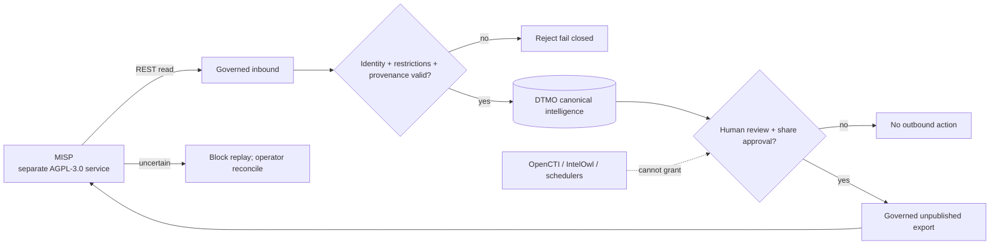

# DTMO Documentation Portal

This directory contains the authoritative professional documentation for Dutch Threat Monitoring for Education (DTMO). Stable product, architecture, security, governance and readiness documentation is separated from immutable operational history and CI evidence.

## Current controlled baseline

| Area | Current state |
|---|---|
| Software baseline | `16.0.0rc12` plus accepted post-RC13/E8/Phase-11 repository enhancements |
| Phases 1–7 | `PASS` |
| RC13 functional product acceptance | `PASS / OWNER_ACCEPTED` |
| E8.1–E8.10 | `PASS / REPOSITORY_COMPLETE` |
| Phase 8 production-equivalent staging | `PASS / OWNER_ACCEPTED` |
| Phase 9 independent assurance | `PASS / EXTERNAL_ASSURANCE_ACCEPTED` |
| Phase 10 production go/no-go | `NO-GO / BLOCKED — PLATFORM INDUSTRIALISATION REQUIRED` |
| Phase 11.1 Taranis architecture/contract | `PASS / REPOSITORY_COMPLETE` |
| Phase 11.2 Taranis adapter | `PASS / REPOSITORY_COMPLETE` |
| Phase 11.3 IntelOwl integration | `PASS / REPOSITORY_COMPLETE` |
| Phase 11.4 OpenCTI persistence/integration | `PASS / REPOSITORY_COMPLETE` |
| Phase 11.5 MISP consolidation contract | `IN PROGRESS / EXACT-HEAD VALIDATION REQUIRED` |
| Phase 12 production go/no-go | `NOT STARTED` |
| Production readiness | **not production authorized** |

The active bounded programme step is **Phase 11.5 MISP consolidation contract validation**. Phase 10 did not grant production authorization. Fresh Phase 11.10 production-equivalent validation and Phase 11.11 independent external assurance remain required before Phase 12.

## Start here

| Audience | Primary documents |
|---|---|
| Executive / sponsor | [Executive Status](project/EXECUTIVE_STATUS.md), [Executive Decision View](project/EXECUTIVE_DECISION_VIEW.md), [Production Readiness Report](project/PRODUCTION_READINESS_REPORT.md) |
| Product / delivery | [Product Guide](product/PRODUCT_GUIDE.md), [Platform Industrialisation Roadmap](roadmap/PLATFORM_INDUSTRIALISATION_ROADMAP.md), [Current State](project/CURRENT_STATE.md), [Production Roadmap](roadmap/PRODUCTION_ROADMAP.md) |
| Analyst / reviewer | [User Guide](user/USER_GUIDE.md), [IntelOwl Governed Enrichment Workflow](user/INTELOWL_ENRICHMENT_WORKFLOW.md), [MISP Read Integration](integrations/MISP_READ_INTEGRATION.md), [System Workflows](architecture/SYSTEM_WORKFLOWS.md), [Screenshot Catalogue](visual/screenshots/README.md) |
| Administrator | [Administrator Guide](administration/ADMINISTRATOR_GUIDE.md), [MISP → DTMO Consolidation Contract](architecture/MISP_DTMO_CONSOLIDATION_CONTRACT.md), [OpenCTI Integration Operations Runbook](operations/OPENCTI_INTEGRATION_RUNBOOK.md), [Security Overview](security/SECURITY_OVERVIEW.md) |
| Architecture / engineering | [MISP → DTMO Consolidation Contract](architecture/MISP_DTMO_CONSOLIDATION_CONTRACT.md), [OpenCTI → DTMO Integration Contract](architecture/OPENCTI_DTMO_INTEGRATION_CONTRACT.md), [IntelOwl → DTMO Integration Contract](architecture/INTELOWL_DTMO_INTEGRATION_CONTRACT.md), [Taranis → DTMO Contract](architecture/TARANIS_DTMO_INTEGRATION_CONTRACT.md), [System Architecture](architecture/SYSTEM_ARCHITECTURE.md) |
| Security / CISO | [Security Overview](security/SECURITY_OVERVIEW.md), [Threat Model](security/THREAT_MODEL.md), [Risk Register](security/RISK_REGISTER.md), [MISP → DTMO Consolidation Contract](architecture/MISP_DTMO_CONSOLIDATION_CONTRACT.md) |
| Governance / compliance | [Governance Mapping Registry](governance/GOVERNANCE_MAPPING_REGISTRY.md), [Data Classification & Retention](governance/DATA_CLASSIFICATION_RETENTION.md), [MISP Governed Export](intelligence/MISP_GOVERNED_EXPORT.md) |
| QA / release | [QA and Release Gates](qa/QA_AND_RELEASE_GATES.md), [Phase 11.5 MISP Consolidation Contract Gate](qa/PHASE11_5_MISP_CONSOLIDATION_CONTRACT_GATE.md), [Production Checklist](project/PRODUCTION_CHECKLIST.md), [Evidence Index](evidence/EVIDENCE_INDEX.md) |
| Operations | [Operating Model](operations/OPERATING_MODEL.md), [Operations Manual](operations/OPERATIONS_MANUAL.md), [IntelOwl Enrichment Runbook](operations/INTELOWL_ENRICHMENT_RUNBOOK.md), [MISP Read Integration](integrations/MISP_READ_INTEGRATION.md), [MISP Governed Export](intelligence/MISP_GOVERNED_EXPORT.md), [OpenCTI Integration Operations Runbook](operations/OPENCTI_INTEGRATION_RUNBOOK.md) |

The governed screenshot catalogue now contains UI-01 through UI-10 and remains the controlled visual reference for accepted operator journeys. These governed screenshots are documentation illustrations rather than proof of live-source connectivity, staging acceptance or production readiness.

No synthetic screenshot is promoted for the Phase 11.5 contract slice because the bounded change defines service/API/authority behavior and introduces no accepted operator GUI surface.

## Phase 11 programme documentation

- [Platform Industrialisation Roadmap](roadmap/PLATFORM_INDUSTRIALISATION_ROADMAP.md) defines the fixed Taranis → IntelOwl → OpenCTI → MISP → TheHive → conditional Cortex → runtime-industrialisation sequence.
- [IntelOwl → DTMO Integration Contract](architecture/INTELOWL_DTMO_INTEGRATION_CONTRACT.md) and [IntelOwl Enrichment Runbook](operations/INTELOWL_ENRICHMENT_RUNBOOK.md) document repository-complete Phase 11.3.
- Phase 11.4 OpenCTI persistence and integration are `PASS / REPOSITORY_COMPLETE`; the accepted contract, adapter and runbook remain authoritative historical-current design references.
- [MISP → DTMO Consolidation Contract](architecture/MISP_DTMO_CONSOLIDATION_CONTRACT.md) is the active Phase 11.5 service/API/licensing/authority baseline.
- [MISP Read Integration](integrations/MISP_READ_INTEGRATION.md) and [MISP Governed Export](intelligence/MISP_GOVERNED_EXPORT.md) are the existing bounded paths to be consolidated rather than duplicated.
- [Evidence Index](evidence/EVIDENCE_INDEX.md) keeps repository evidence separate from deployment, assurance and production authorization evidence.

## Phase 11.5 MISP trust boundary

## Security and authority invariants

- server-side RBAC and least privilege remain authoritative;
- human and service identities remain separate;
- credentials/tokens never belong in repository evidence, logs or screenshots;
- MISP UUID identity remains distinct from DTMO canonical UUID identity;
- MISP distribution, sharing-group and TLP/tag restrictions are attributable constraints and cannot be broadened on re-export;
- import never grants DTMO share/publication authority or local-compromise proof;
- service accounts, collectors, schedulers, IntelOwl, OpenCTI and MISP cannot grant DTMO sharing authority;
- uncertain outbound delivery blocks automatic replay pending operator reconciliation;
- automatic MISP federation and OpenCTI↔MISP synchronization are outside the active contract boundary;
- Taranis, IntelOwl, OpenCTI and MISP remain separate services under their applicable licensing boundaries.

## Evidence and history model

Professional current-state documentation describes the present controlled state. Historical records under `docs/development/` and earlier Phase 8/9 evidence remain scoped to the candidate and moment they originally covered; they are not rewritten or reused as evidence for the materially changed Phase 11 candidate.

Repository CI and documentation-contract tests are engineering evidence only. They do not prove live MISP credentials/roles, remote-server trust, lawful live-data sharing, staging acceptance, independent assurance or production readiness.

## Maintenance rule

Whenever lifecycle state, architecture, security boundary, product scope or governance claims materially change, affected professional documents and documentation-contract tests must be reconciled in the same bounded PR before merge. See [Documentation Status and Authority](project/DOCUMENTATION_STATUS.md), [Documentation Standard](project/DOCUMENTATION_STANDARD.md) and [Visual Documentation Standard](visual/DOCUMENTATION_VISUAL_STANDARD.md).
