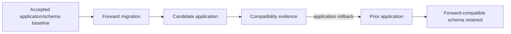

# DTMO Documentation Portal

This directory contains the authoritative professional documentation for Dutch Threat Monitoring for Education (DTMO). Stable product, architecture, security, governance and readiness documentation is separated from immutable operational history and CI evidence.

## Current controlled baseline

| Area | Current state |
|---|---|
| Software baseline | `16.0.0rc12` plus accepted post-RC13/E8/Phase-11 repository enhancements |
| Phases 1–7 | `PASS` |
| RC13 functional product acceptance | `PASS / OWNER_ACCEPTED` |
| E8.1–E8.10 | `PASS / REPOSITORY_COMPLETE` |
| Phase 8 production-equivalent staging | `PASS / OWNER_ACCEPTED — HISTORICAL CANDIDATE` |
| Phase 9 independent assurance | `PASS / EXTERNAL_ASSURANCE_ACCEPTED — HISTORICAL CANDIDATE` |
| Phase 10 production go/no-go | `NO-GO / BLOCKED — PLATFORM INDUSTRIALISATION REQUIRED` |
| Phase 11.1–11.7b integrations | `PASS / REPOSITORY_COMPLETE` |
| Phase 11.8 integrated runtime industrialisation | `PASS / REPOSITORY_COMPLETE` |
| Phase 11.9 migration / compatibility | `IN PROGRESS / EXACT-HEAD VALIDATION REQUIRED` |
| Phase 11.10 production-equivalent validation | `NOT STARTED` |
| Phase 11.11 independent external assurance | `NOT STARTED` |
| Phase 12 production go/no-go | `NOT STARTED` |
| Production readiness | **not production authorized** |

The active bounded programme step is **Phase 11.9 migration/compatibility**. Earlier Phase 8/9 evidence remains historical and candidate-bound. Fresh Phase 11.10 production-equivalent validation and Phase 11.11 independent external assurance remain required before Phase 12.

## Start here

| Audience | Primary documents |
|---|---|
| Executive / sponsor | [Current State](project/CURRENT_STATE.md), [Platform Industrialisation Roadmap](roadmap/PLATFORM_INDUSTRIALISATION_ROADMAP.md), [Production Readiness Report](project/PRODUCTION_READINESS_REPORT.md) |
| Product / delivery | [Product Guide](product/PRODUCT_GUIDE.md), [Platform Industrialisation Roadmap](roadmap/PLATFORM_INDUSTRIALISATION_ROADMAP.md), [Current State](project/CURRENT_STATE.md) |
| Analyst / reviewer | [User Guide](user/USER_GUIDE.md), [System Workflows](architecture/SYSTEM_WORKFLOWS.md), [Screenshot Catalogue](visual/screenshots/README.md) |
| Administrator | [Administrator Guide](administration/ADMINISTRATOR_GUIDE.md), [Kubernetes Runtime Configuration](administration/KUBERNETES_RUNTIME_CONFIGURATION.md), [Security Overview](security/SECURITY_OVERVIEW.md) |
| Architecture / engineering | [Phase 11.9 Migration Compatibility](architecture/PHASE11_9_MIGRATION_COMPATIBILITY.md), [Phase 11.8i Upgrade/Rollback](architecture/PHASE11_8I_UPGRADE_ROLLBACK.md), [System Architecture](architecture/SYSTEM_ARCHITECTURE.md) |
| Security / CISO | [Security Overview](security/SECURITY_OVERVIEW.md), [Threat Model](security/THREAT_MODEL.md), [Risk Register](security/RISK_REGISTER.md), [Phase 11.9 Migration Compatibility](architecture/PHASE11_9_MIGRATION_COMPATIBILITY.md) |
| Governance / compliance | [Governance Mapping Registry](governance/GOVERNANCE_MAPPING_REGISTRY.md), [Data Classification & Retention](governance/DATA_CLASSIFICATION_RETENTION.md) |
| QA / release | [Phase 11.9 Migration Compatibility Gate](qa/PHASE11_9_MIGRATION_COMPATIBILITY_GATE.md), [QA and Release Gates](qa/QA_AND_RELEASE_GATES.md), [Evidence Index](evidence/EVIDENCE_INDEX.md) |
| Operations | [Phase 11.9 Migration Compatibility Runbook](operations/PHASE11_9_MIGRATION_COMPATIBILITY_RUNBOOK.md), [Operating Model](operations/OPERATING_MODEL.md), [Operations Manual](operations/OPERATIONS_MANUAL.md) |

## Phase 11 programme documentation

Phase 11.1–11.7b integration contracts remain accepted and discoverable through their architecture/integration/runbook/gate documents. Phase 11.8 runtime industrialisation is repository-complete, including runtime foundation, identity/secrets, ingress/network, HA, observability, recovery, supply-chain, capacity and exercised upgrade/rollback controls.

Accepted integration and runtime documentation remains directly discoverable:

- TheHive implementation: [TheHive integration](integrations/THEHIVE_HANDOFF.md), [TheHive contract](architecture/THEHIVE_DTMO_HANDOFF_CONTRACT.md), [TheHive runbook](operations/THEHIVE_HANDOFF_RUNBOOK.md), [TheHive administration](administration/THEHIVE_HANDOFF_CONFIGURATION.md) and **Phase 11.6 TheHive Handoff Implementation Gate**.
- Cortex analyzer connector: [CORTEX_ANALYZER_CONNECTOR.md](integrations/CORTEX_ANALYZER_CONNECTOR.md) and [PHASE11_7B_CORTEX_CONNECTOR_GATE.md](qa/PHASE11_7B_CORTEX_CONNECTOR_GATE.md).
- Runtime foundation: [PHASE11_8_RUNTIME_FOUNDATION.md](architecture/PHASE11_8_RUNTIME_FOUNDATION.md) and [KUBERNETES_RUNTIME_CONFIGURATION.md](administration/KUBERNETES_RUNTIME_CONFIGURATION.md).
- [11.8b workload identity and external secrets](architecture/PHASE11_8B_WORKLOAD_IDENTITY_SECRETS.md) (`PHASE11_8B_WORKLOAD_IDENTITY_SECRETS`) with [WORKLOAD_IDENTITY_EXTERNAL_SECRETS.md](administration/WORKLOAD_IDENTITY_EXTERNAL_SECRETS.md).
- [11.8c ingress, TLS and network segmentation](architecture/PHASE11_8C_INGRESS_TLS_NETWORK_SEGMENTATION.md) (`PHASE11_8C_INGRESS_TLS_NETWORK_SEGMENTATION`) with [INGRESS_TLS_NETWORK_SEGMENTATION.md](administration/INGRESS_TLS_NETWORK_SEGMENTATION.md).
- [11.8d HA and disruption hardening](architecture/PHASE11_8D_HA_DISRUPTION.md) (`PHASE11_8D_HA_DISRUPTION`).
- [11.8e observability hardening](architecture/PHASE11_8E_OBSERVABILITY_HARDENING.md) (`PHASE11_8E_OBSERVABILITY_HARDENING`).
- [11.8f recovery hardening](architecture/PHASE11_8F_RECOVERY_HARDENING.md) (`PHASE11_8F_RECOVERY_HARDENING`).
- [11.8g supply-chain hardening](security/PHASE11_8G_SUPPLY_CHAIN_HARDENING.md) (`PHASE11_8G_SUPPLY_CHAIN_HARDENING`).
- [11.8h capacity and resource planning](architecture/PHASE11_8H_CAPACITY_RESOURCE_PLANNING.md).
- [11.8i exercised upgrade and rollback](architecture/PHASE11_8I_UPGRADE_ROLLBACK.md).

The governed screenshot catalogue now contains UI-01 through UI-10. These are documentation illustrations rather than proof of live-source connectivity, staging acceptance or production readiness.

The active Phase 11.9 documentation set is:

- [Migration Compatibility Architecture](architecture/PHASE11_9_MIGRATION_COMPATIBILITY.md)
- [Migration Compatibility Runbook](operations/PHASE11_9_MIGRATION_COMPATIBILITY_RUNBOOK.md)
- [Migration Compatibility Gate](qa/PHASE11_9_MIGRATION_COMPATIBILITY_GATE.md)
- [Evidence Index](evidence/EVIDENCE_INDEX.md)
- [Platform Industrialisation Roadmap](roadmap/PLATFORM_INDUSTRIALISATION_ROADMAP.md)

## Phase 11.9 compatibility boundary

Rolling overlap requires backward-compatible schema behavior. Destructive changes require expand/migrate/contract. Application rollback does not authorize automatic database down migration, and ambiguous migration or compatibility evidence fails closed.

## Security and authority invariants

- server-side RBAC and least privilege remain authoritative;
- human and service identities remain separate;
- publication/share authority remains human-controlled;
- TheHive case-handoff authority remains distinct from publication/share authority;
- IntelOwl and Cortex enrichment do not grant share authority or prove local compromise;
- Kubernetes placement does not collapse Taranis, IntelOwl, OpenCTI, MISP, TheHive or Cortex licensing/service boundaries;
- runtime image identity remains immutable-digest based;
- workload identity credentials and runtime secret values are not committed to Git;
- application rollback is not automatic database rollback;
- migration compatibility evidence remains fail closed;
- repository CI remains engineering evidence only.

## Evidence and history model

Professional current-state documentation describes the present controlled state. Historical records under `docs/development/` and earlier Phase 8/9 evidence remain scoped to the candidate and moment they originally covered; they are not rewritten or reused as evidence for the materially changed Phase 11 candidate. The accepted Phase 11.7 Cortex decision record also remains historical.

Repository CI and documentation-contract tests do not prove production-data migration, live Kubernetes behavior, production-equivalent continuity, independent assurance or production readiness.

## Maintenance rule

Whenever lifecycle state, architecture, security boundary, product scope or governance claims materially change, affected professional documents and documentation-contract tests must be reconciled in the same bounded PR before merge. See [Documentation Status and Authority](project/DOCUMENTATION_STATUS.md), [Documentation Standard](project/DOCUMENTATION_STANDARD.md) and [Visual Documentation Standard](visual/DOCUMENTATION_VISUAL_STANDARD.md).
