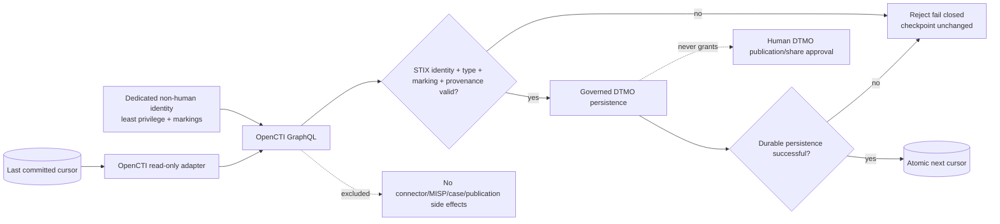

# DTMO Documentation Portal

This directory contains the authoritative professional documentation for Dutch Threat Monitoring for Education (DTMO). Stable product, architecture, security, governance and readiness documentation is separated from immutable operational history and CI evidence.

## Current controlled baseline

| Area | Current state |
|---|---|
| Software baseline | `16.0.0rc12` plus accepted post-RC13/E8/Phase-11 repository enhancements |
| Phases 1–7 | `PASS` |
| RC13 functional product acceptance | `PASS / OWNER_ACCEPTED` |
| E8.1–E8.10 | `PASS / REPOSITORY_COMPLETE` |
| Phase 8 production-equivalent staging | `PASS / OWNER_ACCEPTED` |
| Phase 9 independent assurance | `PASS / EXTERNAL_ASSURANCE_ACCEPTED` |
| Phase 10 production go/no-go | `NO-GO / BLOCKED — PLATFORM INDUSTRIALISATION REQUIRED` |
| Phase 11.1 Taranis architecture/contract | `PASS / REPOSITORY_COMPLETE` |
| Phase 11.2 Taranis adapter | `PASS / REPOSITORY_COMPLETE` |
| Phase 11.3 IntelOwl integration | `PASS / REPOSITORY_COMPLETE` |
| Phase 11.4 OpenCTI contract | `PASS / REPOSITORY_COMPLETE` |
| Phase 11.4 OpenCTI read-only adapter | `IN PROGRESS / EXACT-HEAD VALIDATION REQUIRED` |
| Phase 12 production go/no-go | `NOT STARTED` |
| Production readiness | **not production authorized** |

The active bounded programme step is the **Phase 11.4 OpenCTI read-only STIX/identity adapter**. Phase 10 did not grant production authorization. Phase 12 remains the next formal production authorization decision only after fresh Phase 11.10 production-equivalent validation and Phase 11.11 independent external assurance for the materially changed integrated platform.

## Start here

| Audience | Primary documents |
|---|---|
| Executive / sponsor | [Executive Status](project/EXECUTIVE_STATUS.md), [Executive Decision View](project/EXECUTIVE_DECISION_VIEW.md), [Production Readiness Report](project/PRODUCTION_READINESS_REPORT.md) |
| Product / delivery | [Product Guide](product/PRODUCT_GUIDE.md), [Platform Industrialisation Roadmap](roadmap/PLATFORM_INDUSTRIALISATION_ROADMAP.md), [Current State](project/CURRENT_STATE.md), [Production Roadmap](roadmap/PRODUCTION_ROADMAP.md) |
| Analyst / reviewer | [User Guide](user/USER_GUIDE.md), [IntelOwl Governed Enrichment Workflow](user/INTELOWL_ENRICHMENT_WORKFLOW.md), [System Workflows](architecture/SYSTEM_WORKFLOWS.md), [Screenshot Catalogue](visual/screenshots/README.md) |
| Administrator | [Administrator Guide](administration/ADMINISTRATOR_GUIDE.md), [OpenCTI Integration Operations Runbook](operations/OPENCTI_INTEGRATION_RUNBOOK.md), [IntelOwl Enrichment Operations Runbook](operations/INTELOWL_ENRICHMENT_RUNBOOK.md), [Security Overview](security/SECURITY_OVERVIEW.md) |
| Architecture / engineering | [OpenCTI → DTMO Integration Contract](architecture/OPENCTI_DTMO_INTEGRATION_CONTRACT.md), [OpenCTI Integration](integrations/OPENCTI_INTEGRATION.md), [IntelOwl → DTMO Integration Contract](architecture/INTELOWL_DTMO_INTEGRATION_CONTRACT.md), [Taranis → DTMO Contract](architecture/TARANIS_DTMO_INTEGRATION_CONTRACT.md), [System Architecture](architecture/SYSTEM_ARCHITECTURE.md) |
| Security / CISO | [Security Overview](security/SECURITY_OVERVIEW.md), [Threat Model](security/THREAT_MODEL.md), [Risk Register](security/RISK_REGISTER.md), [OpenCTI → DTMO Integration Contract](architecture/OPENCTI_DTMO_INTEGRATION_CONTRACT.md) |
| Governance / compliance | [Governance Mapping Registry](governance/GOVERNANCE_MAPPING_REGISTRY.md), [Data Classification & Retention](governance/DATA_CLASSIFICATION_RETENTION.md) |
| QA / release | [QA and Release Gates](qa/QA_AND_RELEASE_GATES.md), [Phase 11.4 OpenCTI Contract Gate](qa/PHASE11_4_OPENCTI_CONTRACT_GATE.md), [Production Checklist](project/PRODUCTION_CHECKLIST.md), [Evidence Index](evidence/EVIDENCE_INDEX.md) |
| Operations | [Operating Model](operations/OPERATING_MODEL.md), [Operations Manual](operations/OPERATIONS_MANUAL.md), [OpenCTI Integration Operations Runbook](operations/OPENCTI_INTEGRATION_RUNBOOK.md), [OpenCTI Integration](integrations/OPENCTI_INTEGRATION.md) |

The governed screenshot catalogue now contains UI-01 through UI-10 and remains the controlled visual reference for accepted operator journeys. These governed screenshots are documentation illustrations rather than proof of live-source connectivity, staging acceptance or production readiness.

No synthetic screenshot is promoted for the Phase 11.4 adapter slice because it introduces no accepted operator GUI surface; creating one would falsely imply deployed OpenCTI functionality.

## Phase 11 programme documentation

- [Platform Industrialisation Roadmap](roadmap/PLATFORM_INDUSTRIALISATION_ROADMAP.md) defines the fixed Taranis → IntelOwl → OpenCTI → MISP → TheHive → conditional Cortex → runtime-industrialisation sequence.
- [Taranis Platform Integration Assessment](architecture/TARANIS_PLATFORM_INTEGRATION_ASSESSMENT.md) and [Taranis → DTMO Contract](architecture/TARANIS_DTMO_INTEGRATION_CONTRACT.md) define the accepted Taranis service boundary.
- [IntelOwl → DTMO Integration Contract](architecture/INTELOWL_DTMO_INTEGRATION_CONTRACT.md), [IntelOwl Integration](integrations/INTELOWL_INTEGRATION.md), [IntelOwl Governed Enrichment Workflow](user/INTELOWL_ENRICHMENT_WORKFLOW.md) and [IntelOwl Enrichment Operations Runbook](operations/INTELOWL_ENRICHMENT_RUNBOOK.md) document the repository-complete Phase 11.3 boundary.
- [OpenCTI → DTMO Integration Contract](architecture/OPENCTI_DTMO_INTEGRATION_CONTRACT.md) is the accepted Phase 11.4 service/API/STIX/data-model/identity/security/licensing baseline.
- [OpenCTI Integration](integrations/OPENCTI_INTEGRATION.md) documents the active read-only GraphQL/STIX adapter, bounded pagination, provenance preservation and explicit checkpoint-commit semantics.
- [OpenCTI Integration Operations Runbook](operations/OPENCTI_INTEGRATION_RUNBOOK.md) documents runtime configuration, fail-closed conditions, persistence-before-checkpoint sequencing, restart and incident handling.
- [Phase 11.4 OpenCTI Contract Gate](qa/PHASE11_4_OPENCTI_CONTRACT_GATE.md) retains the accepted contract boundary; adapter behavior is additionally covered by `backend/tests/test_phase11_4_opencti_adapter.py` and exact-head CI.
- [Phase 10 Production Go/No-Go](production/PHASE10_PRODUCTION_GO_NO_GO.md) preserves the completed `NO-GO / BLOCKED` decision as historical decision evidence.

## Phase 11.4 read-only trust boundary

## Security and authority invariants

Across the professional documentation set:

- server-side RBAC and least privilege remain authoritative;
- human and service identities remain separate;
- credentials/tokens never belong in repository evidence, logs or screenshots;
- OpenCTI routine integration uses a dedicated non-human identity without administrator/bypass authority;
- OpenCTI marking/TLP/PAP restrictions remain authorization boundaries;
- OpenCTI/STIX identities stay distinct from DTMO canonical UUIDs and are explicitly preserved/mapped;
- malformed identity, markings, confidence, GraphQL/page/cursor or checkpoint state fail closed;
- graph confidence and relationships do not prove local compromise, exposure or attribution certainty;
- OpenCTI success never grants DTMO external-share/publication authority;
- checkpoint state advances only after successful durable persistence;
- MISP synchronization is deferred to Phase 11.5 and TheHive case handoff to Phase 11.6;
- Taranis, IntelOwl and OpenCTI remain separate services under their applicable licensing boundaries; no upstream source is vendored by this adapter slice.

## Evidence and history model

Professional current-state documentation describes the present controlled state. Historical records under `docs/development/` and earlier Phase 8/9 evidence remain scoped to the candidate and moment they originally covered; they are not rewritten or reused as evidence for the materially changed Phase 11 candidate.

Repository CI and documentation-contract tests are engineering evidence only. They do not prove live OpenCTI connectivity, deployed credentials/RBAC/markings, production graph correctness, staging acceptance, independent assurance or production readiness.

## Maintenance rule

Whenever lifecycle state, architecture, security boundary, product scope or governance claims materially change, the affected professional documents and documentation-contract tests must be reconciled in the same bounded PR before merge. See [Documentation Status and Authority](project/DOCUMENTATION_STATUS.md), [Documentation Standard](project/DOCUMENTATION_STANDARD.md) and [Visual Documentation Standard](visual/DOCUMENTATION_VISUAL_STANDARD.md).
