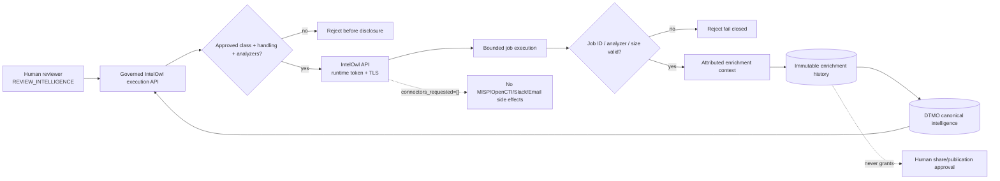

# DTMO Documentation Portal

This directory contains the authoritative professional documentation for Dutch Threat Monitoring for Education (DTMO). Stable product, architecture, security, governance and readiness documentation is separated from immutable operational history and CI evidence.

## Current controlled baseline

| Area | Current state |
|---|---|
| Software baseline | `16.0.0rc12` plus accepted post-RC13/E8/Phase-11 repository enhancements |
| Phases 1–7 | `PASS` |
| RC13 functional product acceptance | `PASS / OWNER_ACCEPTED` |
| E8.1–E8.10 | `PASS / REPOSITORY_COMPLETE` |
| Phase 8 production-equivalent staging | `PASS / OWNER_ACCEPTED` |
| Phase 9 independent assurance | `PASS / EXTERNAL_ASSURANCE_ACCEPTED` |
| Phase 10 production go/no-go | `NO-GO / BLOCKED — PLATFORM INDUSTRIALISATION REQUIRED` |
| Phase 11.1 Taranis architecture/contract | `PASS / REPOSITORY_COMPLETE` |
| Phase 11.2 Taranis adapter | `PASS / REPOSITORY_COMPLETE` |
| Phase 11.3 IntelOwl contract | `PASS / REPOSITORY_COMPLETE` |
| Phase 11.3 IntelOwl adapter | `PASS / REPOSITORY_COMPLETE` |
| Phase 11.3 governed execution/persistence | `IN PROGRESS / EXACT-HEAD VALIDATION REQUIRED` |
| Phase 12 production go/no-go | `NOT STARTED` |
| Production readiness | **not production authorized** |

The active bounded programme step is Phase 11.3 governed IntelOwl execution, durable enrichment-history persistence and operational integration. Phase 10 did not grant production authorization. Phase 12 remains the next formal production authorization decision only after fresh Phase 11.10 production-equivalent validation and Phase 11.11 independent external assurance for the materially changed integrated platform.

## Start here

| Audience | Primary documents |
|---|---|
| Executive / sponsor | [Executive Status](project/EXECUTIVE_STATUS.md), [Executive Decision View](project/EXECUTIVE_DECISION_VIEW.md), [Production Readiness Report](project/PRODUCTION_READINESS_REPORT.md) |
| Product / delivery | [Product Guide](product/PRODUCT_GUIDE.md), [Platform Industrialisation Roadmap](roadmap/PLATFORM_INDUSTRIALISATION_ROADMAP.md), [Current State](project/CURRENT_STATE.md), [Production Roadmap](roadmap/PRODUCTION_ROADMAP.md) |
| Analyst / reviewer | [User Guide](user/USER_GUIDE.md), [IntelOwl Governed Enrichment Workflow](user/INTELOWL_ENRICHMENT_WORKFLOW.md), [System Workflows](architecture/SYSTEM_WORKFLOWS.md), [Screenshot Catalogue](visual/screenshots/README.md) |
| Administrator | [Administrator Guide](administration/ADMINISTRATOR_GUIDE.md), [IntelOwl Enrichment Operations Runbook](operations/INTELOWL_ENRICHMENT_RUNBOOK.md), [Security Overview](security/SECURITY_OVERVIEW.md) |
| Architecture / engineering | [IntelOwl → DTMO Integration Contract](architecture/INTELOWL_DTMO_INTEGRATION_CONTRACT.md), [IntelOwl Integration](integrations/INTELOWL_INTEGRATION.md), [Taranis → DTMO Contract](architecture/TARANIS_DTMO_INTEGRATION_CONTRACT.md), [System Architecture](architecture/SYSTEM_ARCHITECTURE.md) |
| Security / CISO | [Security Overview](security/SECURITY_OVERVIEW.md), [Threat Model](security/THREAT_MODEL.md), [Risk Register](security/RISK_REGISTER.md), [IntelOwl → DTMO Integration Contract](architecture/INTELOWL_DTMO_INTEGRATION_CONTRACT.md) |
| Governance / compliance | [Governance Mapping Registry](governance/GOVERNANCE_MAPPING_REGISTRY.md), [Data Classification & Retention](governance/DATA_CLASSIFICATION_RETENTION.md) |
| QA / release | [QA and Release Gates](qa/QA_AND_RELEASE_GATES.md), [Phase 11.3 IntelOwl Governed Execution Gate](qa/PHASE11_3_INTELOWL_GOVERNED_EXECUTION_GATE.md), [Production Checklist](project/PRODUCTION_CHECKLIST.md), [Evidence Index](evidence/EVIDENCE_INDEX.md) |
| Operations | [Operating Model](operations/OPERATING_MODEL.md), [Operations Manual](operations/OPERATIONS_MANUAL.md), [IntelOwl Enrichment Operations Runbook](operations/INTELOWL_ENRICHMENT_RUNBOOK.md), [IntelOwl Integration](integrations/INTELOWL_INTEGRATION.md) |

The governed screenshot catalogue now contains UI-01 through UI-10 and remains the controlled visual reference for accepted operator journeys. These governed screenshots are documentation illustrations rather than proof of live-source connectivity, staging acceptance or production readiness.

The current IntelOwl execution slice is API/repository based and does not introduce a separately accepted GUI journey. No synthetic screenshot is promoted for this slice because that would falsely imply an accepted operator screen that does not exist.

## Phase 11 programme documentation

- [Platform Industrialisation Roadmap](roadmap/PLATFORM_INDUSTRIALISATION_ROADMAP.md) defines the fixed Taranis → IntelOwl → OpenCTI → MISP → TheHive → conditional Cortex → runtime-industrialisation sequence.
- [Taranis Platform Integration Assessment](architecture/TARANIS_PLATFORM_INTEGRATION_ASSESSMENT.md) and [Taranis → DTMO Contract](architecture/TARANIS_DTMO_INTEGRATION_CONTRACT.md) define the accepted Taranis service boundary.
- [IntelOwl → DTMO Integration Contract](architecture/INTELOWL_DTMO_INTEGRATION_CONTRACT.md) is the accepted Phase 11.3 service/API/security/licensing baseline.
- [IntelOwl Integration](integrations/INTELOWL_INTEGRATION.md) documents the accepted adapter plus active governed execution/persistence slice.
- [IntelOwl Governed Enrichment Workflow](user/INTELOWL_ENRICHMENT_WORKFLOW.md) documents reviewer-facing semantics and human authority boundaries.
- [IntelOwl Enrichment Operations Runbook](operations/INTELOWL_ENRICHMENT_RUNBOOK.md) documents enablement, triage, recovery and incident handling.
- [Phase 11.3 IntelOwl Governed Execution Gate](qa/PHASE11_3_INTELOWL_GOVERNED_EXECUTION_GATE.md) defines exact-head repository acceptance and non-evidence.
- [Phase 10 Production Go/No-Go](production/PHASE10_PRODUCTION_GO_NO_GO.md) preserves the completed `NO-GO / BLOCKED` decision as historical decision evidence.

## Phase 11.3 trust-boundary workflow

Every analyzer is conservatively treated as an external service disclosure boundary in this slice. Restricted handling (`red`, `tlp:red`, `review-required`) therefore fails closed before network disclosure. Durable history preserves requesting human identity and database-enforced `external_share_authorized=false` / `local_compromise_proven=false` invariants.

## Security and authority invariants

Across the professional documentation set:

- server-side RBAC and least privilege remain authoritative;
- human and service identities remain separate;
- credentials/tokens never belong in repository evidence, logs or screenshots;
- `REVIEW_INTELLIGENCE` is required for governed IntelOwl execution;
- TLP/privacy and analyzer allowlists are evaluated before IntelOwl disclosure;
- IntelOwl external Connectors remain excluded from the bounded enrichment path;
- unknown analyzer, malformed/oversized result or job-ID mismatch fails closed;
- enrichment history does not mutate canonical share approval;
- enrichment context does not prove local compromise;
- IntelOwl success never grants DTMO external-share/publication authority;
- Taranis and IntelOwl remain separate services under their own licensing boundaries; no upstream source is vendored by this integration slice.

## Evidence and history model

Professional current-state documentation describes the present controlled state. Historical records under `docs/development/` and earlier Phase 8/9 evidence remain scoped to the candidate and moment they originally covered; they are not rewritten or reused as evidence for the materially changed Phase 11 candidate.

Repository CI, migrations, Docker Compose, emulators and synthetic fixtures are engineering evidence only. They do not substitute for future production-equivalent validation, independent assurance or Phase 12 production authorization.

## Maintenance rule

Whenever lifecycle state, architecture, security boundary, product scope or governance claims materially change, the affected professional documents and documentation-contract tests must be reconciled in the same bounded PR before merge. See [Documentation Status and Authority](project/DOCUMENTATION_STATUS.md), [Documentation Standard](project/DOCUMENTATION_STANDARD.md) and [Visual Documentation Standard](visual/DOCUMENTATION_VISUAL_STANDARD.md).
