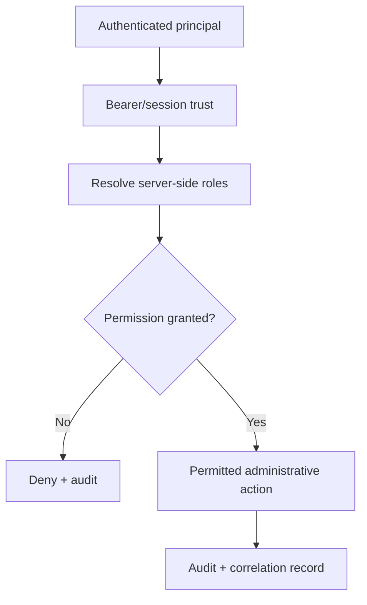

# DTMO Administrator Guide

**Audience:** authorized administrators, security administrators and auditors  
**Scope:** identity, RBAC, privileged Administration, source governance, automation boundaries and controlled operational configuration.

## 1. Administrative security model

DTMO Administration is governed by server-side authorization. UI visibility is never the final authorization decision. Human and service identities remain distinguishable and least privilege is the default.

Relevant workflows include authentication/bearer trust, RBAC/privileged administration and audit/correlation. A successful UI action is not sufficient administrative evidence unless resulting state and audit are attributable.

## 2. Roles and authority separation

Administrators manage principals according to business role rather than convenience. Changes to privileged roles must be attributable and reviewable. Service identities must not silently acquire human-only approval authority.

Key permissions remain server-authoritative and separated by purpose: `read:intelligence`, `review:intelligence`, `approve:share`, `handoff:case`, `manage:connectors` and administration permissions are not interchangeable. Technical access, CI/deployment identity and service connectivity do not grant human review, sharing, publication, case or production authority.

## 3. Source and automation governance

The Sources & Collection control plane separates source definitions, runtime registration and operational state. Administrators verify source identity/endpoint purpose, execution profile, secret references, enablement, provenance expectations and manual-execution rules. Raw credential values remain server-side; repository, browser and evidence artifacts contain references rather than secrets.

Automation & Playbooks reuses governed connector execution. Automation success is execution evidence only: it does not prove source truth, compromise, remediation, review completion, publication/share authority or production readiness.

## 4. Phase 11.10l Governance & Evidence boundary

The canonical `/workbench/governance` workspace is read-oriented. It consumes `GET /api/v1/governance/knowledge` under server-side `read:intelligence`; viewing a framework or mapping grants **no administrative permission**.

The repository contains explicit typed partial mappings for Normenkader IBP, MITRE ATT&CK and NIST CSF plus CVSS context in `backend/dtmo/governance_crosswalk.py` and `docs/governance/GOVERNANCE_MAPPING_REGISTRY.md`. Administrators must not convert these scoped relationships into blanket compliance, certification or environment-effectiveness claims. Unrecorded framework objects remain unmapped and missing evidence fails closed.

Governance visibility does not authorize role changes, connector execution, review, case creation, remediation, external sharing, publication or production. Any future governance write capability must use a separately authorized, attributable server-side mutation contract; Phase 11.10l introduces none.

## 5. Audit, correlation and evidence handling

Privileged actions must retain actor, action, target, result and request/correlation context. Audit evidence must avoid secrets and unnecessary personal data. Evidence is interpreted according to its class: repository CI is repository engineering evidence; owner acceptance, production-equivalent validation, independent assurance and production authorization remain separate decisions.

## 6. Current lifecycle

Phase 10 remains **`NO-GO / BLOCKED — PLATFORM INDUSTRIALISATION REQUIRED`**. Phase 11.10a–11.10k are `PASS / REPOSITORY_COMPLETE`; Phase 11.10l is `IN PROGRESS / EXACT-HEAD VALIDATION REQUIRED`. Phase 11.10 as a whole remains `IN PROGRESS / FRESH CANDIDATE-BOUND EVIDENCE REQUIRED`. Phase 11.10m–11.10o, Phase 11.11 and Phase 12 are `NOT STARTED`; 11.10p requires later immutable candidate freeze. DTMO is **not production authorized**.

Historical Phase 8 `PASS / OWNER_ACCEPTED` and Phase 9 `PASS / EXTERNAL_ASSURANCE_ACCEPTED` evidence remains candidate-bound history and cannot be reused for the materially changed Phase 11 candidate.
