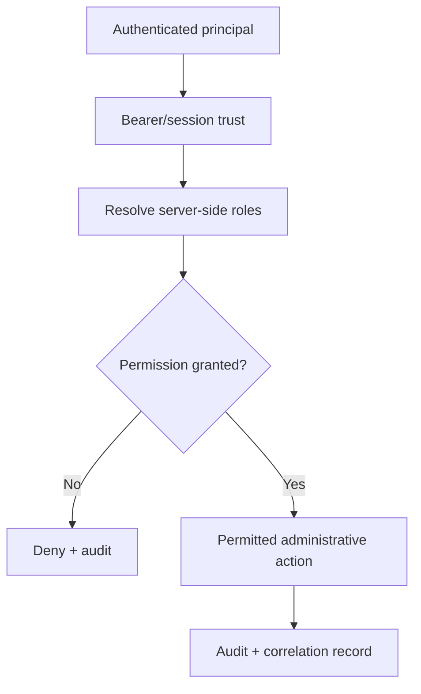
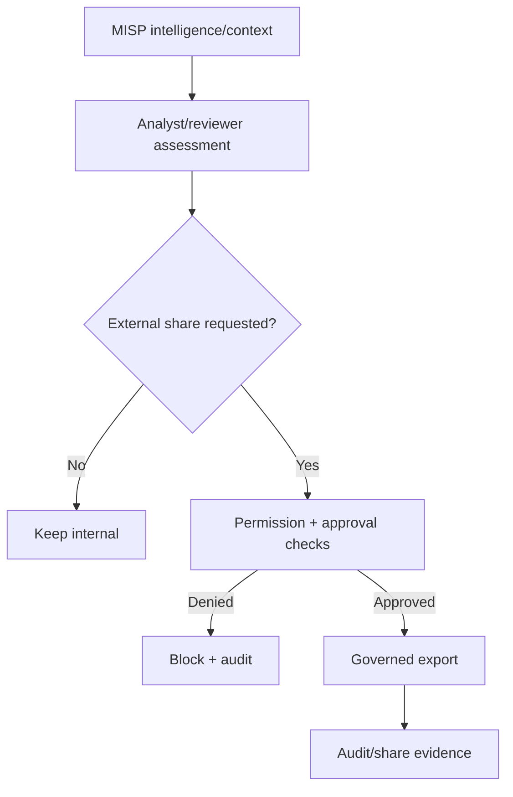
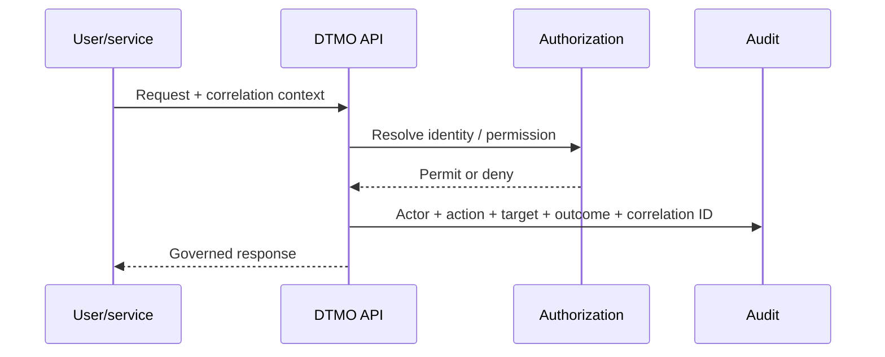

# DTMO Administrator Guide

**Audience:** authorized administrators, security administrators and auditors  
**Scope:** identity, RBAC, privileged Administration, source governance and controlled operational configuration.

## 1. Administrative security model

DTMO Administration is governed by server-side authorization. UI visibility is never the final authorization decision. Human and service identities must remain distinguishable and least privilege is the default.

Relevant workflows: **WF-05 Authentication and bearer trust**, **WF-06 RBAC and privileged Administration**, **WF-07 Audit and correlation**.

## 2. Roles and principals

Administrators should manage principals according to business role rather than convenience. Changes to privileged roles must be attributable and reviewable. Service identities must not silently acquire human-only approval authority.

Typical product roles include analyst, reviewer, publisher and administrator roles where configured. Exact permissions remain defined by the server-side authorization model.

**Screenshot reference:** `administration-rbac.png` in the governed screenshot catalogue.

## 3. Privileged Administration workflow

A successful UI action is not sufficient administrative evidence unless the resulting state and audit trail are attributable.

## 4. Source governance

The **Sources & Catalogue** surface separates source definitions, runtime registration and operational status. Administrators should verify:

- source identity and endpoint purpose;
- execution profile and supported connector type;
- secret references rather than raw credentials;
- enablement and interval settings;
- health/failure state;
- provenance expectations;
- whether manual execution is permitted;
- whether external sharing requires additional human approval.

**Screenshot reference:** `sources-catalogue.png`.

## 5. Secrets and credentials

Raw secrets, tokens or production credentials must not be stored in documentation, evidence manifests or screenshots. Secret references should be used where the product supports them. Production credentials must not be reused for fixture-backed documentation capture or unrelated staging evidence.

## 6. MISP administration and sharing boundary

MISP connectivity and MISP export authority are distinct. Read access can support analysis without granting external publication rights. Governed export requires the configured permissions and human approval chain.

Relevant workflow: **WF-03**.

## 7. AIL administration boundary

AIL is used as governed read/enrichment/correlation context. Administrators should preserve data-minimization controls and avoid exposing unnecessary raw paste/leak content when an indicator-level analytical relationship is sufficient.

Relevant workflow: **WF-04**.

## 8. Audit and correlation

Administrative and security-relevant actions should produce attributable evidence with actor identity, action, target/object, outcome, timestamp and request/correlation context where applicable. Failed or denied authorization is also security-relevant evidence.

## 9. Operational administration

Administrative changes that affect deployment, data stores, IAM, recovery or monitoring should follow the formal change/rollback process. Repository CI and local Docker behavior can support validation but do not substitute for accepted production-equivalent staging evidence.

Relevant workflows: **WF-09 Observability**, **WF-10 Backup/recovery/rollback** and **WF-11 Deployment/immutable identity**.

## 10. Screenshot and evidence boundary

The screenshots referenced by this guide are documentation illustrations from the real DTMO UI with sanitized synthetic fixture data unless explicitly labelled otherwise. They are safe visual examples, not evidence that a privileged change was performed in the approved staging environment.

## 11. Related documentation

- [`PRODUCT_GUIDE.md`](../product/PRODUCT_GUIDE.md)
- [`USER_GUIDE.md`](../user/USER_GUIDE.md)
- [`SECURITY_OVERVIEW.md`](../security/SECURITY_OVERVIEW.md)
- [`SYSTEM_WORKFLOWS.md`](../architecture/SYSTEM_WORKFLOWS.md)
- [`OPERATIONS_MANUAL.md`](../operations/OPERATIONS_MANUAL.md)
