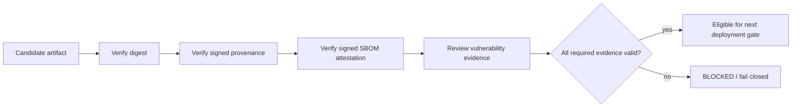

# Supply-chain release verification

## Purpose

This administrator guide defines how an authorized release/deployment operator verifies DTMO supply-chain evidence without treating CI or signatures as production authorization.

## Required release evidence

For a candidate that claims Phase 11.8g compliance, require:

- immutable artifact identity and SHA-256 subject digest;
- Python and container CycloneDX SBOM evidence;
- successful governed vulnerability evidence for the exact build;
- signed provenance attestation for the exact release artifact;
- signed SBOM attestation for the exact release artifact;
- expected repository/workflow/release identity during verification.

## Verification workflow

Use `gh attestation verify` or an equivalent policy engine to verify the artifact against the expected DTMO repository identity. Verification is a prerequisite for later deployment admission; it does not itself authorize production.

## Credential handling

Do not store private signing keys in Git, Helm values, CI evidence or administrator documentation. The governed release path uses short-lived OIDC-backed signing. Registry credentials, if later required, remain deployment-owned secrets delivered through the approved secret-management boundary.

## Exceptions

A vulnerability exception must be explicit, accountable, time-bounded and traceable to the exact finding and artifact identity. An exception does not rewrite the scanner output or turn missing evidence into `PASS`.

## Fail-closed conditions

Reject the candidate when the artifact digest, SBOM, vulnerability evidence, signed provenance, signed SBOM attestation or expected identity cannot be verified. Do not substitute historical Phase 8/9 evidence, a different artifact digest or a rebuilt binary for the exact release subject.
