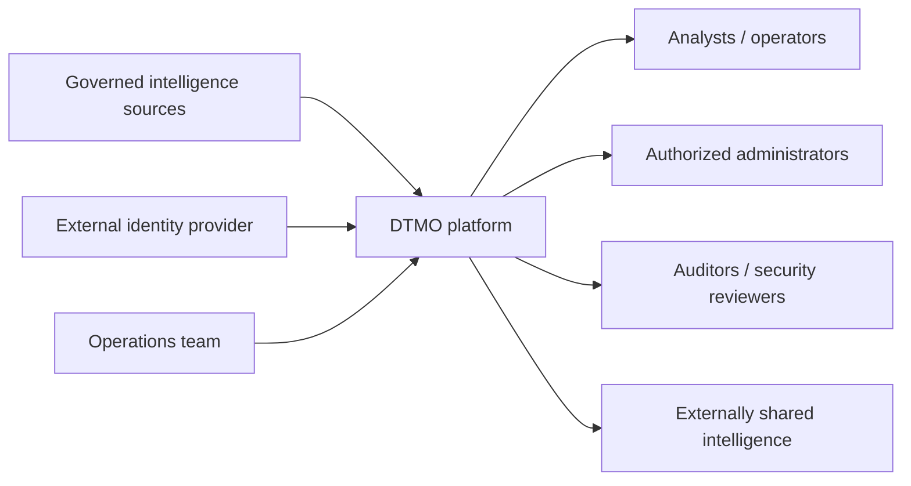

# DTMO Architecture Context

## Purpose

This document gives reviewers, assessors and stakeholders a concise architectural orientation before they enter the detailed system architecture. It defines the platform boundary, principal trust relationships, canonical state, deployment assumptions and evidence limits.

## System context

DTMO receives threat intelligence from approved sources, normalizes and stores it with provenance, exposes a governed operator console, supports controlled administration and retains explicit human authority over review and external sharing.

## Principal architectural boundaries

| Boundary | Security significance |
|---|---|
| External source → connector | Source authenticity, endpoint validation, parser safety, provenance and secret handling |
| Identity provider → DTMO API | Token trust, issuer/audience/signature and principal/role claim validation |
| Browser → application services | Authentication, RBAC, request correlation and privileged-action control |
| Application → PostgreSQL | Canonical application truth and durable commit boundary |
| Application → OpenSearch | Supporting search representation; not canonical truth |
| Application → object storage | Raw source/evidence retention |
| Application → Redis | Ephemeral coordination/cache/queue state |
| Application → observability | Bounded operational telemetry, not canonical business state |
| DTMO → external sharing | Separate explicit human approval boundary |
| Repository CI → staging | Engineering evidence cannot substitute for environment acceptance |

## Canonical state and supporting stores

PostgreSQL is the authoritative application persistence layer for normalized intelligence and managed application state. OpenSearch is a supporting search index. S3-compatible storage retains raw evidence. Redis provides ephemeral runtime coordination. Prometheus and Grafana provide operational visibility.

A supporting store becoming available does not establish successful canonical persistence. Ingestion success is bounded by the durable PostgreSQL commit boundary.

## Identity and authority model

DTMO distinguishes authentication, authorization, administration, review and external-share authority.

- Production bearer tokens are externally issued and cryptographically validated.
- Server-side RBAC controls application authorization.
- Human and service identities remain separate.
- Administration rights do not silently grant intelligence review or external publication rights.
- External sharing requires explicit human approval.

## Deployment model

The repository contains a Docker Compose reference topology and staging-emulator capabilities. These support engineering verification only. Production readiness requires an approved production-equivalent staging environment with an immutable deployment identity and environment-specific security, parity, recovery and operational evidence.

## Evidence boundary

Architecture documentation describes the accepted design and current repository-controlled state. It does not itself prove that a production-equivalent staging environment exists, that independent assurance has completed or that production deployment has been authorized.

For detailed component, trust-boundary and deployment information, see `SYSTEM_ARCHITECTURE.md`.
