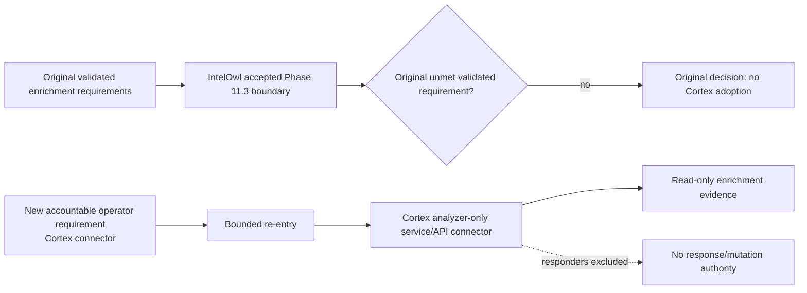

# Phase 11.7 Cortex Decision Gate

State: **`PASS / REPOSITORY_COMPLETE — OPERATOR RE-ENTRY REQUIREMENT RECORDED`**  
Decision date: **2026-08-17**

## Original accepted decision

DTMO does **not** adopt Cortex in the original Phase 11 candidate assessed by this decision. Phase 11.7 was explicitly conditional on a validated capability gap remaining after the accepted IntelOwl integration. Repository review found no such validated gap for the then-approved DTMO enrichment requirements.

That decision remains valid historical architecture evidence for the requirement set it assessed. It is not rewritten into a claim that Cortex was required at that time.

## New attributable requirement and re-entry

On **2026-08-17** the accountable operator explicitly required DTMO to add a **Cortex connector**. This is a new attributable requirement that did not exist in the original Phase 11.7 requirement set and therefore triggers the decision's re-entry path.

The re-entry is intentionally narrower than full Cortex adoption: DTMO adds an **analyzer-only service/API connector**. Cortex responders, automated response, TheHive responder automation and any mutation authority remain excluded. The connector is additive and does not replace the accepted IntelOwl enrichment boundary.

## Evidence reviewed

The accepted Phase 11.3 IntelOwl boundary already provides the required generic enrichment capabilities for the original DTMO scope:

| DTMO requirement | Accepted IntelOwl capability | Decision |
|---|---|---|
| Observable enrichment for CVE, IP, domain, URL and hash | approved analyzers/playbooks via bounded service API | covered |
| Explicit provider/analyzer governance | configured allowlist and fail-closed unknown analyzer handling | covered |
| Human authorization before disclosure | `REVIEW_INTELLIGENCE` governed execution | covered |
| TLP/handling restrictions | pre-disclosure fail-closed policy plus upstream maximum-TLP guardrail | covered |
| Stable job/result identity | DTMO item + IntelOwl job/analyzer identity | covered |
| Partial-result semantics | successful and failed analyzers retained separately | covered |
| Durable enrichment provenance | immutable `intelowl_enrichment_records` history | covered |
| No publication/share authority inheritance | database-enforced no-share invariant | covered |
| No local-compromise inference | database-enforced no-local-compromise invariant | covered |
| Bounded execution / outage isolation | bounded polling, quota/error handling and dependency isolation | covered |

IntelOwl Connectors and external side-effect actions remain deliberately excluded. That exclusion remains an authority/control boundary rather than retroactive evidence of a capability defect.

## Cortex boundary

Cortex remains a separate service/API and licensing boundary. The bounded DTMO connector may invoke explicitly allowlisted **analyzers only** and import the returned report as read-only enrichment evidence.

Responders introduce mutation/response authority and remain excluded. The accepted TheHive handoff remains a distinct human-authorized case-creation path and does not inherit Cortex responder authority.

## Trust-boundary decision

## Re-entry criteria

The original decision required a new attributable requirement, explicit licensing/identity/secret/network/provenance/human-authority design, a new bounded PR and exact-head acceptance before runtime integration. The operator requirement above supplies the attributable re-entry trigger. The bounded connector PR must still satisfy all remaining controls.

Any future expansion from analyzers to responders requires a **new** decision and cannot be inferred from acceptance of this connector.

## Evidence boundary

Repository CI can validate connector policy, synthetic request/response handling and consistency with accepted IntelOwl/TheHive contracts. It cannot establish live analyzer coverage, provider quality, production permissions, operational responder safety, lawful disclosure authority, independent assurance or production authorization.

Historical Phase 8/9 evidence is not reused. Phase 11.8 remains the next priority after this bounded re-entry connector is protected-merged.