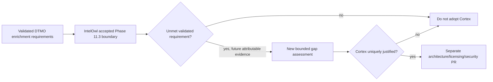

# Phase 11.7 Cortex Decision Gate

State: **`IN PROGRESS / EXACT-HEAD VALIDATION REQUIRED`**  
Decision date: **2026-08-17**

## Decision

DTMO does **not** adopt Cortex in the current Phase 11 candidate. Phase 11.7 was explicitly conditional on a validated capability gap remaining after the accepted IntelOwl integration. Repository review finds no such validated gap for the currently approved DTMO enrichment requirements.

This is a bounded architecture decision, not production evidence. A future Cortex proposal requires a new, attributable requirement and a separate capability-gap assessment; absence of a current gap does not claim that IntelOwl can satisfy every conceivable SOAR or responder use case.

## Evidence reviewed

The accepted Phase 11.3 IntelOwl boundary already provides the required generic enrichment capabilities for the defined DTMO scope:

| DTMO requirement | Accepted IntelOwl capability | Decision |
|---|---|---|
| Observable enrichment for CVE, IP, domain, URL and hash | approved analyzers/playbooks via bounded service API | covered |
| Explicit provider/analyzer governance | configured allowlist and fail-closed unknown analyzer handling | covered |
| Human authorization before disclosure | `REVIEW_INTELLIGENCE` governed execution | covered |
| TLP/handling restrictions | pre-disclosure fail-closed policy plus upstream maximum-TLP guardrail | covered |
| Stable job/result identity | DTMO item + IntelOwl job/analyzer identity | covered |
| Partial-result semantics | successful and failed analyzers retained separately | covered |
| Durable enrichment provenance | immutable `intelowl_enrichment_records` history | covered |
| No publication/share authority inheritance | database-enforced no-share invariant | covered |
| No local-compromise inference | database-enforced no-local-compromise invariant | covered |
| Bounded execution / outage isolation | bounded polling, quota/error handling and dependency isolation | covered |

IntelOwl Connectors and external side-effect actions remain deliberately excluded. That exclusion is an authority/control boundary, not a capability defect that justifies Cortex adoption.

## Cortex boundary

Cortex analyzers/responders would add another service, identity, secret, licensing/maintenance and external-side-effect boundary. Responders in particular introduce mutation/response authority that is outside the accepted enrichment requirement and would require separate human authorization, replay safety, data-handling, audit and deployment evidence.

The accepted TheHive handoff does not create a Cortex requirement. Case creation remains a distinct human-authorized operation and responders remain excluded.

## Trust-boundary decision

## Re-entry criteria

Cortex may be reconsidered only when all of the following exist:

1. a concrete operational requirement not satisfied by the accepted IntelOwl contract;
2. attributable evidence that the gap is material rather than a convenience preference;
3. analysis showing the requirement cannot be met safely by an approved IntelOwl analyzer/playbook or existing DTMO/TheHive boundary;
4. explicit licensing, identity, secret, network, provenance and human-authority design;
5. a new bounded PR and exact-head acceptance before any runtime integration.

## Evidence boundary

Repository CI can validate this decision record and consistency with the accepted IntelOwl/TheHive contracts. It cannot establish live analyzer coverage, provider quality, production permissions, operational responder safety, independent assurance or production authorization.

Historical Phase 8/9 evidence is not reused. Phase 11.8 remains the next priority only after this decision gate is protected-merged.