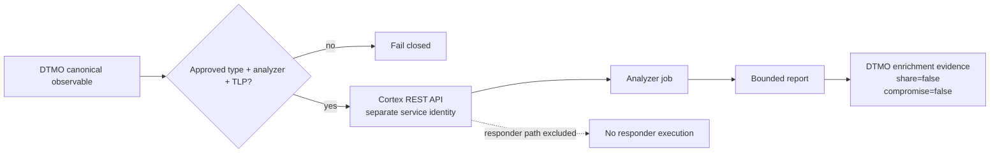

# Cortex → DTMO Analyzer Integration Contract

State: **`IN PROGRESS / EXACT-HEAD VALIDATION REQUIRED`**  
Owner requirement: **2026-08-17**

## Decision

The DTMO owner has now explicitly required a Cortex connector. This attributable requirement reopens the earlier conditional Phase 11.7 no-adoption decision as a bounded Phase 11.7b integration. Phase 11.8 remains blocked until this slice is protected-merged.

Cortex remains a separate service boundary; DTMO does not vendor Cortex or Cortex-Analyzers source. StrangeBee documentation describes Cortex as fully open source and not requiring a product license. Analyzer implementations can have their own licenses and third-party provider terms, so each enabled analyzer remains separately governed.

## Supported API boundary

The connector uses the official Cortex REST API with API-key bearer authentication:

- `POST /api/analyzer/{ANALYZER_ID}/run` — submit one non-file observable to an explicitly allowed analyzer;
- `GET /api/job/{JOB_ID}/waitreport?atMost=...` — retrieve the bounded job report;
- API key identity must have only the permissions needed to analyze/read jobs in the approved Cortex organization.

No organization administration, user administration, analyzer enable/disable/update, job deletion or responder execution is permitted by DTMO.

## Authority and provenance invariants

1. Cortex analyzer execution is enrichment only; it does not establish local compromise.
2. Cortex output never grants DTMO publication/share authority.
3. Analyzer IDs and observable datatypes are explicit allowlists.
4. Personal-data datatypes are excluded from this slice.
5. TLP is explicit and fail-closed; values outside the Cortex 0..3 range are rejected before network I/O.
6. Stable Cortex job identity is required and returned analyzer identity must match the requested analyzer when present.
7. Result size is bounded and malformed result structures fail closed.
8. Responders and all external side-effect actions remain excluded.
9. DTMO stores or presents Cortex output only as attributable enrichment evidence and preserves the canonical DTMO item identity in connector metadata.
10. Live provider/API credentials, analyzer configuration, organization scope and lawful disclosure authorization are deployment evidence, never inferred from CI.

## Trust boundary

## Relationship to IntelOwl

IntelOwl remains the primary accepted generic enrichment integration. Cortex is an additional owner-required analyzer connector and must not silently duplicate or replace existing IntelOwl authority controls. Analyzer selection remains explicit. A future consolidation decision may compare coverage and operational cost, but this PR does not remove IntelOwl or introduce autonomous fallback between platforms.

## Evidence boundary

Repository tests may prove request validation, endpoint construction, bearer authentication, identity checks, bounded report normalization and production configuration guardrails. They do **not** prove live Cortex reachability, enabled analyzer quality, external-provider entitlement, lawful data disclosure, production-equivalent behavior or production authorization.
