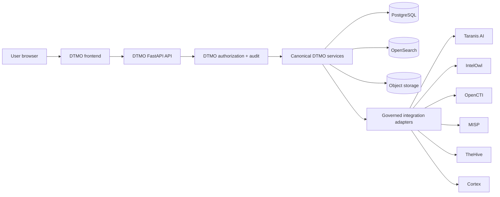

# DTMO Canonical Frontend Architecture

Status: **Phase 11.10a — PASS / REPOSITORY_COMPLETE; Phase 11.10b — IN PROGRESS / CANONICAL SHELL IMPLEMENTATION**  
Last updated: **2026-08-20**

## 1. Purpose

This document is the accepted architecture baseline for the next-generation DTMO Unified Operations Workbench. Phase 11.10a established the frontend, information-architecture, design-system and browser/API contracts. Phase 11.10b now implements the canonical shell foundation without importing Command Center feature scope from 11.10c.

The objective remains one maintainable canonical browser application while preserving the security, authority, provenance and evidence boundaries already accepted elsewhere in DTMO.

## 2. Architectural decision

The canonical browser application uses:

- **React** for composable application views;
- **TypeScript** for typed frontend contracts;
- **Vite** for deterministic frontend development/build tooling;
- **React Router** for canonical client-side navigation;
- **TanStack Query** for governed server-state retrieval, cache invalidation and request state;
- a DTMO-owned component/design-system layer using CSS design tokens;
- later bounded graph and analytical visualization adapters for accepted feature slices.

Phase 11.10b exact-pins the direct frontend dependency set and commits the npm dependency lockfile. Third-party packages remain subject to DTMO licensing, dependency and supply-chain controls; inclusion in the browser bundle does not collapse upstream service or licensing boundaries.

## 3. Canonical trust path

The browser is never a privileged integration broker. The canonical path is:

### Invariant

**Browser → DTMO API → governed integration adapter → upstream service** is mandatory for normal product operations.

The browser must not directly invoke Taranis AI, IntelOwl, OpenCTI, MISP, TheHive or Cortex for governed product workflows. Advanced upstream administration can remain an explicitly separate operational escape hatch where required, but it is not the canonical DTMO product path and cannot bypass DTMO authorization, provenance or evidence controls.

## 4. Application shell

The canonical shell contains four persistent regions:

1. **Primary navigation** — stable navigation grouped by operator intent rather than service ownership.
2. **Global command/status bar** — navigation/command palette, environment health and principal context; later slices may add candidate identity and governed notifications where attributable data exists.
3. **Main workspace** — task-specific content delivered incrementally in 11.10c–11.10n.
4. **Context rail/drawer** — selected-object facts and governed actions without losing the current workspace.

Phase 11.10b implements these four regions under `/workbench/`. The command palette is navigation-only in this slice. The context rail starts fail-closed with `Geen object geselecteerd`; it does not infer object facts from integration configuration.

## 5. Target capability workspaces

The accepted information architecture in `docs/ux/INFORMATION_ARCHITECTURE.md` includes:

- Command Center;
- Threat Intelligence;
- Exposure;
- Investigations;
- Analysis & Enrichment;
- Sharing & Exchange;
- Automation & Playbooks;
- Collection;
- Governance & Evidence;
- Operations;
- Administration.

Phase 11.10b creates safe route foundations for these domains. A route foundation is not feature acceptance and must not display fabricated operational metrics or state.

## 6. Object-centric interaction model

A canonical intelligence object, IOC, CVE, threat actor, campaign, source, case or other governed entity can later be selected from compatible workspaces. The common context model supports:

- canonical identity;
- severity/classification where applicable;
- confidence;
- provenance and markings;
- linked intelligence;
- enrichment/analysis state;
- relationships;
- cases/tasks;
- sharing/approval state;
- audit timeline;
- actions allowed to the current principal.

Phase 11.10b implements only the context container and truthful no-selection state. Object data and actions arrive with their bounded feature/API slices.

## 7. Frontend state model

### 7.1 Server state

Canonical state is retrieved from DTMO APIs. TanStack Query manages request lifecycle and stale-state behavior. Browser caches never become authoritative product state.

### 7.2 URL state

Workspace, object identity, filters, pagination and safe investigation context should be URL-addressable where practical without embedding secrets.

### 7.3 Ephemeral UI state

Drawer visibility, local sort direction, temporary form state and presentation preferences may remain client-local. Phase 11.10b persists only the non-sensitive theme preference in local storage.

### 7.4 Security-sensitive state

Credentials, API secrets, private keys, upstream tokens and approval authority are never ordinary persistent frontend state. Production authentication follows the configured identity/bearer-token trust model and server-side authorization remains authoritative.

## 8. Authorization and authority boundaries

Role-aware rendering is a usability feature, not a security control. Every governed operation remains server-authorized.

The frontend preserves:

- least privilege;
- **server-side RBAC**;
- **human/service identity separation**;
- read-only auditor behavior;
- administrator self-protection and final-admin protections;
- case-handoff authority separate from publication/share authority;
- human review and external-share approval separation;
- **no local-compromise inference** from enrichment/graph presence;
- no publication authority from a connector call, analyzer result, MISP match, OpenCTI relationship or TheHive case.

High-impact actions require their feature-specific server contract and cannot be created merely by exposing a control in the shell.

## 9. API and integration boundary

The detailed browser/API contract is `docs/architecture/UI_API_CONTRACT.md`.

All frontend capabilities must either reuse an existing governed `/api/v1/...` endpoint with the required authorization/audit semantics or add a bounded DTMO API contract in the same feature slice before the UI depends on it.

Phase 11.10b uses same-origin `/health` and `/api/v1/ui/session` only for shell status/principal context. It does not become an upstream service client.

## 10. Design-system boundary

The visual and interaction contract is `docs/ux/DESIGN_SYSTEM.md`.

The 11.10b shell implements its first reusable baseline:

- semantic design tokens rather than page-local styling;
- dark operations and accessible light modes;
- consistent surfaces, spacing and typography;
- skip link and visible keyboard focus;
- responsive navigation/context behavior;
- reduced-motion handling;
- no colour-only status semantics;
- explicit loading/degraded/empty truth rather than synthetic data.

Feature-specific component acceptance continues in later slices.

## 11. Migration from current UI

The migration is incremental and bounded:

1. Phase 11.10a architecture/design contracts — `PASS / REPOSITORY_COMPLETE`.
2. **Phase 11.10b — canonical application shell** — active.
3. Phase 11.10c–11.10n migrate capabilities one bounded slice at a time.
4. Phase 11.10o performs consolidation/full functional acceptance and retires obsolete UI paths where safe.
5. Phase 11.10p executes fresh production-equivalent validation only after immutable candidate freeze.

The declared canonical built product route is `/workbench/`. `/ui/console` remains a temporary migration compatibility path, not a parallel feature-development target.

## 12. Build and deployment contract

Phase 11.10b implements the build contract defined in 11.10a:

- `frontend/package.json` exact-pins direct dependencies;
- `frontend/package-lock.json` is committed and is the authoritative npm dependency graph;
- supported CI and container builds use `npm ci` and do not regenerate dependency resolution;
- TypeScript is checked before Vite production build;
- Vite creates hashed production assets and no production source maps;
- the frontend build is a separate Docker build stage pinned by immutable Node image digest;
- Node/npm tooling is not copied into the final Python runtime image;
- only `frontend/dist` enters the supported runtime;
- FastAPI serves `/workbench/` and hashed assets through the same application origin;
- the canonical index uses a strict self-origin CSP and `no-store`;
- hashed assets use long-lived immutable caching;
- CI records exact-head frontend asset SHA-256 hashes and audits production frontend dependencies;
- existing final-container SBOM/vulnerability and artifact-attestation controls continue to apply.

This build integration creates no second browser ingress or upstream credential path.

## 13. Observability

The browser uses bounded shell state and server request behavior suitable for troubleshooting without leaking sensitive intelligence or credentials. Server-side correlation/request IDs remain authoritative for governed actions.

Later features must distinguish authentication/authorization failure, validation failure, upstream dependency degradation, canonical backend failure, empty canonical data and stale/read-only degraded mode.

## 14. Accessibility

The 11.10b shell implements a baseline of:

- semantic navigation/main/context regions;
- skip-to-content;
- visible focus;
- keyboard route navigation and Ctrl/Cmd+K palette;
- responsive reflow and mobile navigation drawer;
- context drawer behavior below desktop layout thresholds;
- dark/light semantic themes;
- reduced-motion behavior;
- status not conveyed by colour alone.

Full role-aware and feature-specific WCAG 2.2 AA acceptance remains Phase 11.10n plus final 11.10o consolidation.

## 15. Evidence boundary

Phase 11.10a repository acceptance proves the architecture/design contract is accepted and protected by CI. Phase 11.10b repository/browser CI can additionally prove the exact-head dependency/build contract, same-origin shell serving, route mechanics, responsive baseline and CSP/cache behavior.

Neither proves:

- live upstream integration behavior;
- functional acceptance of Command Center or later workspaces;
- production-equivalent deployment/continuity;
- independent external assurance;
- production authorization.

The graphical reference remains a design target, not operational evidence.

## 16. Lifecycle and exit

Phase 11.10a is **`PASS / REPOSITORY_COMPLETE`**.

Phase 11.10b may become **`PASS / REPOSITORY_COMPLETE`** only when the committed lockfile is consumed unchanged, the shell build/browser contract is green on the exact final head, existing security/supply-chain regressions remain green and all professional lifecycle documentation is synchronized.

The only next bounded slice after 11.10b acceptance is **Phase 11.10c — Command Center**.
