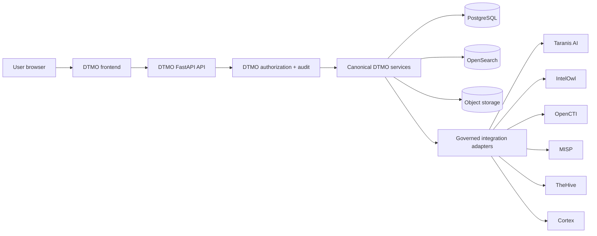

# DTMO Canonical Frontend Architecture

Status: **Phase 11.10a–11.10g — PASS / REPOSITORY_COMPLETE; Phase 11.10h — IN PROGRESS / THEHIVE INVESTIGATIONS & CASES**  
Last updated: **2026-08-20**

## 1. Purpose

This document is the accepted architecture baseline for the DTMO Unified Operations Workbench. Phase 11.10a established the frontend, information-architecture, design-system and browser/API contracts. **Phase 11.10b implemented the canonical shell**, Phase 11.10c delivered the Command Center, Phase 11.10d governed intelligence discovery/investigation, Phase 11.10e governed IntelOwl/Cortex analysis, Phase 11.10f persisted OpenCTI graph/entity context, Phase 11.10g delivered governed MISP Sharing & Exchange, and Phase 11.10h is the active migration of TheHive Investigations & Cases.

The objective remains one maintainable canonical browser application while preserving security, authority, provenance and evidence boundaries already accepted elsewhere in DTMO.

## 2. Architectural decision

The canonical browser application uses:

- **React** for composable application views;
- **TypeScript** for typed frontend contracts;
- **Vite** for deterministic frontend development/build tooling;
- **React Router** for canonical client-side navigation;
- **TanStack Query** for governed server-state retrieval, cache invalidation and request state;
- a DTMO-owned component/design-system layer using CSS design tokens;
- bounded graph and analytical visualization adapters only when their feature slices are accepted.

The direct frontend dependency set remains exact-pinned and the npm lockfile committed. Third-party packages remain subject to DTMO licensing, dependency and supply-chain controls; browser inclusion does not collapse upstream service or licensing boundaries.

## 3. Canonical trust path

The browser is never a privileged integration broker. The canonical path is:

### Invariant

**Browser → DTMO API → governed integration adapter → upstream service** is mandatory for normal product operations.

The browser must not directly invoke Taranis AI, IntelOwl, OpenCTI, MISP, TheHive or Cortex for governed product workflows. Advanced upstream administration can remain an explicitly separate operational escape hatch where required, but it is not the canonical DTMO product path and cannot bypass DTMO authorization, provenance or evidence controls.

## 4. Application shell

The canonical shell contains four persistent regions:

1. **Primary navigation** — stable navigation grouped by operator intent rather than service ownership.
2. **Global command/status bar** — navigation/command palette, environment health and principal context.
3. **Main workspace** — task-specific content delivered incrementally in 11.10c–11.10n.
4. **Context rail/drawer** — selected-object facts and governed actions without losing the current workspace.

Phase 11.10b accepted these regions under `/workbench/`. The command palette remains navigation-safe; high-impact operations require accepted server contracts. The context rail remains fail-closed when no attributable selection exists.

## 5. Delivered and target capability workspaces

- Command Center — accepted in 11.10c;
- Threat Intelligence — accepted in 11.10d;
- IOC Explorer — accepted in 11.10d;
- Knowledge Graph — accepted in 11.10f;
- Exposure — 11.10i;
- Investigations — active in 11.10h;
- Analysis & Enrichment — accepted in 11.10e;
- Sharing & Exchange — accepted in 11.10g;
- Automation & Playbooks — 11.10k;
- Collection — 11.10j;
- Governance & Evidence — 11.10l;
- Operations and Administration — 11.10m.

A route foundation is not feature acceptance and must not display fabricated operational metrics or state.

## 6. Object-centric interaction model

A canonical intelligence object, IOC, CVE, threat actor, campaign, source, case or other governed entity can be selected from compatible workspaces. The common context model supports, where attributable, canonical identity, severity/classification, confidence, provenance/markings, linked intelligence, enrichment/analysis state, relationships, cases/tasks, sharing/approval state, audit timeline and actions allowed to the current principal.

Phase 11.10d established deep object investigation. Phase 11.10e extended object context into persisted analysis history. Phase 11.10f extended it into persisted OpenCTI graph/entity evidence. Phase 11.10g extended it into canonical sharing state, human review/share attribution, handling restrictions and MISP export evidence. Phase 11.10h extends it into canonical investigation state and durable TheHive handoff/reconciliation evidence without fabricating upstream alerts, tasks or timeline state.

## 7. Frontend state model

### 7.1 Server state
Canonical state is retrieved from DTMO APIs. TanStack Query or bounded request-state handling manages request lifecycle and stale-state behavior. Browser caches never become authoritative product state.

### 7.2 URL state
Workspace, object identity, filters, pagination and safe investigation context should be URL-addressable where practical without embedding secrets. The `item` query parameter carries only canonical UUID context for analysis, graph, sharing and investigation deep links.

### 7.3 Ephemeral UI state
Drawer visibility, local sort direction, temporary form state and presentation preferences may remain client-local. Only non-sensitive preferences such as theme may be persisted locally.

### 7.4 Security-sensitive state
Credentials, API secrets, private keys, upstream tokens and approval authority are never ordinary persistent frontend state. Production authentication follows the configured trust model and server-side authorization remains authoritative.

## 8. Authorization and authority boundaries

Role-aware rendering is a usability feature, not a security control. Every governed operation remains server-authorized.

The frontend preserves:

- least privilege;
- **server-side RBAC**;
- **human/service identity separation**;
- read-only auditor behavior;
- administrator self-protection and final-admin protections;
- case-handoff authority separate from publication/share authority;
- human review and external-share approval separation;
- **no local-compromise inference** from enrichment/graph/exchange/case presence;
- no publication authority from a connector call, analyzer result, MISP match/export, OpenCTI mapping or TheHive case.

Phase 11.10d search/canonical detail require `read:intelligence`. Phase 11.10e analysis history/capabilities require `read:intelligence` while explicit IntelOwl/Cortex execution requires `review:intelligence`. Phase 11.10f OpenCTI capability/graph/entity detail is read-only and requires `read:intelligence`.

Phase 11.10g canonical sharing-state reads require `read:intelligence`; review remains `review:intelligence`; external share approval remains `approve:share`. The share approver must be a different human principal from the reviewer.

Phase 11.10h canonical investigation reads require `read:intelligence`; case mutation remains `handoff:case` and an explicit human action. Service accounts cannot authorize TheHive case handoff.

## 9. API and integration boundary

The detailed browser/API contract is `docs/architecture/UI_API_CONTRACT.md`.

All frontend capabilities must either reuse an existing governed `/api/v1/...` endpoint with required authorization/audit semantics or add a bounded DTMO API contract in the same feature slice before the UI depends on it.

Current accepted/active examples are:

- `/health` and `/api/v1/ui/session` for shell context;
- `/api/v1/command-center` for accepted 11.10c operational orientation;
- `/api/v1/intelligence/search` and `/api/v1/intelligence/{item_id}/workspace` for accepted 11.10d discovery/detail;
- `/api/v1/analysis/capabilities`, `/api/v1/analysis/items/{item_id}/history`, `/api/v1/intelowl/items/{item_id}/enrich` and `/api/v1/analysis/items/{item_id}/cortex` for accepted 11.10e analysis;
- `/api/v1/opencti/capabilities`, `/api/v1/opencti/items/{item_id}/graph` and `/api/v1/opencti/entities/{mapping_id}` for accepted 11.10f read-only OpenCTI graph/entity evidence;
- `/api/v1/sharing/items/{item_id}`, `/api/v1/intelligence/{item_id}/review`, `/api/v1/intelligence/{item_id}/share-approval` and `/api/v1/intelligence/{item_id}/misp-export` for accepted 11.10g MISP sharing/exchange;
- `/api/v1/thehive/items/{item_id}/investigation` and `/api/v1/thehive/items/{item_id}/cases` for active 11.10h investigation state and explicit case handoff.

None makes the browser an upstream service client.

## 10. Accepted MISP sharing safety boundary

MISP remains a separate upstream service behind the accepted DTMO governance/export boundary. Browser requests remain same-origin DTMO API calls; MISP keys remain server-side; review and share approval remain separate human decisions; authoritative source restrictions cannot be weakened; deterministic replay state fails closed; exported events remain `published=false`; and configuration/transfer evidence is not publication, synchronization, health or compromise proof.

## 11. Active TheHive investigation safety boundary

TheHive remains a separate upstream service behind the accepted Phase 11.6 case-handoff adapter.

- browser requests remain same-origin DTMO API calls;
- TheHive API token and organization context remain server-side;
- investigation reads do not create case authority;
- case creation remains an explicit human `handoff:case` action;
- canonical provenance and handling restrictions fail closed;
- durable reservation precedes the external mutation;
- `reserved` or `ambiguous` handoff evidence requires manual reconciliation and blocks blind new UI case requests;
- a delivered handoff establishes only the stable case identity returned at creation time;
- alerts, tasks, case timeline, later upstream state and responder results are not inferred where accepted persistence/readback has no evidence;
- case presence does not prove external sharing, remediation or local compromise;
- configuration is not live TheHive health.

## 12. Design-system boundary

The visual and interaction contract is `docs/ux/DESIGN_SYSTEM.md`. The workbench baseline includes semantic tokens, dark operations and accessible light modes, consistent surfaces, skip link/visible keyboard focus, responsive navigation/context behavior, reduced-motion handling, non-colour-only state and explicit loading/degraded/empty truth rather than synthetic data.

## 13. Migration from current UI

1. Phase 11.10a architecture/design contracts — `PASS / REPOSITORY_COMPLETE`.
2. Phase 11.10b canonical application shell — `PASS / REPOSITORY_COMPLETE`.
3. Phase 11.10c Command Center — `PASS / REPOSITORY_COMPLETE`.
4. Phase 11.10d Unified Intelligence Workspace — `PASS / REPOSITORY_COMPLETE`.
5. Phase 11.10e IntelOwl/Cortex integrated analysis — `PASS / REPOSITORY_COMPLETE`.
6. Phase 11.10f OpenCTI graph/entity workspace — `PASS / REPOSITORY_COMPLETE`.
7. Phase 11.10g MISP Sharing & Exchange — `PASS / REPOSITORY_COMPLETE`.
8. **Phase 11.10h TheHive Investigations & Cases** — active.
9. Phase 11.10i–11.10n migrate remaining capabilities one bounded slice at a time.
10. Phase 11.10o performs consolidation/full functional acceptance and retires obsolete UI paths where safe.
11. Phase 11.10p executes fresh production-equivalent validation only after immutable candidate freeze.

The declared canonical built product route is `/workbench/`. `/ui/console` and prior UI routes remain temporary migration compatibility paths, not parallel feature-development targets.

## 14. Build and deployment contract

The accepted build contract requires exact-pinned direct dependencies in `frontend/package.json`, committed `frontend/package-lock.json`, `npm ci`, TypeScript checking before Vite build, hashed assets/no production source maps, separate immutable Node build stage, no Node/npm in final Python runtime, only `frontend/dist` in supported runtime, same-origin FastAPI serving, strict self-origin CSP, immutable hashed-asset caching, exact-head frontend asset evidence and continued final-container SBOM/vulnerability/artifact-attestation controls.

## 15. Observability and truthful failure

The browser distinguishes authentication/authorization failure, validation failure, upstream dependency degradation, canonical backend failure, empty canonical data and stale/read-only degraded mode.

For 11.10h specifically:

- TheHive configuration is not rendered as live service health;
- missing canonical investigation state is not represented as no case/no compromise;
- missing provenance/authority/handling blocks case creation;
- ambiguous handoff is not represented as failure-safe retry or success;
- repository/browser fixtures remain engineering evidence, not operational evidence.

Server-side correlation/request IDs remain authoritative for governed actions.

## 16. Accessibility

The accepted shell baseline provides semantic navigation/main/context regions, skip-to-content, visible focus, keyboard route navigation and Ctrl/Cmd+K palette, responsive reflow/mobile navigation, dark/light semantic themes, reduced-motion handling and non-colour-only status treatment. Full role-aware and feature-specific WCAG 2.2 AA acceptance remains Phase 11.10n plus final 11.10o consolidation.

## 17. Evidence boundary

Phase 11.10a–11.10g repository/browser acceptance remains accepted within each bounded scope. Phase 11.10h exact-head CI may prove canonical investigation routes, human case authority, handling/reconciliation semantics and fail-closed browser behavior within repository-controlled scope.

None proves completeness or health of live upstream integrations, TheHive case completeness/responder execution, production-equivalent deployment/continuity, independent external assurance or production authorization. The graphical reference remains a design target, not operational evidence.

## 18. Lifecycle and exit

Phase 11.10a–11.10g are **`PASS / REPOSITORY_COMPLETE`**.

Phase 11.10h may become **`PASS / REPOSITORY_COMPLETE`** only when the frontend build and dedicated repository/API/browser contracts are green on one exact final head, existing security/accessibility/integration/runtime/supply-chain regressions remain green, and all professional lifecycle documentation is synchronized.

The only next bounded slice after 11.10h acceptance and merge is **Phase 11.10i — Vulnerability & Exposure**.
