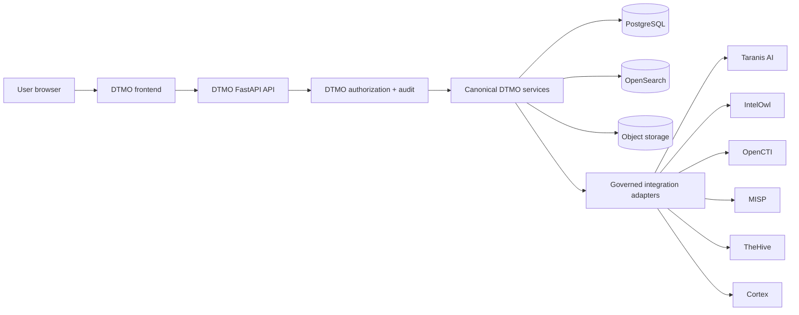

# DTMO Canonical Frontend Architecture

Status: **Phase 11.10a — IN PROGRESS / REPOSITORY ARCHITECTURE CONTRACT**  
Last updated: **2026-08-20**

## 1. Purpose

This document defines the target architecture for the next-generation DTMO Unified Operations Workbench. Phase 11.10a is intentionally an architecture and design-contract slice: it does not claim that the new application shell, workspaces or production-equivalent environment have already been implemented or exercised.

The objective is to replace the current mixture of embedded console markup and separate UI concepts with one maintainable canonical browser application while preserving the security, authority, provenance and evidence boundaries already accepted elsewhere in DTMO.

## 2. Architectural decision

The target browser application is a separately built frontend using:

- **React** for composable application views;
- **TypeScript** for typed frontend contracts;
- **Vite** for deterministic frontend development/build tooling;
- **React Router** for canonical client-side navigation;
- **TanStack Query** for governed server-state retrieval, cache invalidation and request state;
- a DTMO-owned component/design-system layer using CSS design tokens;
- a graph visualization adapter suitable for OpenCTI/entity relationship exploration;
- an analytical visualization adapter suitable for native DTMO charts and trends.

Exact third-party frontend packages must be pinned and reviewed through the existing dependency, licensing and supply-chain process before implementation. This document does not authorize a dependency merely by naming a preferred technology class.

## 3. Canonical trust path

The browser is never a privileged integration broker. The canonical path is:

### Invariant

**Browser → DTMO API → governed integration adapter → upstream service** is mandatory for normal product operations.

The production product must not require direct browser calls to Taranis AI, IntelOwl, OpenCTI, MISP, TheHive or Cortex for governed operations. Advanced upstream administration may remain an explicitly separate escape hatch where required, but it is not the canonical DTMO workflow and cannot bypass DTMO authorization or evidence boundaries.

## 4. Application shell

The canonical shell contains four persistent regions:

1. **Primary navigation** — stable role-aware navigation grouped by operator intent rather than service ownership.
2. **Global command/status bar** — search/command palette, environment identity, immutable candidate identity where applicable, notifications and signed-in principal context.
3. **Main workspace** — task-specific command, intelligence, investigation, exposure, collection, governance, operations or administration content.
4. **Context rail/drawer** — selected object details and governed actions without losing the current workspace.

The shell must support responsive desktop/tablet behavior and a reduced mobile/read-only operational view where full workflows are not safe or usable on a small viewport.

## 5. Target capability workspaces

The target information architecture is defined in `docs/ux/INFORMATION_ARCHITECTURE.md` and includes:

- Command Center;
- Threat Intelligence;
- Exposure;
- Investigations;
- Analysis & Enrichment;
- Sharing & Exchange;
- Automation & Playbooks;
- Collection;
- Governance & Evidence;
- Operations;
- Administration.

Internal service boundaries remain visible as provenance and execution context, but the primary navigation is task-oriented rather than a collection of vendor frontends.

## 6. Object-centric interaction model

A canonical intelligence object, IOC, CVE, threat actor, campaign, source, case or other governed entity can be selected from any compatible workspace. Selection opens a common context surface with:

- canonical identity;
- severity/classification where applicable;
- confidence;
- provenance and markings;
- linked intelligence;
- enrichment/analysis state;
- relationships;
- cases/tasks;
- sharing/approval state;
- audit timeline;
- actions allowed to the current principal.

The user should not have to manually rediscover the same object independently inside every upstream service.

## 7. Frontend state model

Frontend state is divided into:

### 7.1 Server state

Canonical state is retrieved from DTMO APIs. TanStack Query or its approved equivalent manages request lifecycle, cache invalidation and stale-state behavior. Browser caches never become authoritative product state.

### 7.2 URL state

Workspace, object identity, filters, pagination and safe investigation context should be URL-addressable where practical so views can be bookmarked and audited without embedding secrets.

### 7.3 Ephemeral UI state

Drawer visibility, local sort direction, temporary form state and presentation preferences may remain client-local.

### 7.4 Security-sensitive state

Credentials, API secrets, private keys, upstream tokens and approval authority are never stored as ordinary persistent frontend state. Production authentication follows the configured external identity/bearer-token trust model and server-side authorization remains authoritative.

## 8. Authorization and authority boundaries

Role-aware rendering is a usability feature, not a security control. Every governed operation remains server-authorized.

The frontend must preserve:

- least privilege;
- server-side RBAC;
- human/service identity separation;
- read-only auditor behavior;
- administrator self-protection and final-admin protections;
- case-handoff authority separate from publication/share authority;
- human review and external-share approval separation;
- no local-compromise inference from enrichment/graph presence;
- no publication authority from a successful connector call, analyzer result, MISP match, OpenCTI relationship or TheHive case.

High-impact actions use progressive disclosure and explicit consequences. UI convenience must never create a new authority path.

## 9. API and integration boundary

The detailed browser/API contract is defined in `docs/architecture/UI_API_CONTRACT.md`.

All new frontend capabilities must either:

1. reuse an existing governed `/api/v1/...` endpoint with the required authorization/audit semantics; or
2. add a bounded DTMO API contract in the same feature slice before the UI depends on it.

The frontend must not parse undocumented upstream responses as product contracts.

## 10. Design-system boundary

The visual and interaction contract is defined in `docs/ux/DESIGN_SYSTEM.md`.

Key requirements are:

- semantic design tokens rather than page-local hard-coded styling;
- consistent typography, spacing and surfaces;
- accessible focus/keyboard behavior;
- light and dark modes sharing the same semantic state model;
- severity/status represented by text and/or icon in addition to colour;
- deterministic loading, empty, partial-failure and error states;
- no synthetic operational data presented as live evidence.

## 11. Migration from current UI

The migration is incremental and bounded:

1. Phase 11.10a defines architecture and design contracts.
2. Phase 11.10b establishes the new canonical shell and routing foundation.
3. Phase 11.10c–11.10n migrate capabilities into the new workbench one bounded slice at a time.
4. Phase 11.10o performs consolidation, complete functional acceptance and retirement of obsolete UI paths.
5. Only after candidate freeze does Phase 11.10p execute fresh production-equivalent validation.

During migration, compatibility paths may exist temporarily, but there must be one declared canonical product route. Legacy paths may not become parallel feature-development targets.

## 12. Build and deployment contract

The future frontend build must produce deterministic static assets served through the supported DTMO deployment topology. The implementation slice must define:

- dependency lockfile;
- reproducible build command;
- production asset hashing;
- CSP-compatible asset loading;
- cache-control strategy;
- source-map handling policy;
- frontend SBOM/dependency audit integration;
- container/build integration without introducing a second unauthorized ingress path.

Phase 11.10a records these requirements but does not claim their implementation.

## 13. Observability

The browser should emit bounded telemetry suitable for troubleshooting and product-quality measurement without leaking sensitive intelligence or credentials. Server-side request IDs remain the primary correlation mechanism for governed actions.

Frontend errors must distinguish:

- authentication/authorization failure;
- validation failure;
- upstream dependency degradation;
- canonical backend failure;
- empty canonical data;
- stale/read-only degraded mode.

## 14. Accessibility

The new shell must preserve or improve the accepted DTMO accessibility baseline:

- semantic landmarks;
- skip links;
- visible focus;
- full keyboard navigation;
- logical focus order;
- text resize and spacing resilience;
- responsive reflow;
- contrast compliance;
- reduced-motion support where animation is used;
- status and severity not conveyed by colour alone.

## 15. Evidence boundary

Phase 11.10a repository acceptance proves only that the architecture/design contract is present, internally consistent and protected by exact-head CI.

It does **not** prove:

- that the next-generation frontend is implemented;
- live connectivity to any integration;
- production-equivalent deployment or operation;
- external assurance;
- production authorization.

The graphical reference design is a design target only and is not operational evidence.

## 16. Phase 11.10a exit criteria

Phase 11.10a may become `PASS / REPOSITORY_COMPLETE` only when:

- this architecture contract is accepted;
- the UI/API contract is accepted;
- information architecture and design-system contracts are accepted;
- the workbench scope and migration order are documented;
- security/authority invariants are explicitly preserved;
- exact-head contract CI is green;
- professional current-state, roadmap and evidence documentation is synchronized.

The next bounded slice after acceptance is **Phase 11.10b — canonical application shell**.