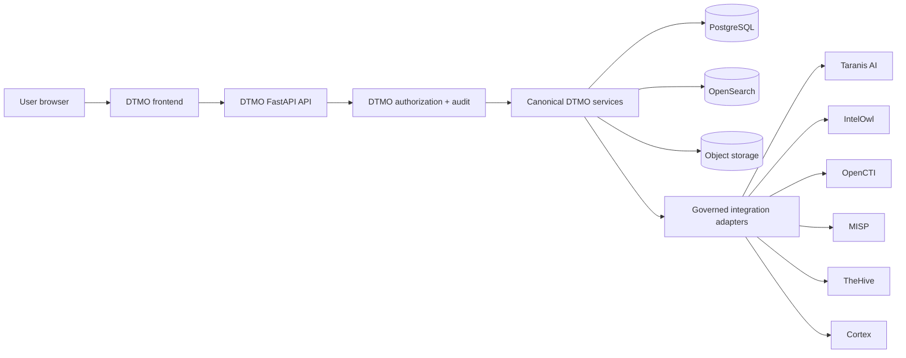

# DTMO Canonical Frontend Architecture

Status: **Phase 11.10a–11.10c — PASS / REPOSITORY_COMPLETE; Phase 11.10d — IN PROGRESS / UNIFIED INTELLIGENCE WORKSPACE**  
Last updated: **2026-08-20**

## 1. Purpose

This document is the accepted architecture baseline for the DTMO Unified Operations Workbench. Phase 11.10a established the frontend, information-architecture, design-system and browser/API contracts. Phase 11.10b implemented the canonical shell, Phase 11.10c delivered the accepted Command Center, and Phase 11.10d is the active migration of governed intelligence discovery and investigation.

The objective remains one maintainable canonical browser application while preserving security, authority, provenance and evidence boundaries already accepted elsewhere in DTMO.

## 2. Architectural decision

The canonical browser application uses:

- **React** for composable application views;
- **TypeScript** for typed frontend contracts;
- **Vite** for deterministic frontend development/build tooling;
- **React Router** for canonical client-side navigation;
- **TanStack Query** for governed server-state retrieval, cache invalidation and request state;
- a DTMO-owned component/design-system layer using CSS design tokens;
- bounded graph and analytical visualization adapters only when their feature slices are accepted.

The direct frontend dependency set remains exact-pinned and the npm lockfile committed. Third-party packages remain subject to DTMO licensing, dependency and supply-chain controls; browser inclusion does not collapse upstream service or licensing boundaries.

## 3. Canonical trust path

The browser is never a privileged integration broker. The canonical path is:

### Invariant

**Browser → DTMO API → governed integration adapter → upstream service** is mandatory for normal product operations.

The browser must not directly invoke Taranis AI, IntelOwl, OpenCTI, MISP, TheHive or Cortex for governed product workflows. Advanced upstream administration can remain an explicitly separate operational escape hatch where required, but it is not the canonical DTMO product path and cannot bypass DTMO authorization, provenance or evidence controls.

## 4. Application shell

The canonical shell contains four persistent regions:

1. **Primary navigation** — stable navigation grouped by operator intent rather than service ownership.
2. **Global command/status bar** — navigation/command palette, environment health and principal context; later slices may add candidate identity and governed notifications where attributable data exists.
3. **Main workspace** — task-specific content delivered incrementally in 11.10c–11.10n.
4. **Context rail/drawer** — selected-object facts and governed actions without losing the current workspace.

Phase 11.10b accepted these regions under `/workbench/`. The command palette remains navigation-safe; high-impact operations require their own accepted server contracts. The context rail remains fail-closed when no attributable selection exists.

## 5. Delivered and target capability workspaces

The accepted information architecture in `docs/ux/INFORMATION_ARCHITECTURE.md` includes:

- Command Center — accepted in 11.10c;
- Threat Intelligence — active functional migration in 11.10d;
- IOC Explorer — active functional migration in 11.10d;
- Knowledge Graph — 11.10f;
- Exposure — 11.10i;
- Investigations — 11.10h;
- Analysis & Enrichment — 11.10e;
- Sharing & Exchange — 11.10g;
- Automation & Playbooks — 11.10k;
- Collection — 11.10j;
- Governance & Evidence — 11.10l;
- Operations and Administration — 11.10m.

A route foundation is not feature acceptance and must not display fabricated operational metrics or state.

## 6. Object-centric interaction model

A canonical intelligence object, IOC, CVE, threat actor, campaign, source, case or other governed entity can be selected from compatible workspaces. The common context model supports, where attributable:

- canonical identity;
- severity/classification;
- confidence;
- provenance and markings;
- linked intelligence;
- enrichment/analysis state;
- relationships;
- cases/tasks;
- sharing/approval state;
- audit timeline;
- actions allowed to the current principal.

Phase 11.10d establishes the first deep object investigation surface: search hits remain discovery projections, while selected detail and provenance are retrieved separately from canonical DTMO persistence. A failed canonical-detail lookup never promotes incomplete search-hit data into a complete object.

## 7. Frontend state model

### 7.1 Server state

Canonical state is retrieved from DTMO APIs. TanStack Query manages request lifecycle and stale-state behavior. Browser caches never become authoritative product state.

### 7.2 URL state

Workspace, object identity, filters, pagination and safe investigation context should be URL-addressable where practical without embedding secrets.

### 7.3 Ephemeral UI state

Drawer visibility, local sort direction, temporary form state and presentation preferences may remain client-local. Only non-sensitive preferences such as theme may be persisted locally.

### 7.4 Security-sensitive state

Credentials, API secrets, private keys, upstream tokens and approval authority are never ordinary persistent frontend state. Production authentication follows the configured identity/bearer-token trust model and server-side authorization remains authoritative.

## 8. Authorization and authority boundaries

Role-aware rendering is a usability feature, not a security control. Every governed operation remains server-authorized.

The frontend preserves:

- least privilege;
- **server-side RBAC**;
- **human/service identity separation**;
- read-only auditor behavior;
- administrator self-protection and final-admin protections;
- case-handoff authority separate from publication/share authority;
- human review and external-share approval separation;
- **no local-compromise inference** from enrichment/graph presence;
- no publication authority from a connector call, analyzer result, MISP match, OpenCTI relationship or TheHive case.

Phase 11.10d search and canonical detail require `read:intelligence` and add no review/share/case/connector/analyzer/admin mutation authority.

## 9. API and integration boundary

The detailed browser/API contract is `docs/architecture/UI_API_CONTRACT.md`.

All frontend capabilities must either reuse an existing governed `/api/v1/...` endpoint with required authorization/audit semantics or add a bounded DTMO API contract in the same feature slice before the UI depends on it.

Current accepted/active examples are:

- `/health` and `/api/v1/ui/session` for shell context;
- `/api/v1/command-center` for accepted read-only 11.10c operational orientation;
- `/api/v1/intelligence/search` for 11.10d governed discovery;
- `/api/v1/intelligence/{item_id}/workspace` for 11.10d canonical object detail/provenance.

None makes the browser an upstream service client.

## 10. Design-system boundary

The visual and interaction contract is `docs/ux/DESIGN_SYSTEM.md`.

The workbench baseline includes:

- semantic design tokens rather than page-local styling;
- dark operations and accessible light modes;
- consistent surfaces, spacing and typography;
- skip link and visible keyboard focus;
- responsive navigation/context behavior;
- reduced-motion handling;
- no colour-only status semantics;
- explicit loading/degraded/empty truth rather than synthetic data.

Feature-specific component acceptance continues in bounded slices.

## 11. Migration from current UI

The migration is incremental and bounded:

1. Phase 11.10a architecture/design contracts — `PASS / REPOSITORY_COMPLETE`.
2. Phase 11.10b canonical application shell — `PASS / REPOSITORY_COMPLETE`.
3. Phase 11.10c Command Center — `PASS / REPOSITORY_COMPLETE`.
4. **Phase 11.10d Unified Intelligence Workspace** — active.
5. Phase 11.10e–11.10n migrate remaining capabilities one bounded slice at a time.
6. Phase 11.10o performs consolidation/full functional acceptance and retires obsolete UI paths where safe.
7. Phase 11.10p executes fresh production-equivalent validation only after immutable candidate freeze.

The declared canonical built product route is `/workbench/`. `/ui/console` and `/ui/intelligence-workspace` remain temporary migration compatibility paths, not parallel feature-development targets.

## 12. Build and deployment contract

The accepted build contract requires:

- exact-pinned direct dependencies in `frontend/package.json`;
- committed `frontend/package-lock.json` as the authoritative npm dependency graph;
- supported CI/container builds using `npm ci` without regenerating dependency resolution;
- TypeScript checking before Vite production build;
- hashed production assets and no production source maps;
- frontend build in a separate immutable Node build stage;
- Node/npm tooling excluded from the final Python runtime image;
- only `frontend/dist` entering the supported runtime;
- FastAPI serving `/workbench/` and hashed assets through the same application origin;
- strict self-origin CSP and `no-store` for the canonical index;
- long-lived immutable caching for hashed assets;
- exact-head frontend asset SHA-256 evidence;
- continued final-container SBOM/vulnerability and artifact-attestation controls.

This build integration creates no second browser ingress or upstream credential path.

## 13. Observability and truthful failure

The browser distinguishes authentication/authorization failure, validation failure, upstream dependency degradation, canonical backend failure, empty canonical data and stale/read-only degraded mode.

For 11.10d specifically:

- a search backend failure is `unavailable`, not an empty query result;
- a zero-result search describes only the governed DTMO index;
- missing canonical detail/provenance remains missing;
- repository/browser test fixtures remain engineering evidence, not operational evidence.

Server-side correlation/request IDs remain authoritative for governed actions.

## 14. Accessibility

The accepted shell baseline provides semantic navigation/main/context regions, skip-to-content, visible focus, keyboard route navigation and Ctrl/Cmd+K palette, responsive reflow/mobile navigation, dark/light semantic themes, reduced-motion handling and non-colour-only status treatment.

Phase 11.10d adds responsive search/result/detail layouts while preserving native labels and keyboard-accessible controls. Full role-aware and feature-specific WCAG 2.2 AA acceptance remains Phase 11.10n plus final 11.10o consolidation.

## 15. Evidence boundary

Phase 11.10a repository acceptance proves the architecture/design contract. Phase 11.10b proves the accepted exact-head shell/build/browser contract. Phase 11.10c proves the accepted repository/browser Command Center contract. Phase 11.10d exact-head CI may prove governed search/detail/provenance rendering and fail-closed browser behavior within repository-controlled scope.

None proves:

- completeness or health of live upstream integrations;
- production-equivalent deployment/continuity;
- independent external assurance;
- production authorization.

The graphical reference remains a design target, not operational evidence.

## 16. Lifecycle and exit

Phase 11.10a, 11.10b and 11.10c are **`PASS / REPOSITORY_COMPLETE`**.

Phase 11.10d may become **`PASS / REPOSITORY_COMPLETE`** only when the frontend build and dedicated repository/browser contract are green on one exact final head, existing security/accessibility/integration/runtime/supply-chain regressions remain green, and all professional lifecycle documentation is synchronized.

The only next bounded slice after 11.10d acceptance and merge is **Phase 11.10e — IntelOwl/Cortex integrated analysis**.
