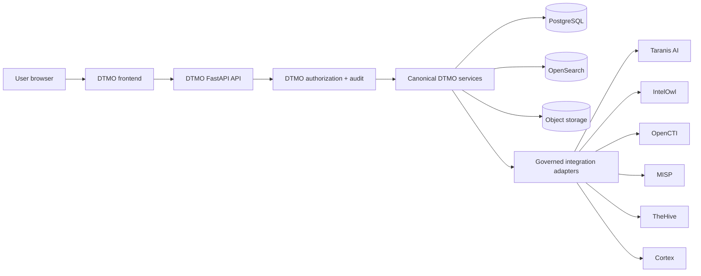

# DTMO Canonical Frontend Architecture

Status: **Phase 11.10a–11.10h — PASS / REPOSITORY_COMPLETE; Phase 11.10i — IN PROGRESS / VULNERABILITY & EXPOSURE**  
Last updated: **2026-08-21**

## 1. Purpose

This document is the accepted architecture baseline for the DTMO Unified Operations Workbench. Phase 11.10a established the frontend, information-architecture, design-system and browser/API contracts. Phase 11.10b implemented the canonical shell; 11.10c delivered Command Center; 11.10d Unified Intelligence; 11.10e IntelOwl/Cortex Integrated Analysis; 11.10f OpenCTI graph/entity context; 11.10g governed MISP Sharing & Exchange; and 11.10h TheHive Investigations & Cases. **Phase 11.10i is the active bounded migration of Vulnerability & Exposure.**

The objective remains one maintainable canonical browser application while preserving security, authority, provenance and evidence boundaries already accepted elsewhere in DTMO.

## 2. Architectural decision

The canonical browser application uses React, TypeScript, Vite, React Router and TanStack Query with DTMO-owned design-system and bounded visualization components. Direct frontend dependencies remain exact-pinned with a committed npm lockfile and remain subject to DTMO supply-chain and licensing controls.

## 3. Canonical trust path

The browser is never a privileged integration broker.

**Browser → DTMO API → governed integration adapter → upstream service** remains mandatory for normal product operations. Upstream credentials do not become browser state.

## 4. Application shell

The canonical `/workbench/` shell contains primary navigation, global command/status bar, main workspace and context rail/drawer. The command palette remains navigation-safe; high-impact actions require accepted server contracts. Missing attributable object context fails closed.

## 5. Delivered and target workspaces

- Command Center — accepted 11.10c;
- Threat Intelligence / IOC Explorer — accepted 11.10d;
- Knowledge Graph — accepted 11.10f;
- Analysis & Enrichment — accepted 11.10e;
- Sharing & Exchange — accepted 11.10g;
- Investigations — accepted 11.10h;
- **Exposure — active 11.10i**;
- Collection — 11.10j;
- Automation & Playbooks — 11.10k;
- Governance & Evidence — 11.10l;
- Operations and Administration — 11.10m.

A route foundation is not feature acceptance and must not display fabricated operational metrics or state.

## 6. Object-centric interaction model

Canonical objects can be selected from compatible workspaces. The shared context model may expose canonical identity, severity/classification, confidence, provenance/markings, linked intelligence, analysis, relationships, cases, sharing state, vulnerability evidence, audit history and actions allowed to the current principal where those facts are attributable.

Phase 11.10i extends this model with vulnerability intelligence and prioritization evidence. It does not infer local asset exposure, exploitability or compromise.

## 7. Frontend state model

Canonical state comes from DTMO APIs. Browser caches never become authoritative product state. Workspace/object/filter state may be URL-addressable when safe. Only presentation preferences may be persisted locally. Credentials, private keys, upstream tokens and approval authority are never ordinary persistent frontend state.

## 8. Authorization and authority boundaries

Role-aware rendering is usability, not authorization. Every governed operation remains server-authorized.

The frontend preserves least privilege, **server-side RBAC**, human/service identity separation, read-only auditor behavior, separate review/share/case authority and no local-compromise inference from enrichment, graph, exchange, case or vulnerability evidence.

For Phase 11.10i, the Exposure workspace is read-only and relies on the existing server-authorized vulnerability analytics endpoint. It introduces no remediation, scanner-execution, publication/share or case authority.

## 9. API and integration boundary

The detailed browser/API contract is `docs/architecture/UI_API_CONTRACT.md`.

Accepted/active examples include:

- `/health` and `/api/v1/ui/session` for shell context;
- `/api/v1/command-center` for Command Center;
- `/api/v1/intelligence/search` and `/api/v1/intelligence/{item_id}/workspace` for Unified Intelligence;
- IntelOwl/Cortex analysis endpoints for 11.10e;
- OpenCTI graph/entity endpoints for 11.10f;
- MISP sharing/review/approval/export endpoints for 11.10g;
- TheHive investigation/case-handoff endpoints for 11.10h;
- **`/api/v1/console/vulnerability-analytics?window=30d` for active 11.10i Exposure.**

None makes the browser an upstream service client.

## 10. Vulnerability & Exposure safety boundary

Phase 11.10i reuses the accepted canonical vulnerability analytics projection. The browser performs same-origin DTMO requests only.

- `read:intelligence` remains server-side authority;
- CVSS, EPSS, CISA KEV, CWE and vendor/product mappings are prioritization evidence;
- intelligence presence is not proof a local asset is affected or compromised;
- absence of a record is not proof of safety;
- raw-evidence linkage is retained where available;
- missing/degraded evidence is rendered explicitly and **fails closed**;
- no scanner or upstream service credential is placed in browser state;
- no remediation or share/case mutation authority is added.

## 11. Accepted MISP and TheHive boundaries

MISP remains behind DTMO governance/export controls with separate human review/share approval and `published=false` export. TheHive remains behind the accepted case-handoff adapter with explicit human `handoff:case` authority and reconciliation-aware durable state. Neither acceptance proves downstream action, local compromise or production readiness.

## 12. Design-system and accessibility boundary

The workbench uses semantic design tokens, dark operations and accessible light modes, consistent surfaces, skip link and visible keyboard focus, responsive navigation/context behavior, reduced-motion handling, non-colour-only state and explicit loading/degraded/empty truth rather than synthetic data. Full role-aware WCAG 2.2 AA acceptance remains 11.10n plus final 11.10o consolidation.

## 13. Migration sequence

1. 11.10a architecture/design — `PASS / REPOSITORY_COMPLETE`.
2. 11.10b shell — `PASS / REPOSITORY_COMPLETE`.
3. 11.10c Command Center — `PASS / REPOSITORY_COMPLETE`.
4. 11.10d Unified Intelligence — `PASS / REPOSITORY_COMPLETE`.
5. 11.10e Integrated Analysis — `PASS / REPOSITORY_COMPLETE`.
6. 11.10f OpenCTI — `PASS / REPOSITORY_COMPLETE`.
7. 11.10g MISP — `PASS / REPOSITORY_COMPLETE`.
8. 11.10h TheHive — `PASS / REPOSITORY_COMPLETE`.
9. **11.10i Vulnerability & Exposure — active.**
10. 11.10j–11.10n migrate remaining capabilities one bounded slice at a time.
11. 11.10o performs consolidation/full functional acceptance.
12. 11.10p executes fresh production-equivalent validation only after immutable candidate freeze.

`/ui/console` and prior UI routes remain migration compatibility paths, not parallel feature-development targets.

## 14. Build and deployment contract

The accepted build contract requires exact-pinned direct dependencies, committed lockfile, `npm ci`, TypeScript checking before Vite build, hashed assets/no production source maps, immutable build stages, no Node/npm in the final Python runtime, same-origin serving, strict CSP and continued SBOM/vulnerability/artifact-attestation controls.

## 15. Observability and truthful failure

The browser distinguishes authentication/authorization failure, validation failure, upstream dependency degradation, canonical backend failure, empty canonical data and stale/read-only degraded mode. For 11.10i, missing or degraded vulnerability evidence is never represented as zero exposure or healthy state. Server-side request/correlation IDs remain authoritative for governed actions.

## 16. Evidence boundary and exit

Phase 11.10a–11.10h are **`PASS / REPOSITORY_COMPLETE`** within repository scope. Phase 11.10i may become `PASS / REPOSITORY_COMPLETE` only when the dedicated Vulnerability Exposure gate, application-shell/frontend regressions and Professional Documentation Gate are `completed/success` on one exact final head and all required documentation is synchronized.

Repository/browser acceptance does not prove live provider health, local asset exposure, production-equivalent deployment/continuity, independent external assurance or production authorization.

The only next bounded slice after 11.10i acceptance and protected merge is **Phase 11.10j — Sources & Collection Control Center**.
