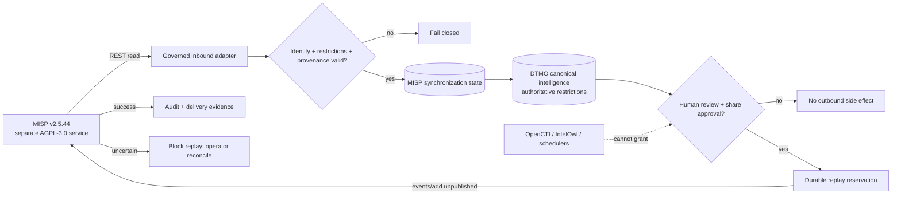

# MISP → DTMO Consolidation Contract

Status: **PHASE 11.5 CONTRACT `PASS / REPOSITORY_COMPLETE`**  
Reviewed upstream baseline: **MISP v2.5.44** (released 2026-07-13)

## Purpose

Phase 11.5 consolidates DTMO's existing E8 MISP read and governed-export capabilities into one explicit authority, synchronization and lifecycle model. It does not introduce a second CTI truth store, automatic publication authority, or a hidden MISP-to-OpenCTI synchronization path.

MISP remains a separate service accessed through its REST API. DTMO remains authoritative for education-sector relevance, canonical review state, local exposure/compromise semantics, governance evidence, and human publication/share approval.

The contract is accepted repository engineering evidence. The active bounded implementation is the single reconciled MISP synchronization-state/persistence and authority-enforcement layer described by `docs/qa/PHASE11_5_MISP_CONSOLIDATION_STATE_GATE.md`.

## Upstream and licensing boundary

MISP core v2.5.44 is the reviewed upstream baseline for this contract. MISP core is licensed under **GNU AGPL-3.0**. DTMO integrates as a separate service/API consumer and does not vendor, fork, embed, or redistribute MISP core source as part of this programme. Any future source-level modification, bundling, redistribution, or modified network-service operation requires explicit licensing/legal review before acceptance.

The contract is version-aware: a later MISP release requires compatibility review when its API, synchronization, sharing, authentication or licensing behavior materially changes.

## Existing DTMO capabilities to consolidate

DTMO already has two bounded E8 capabilities:

1. **Inbound read** via `POST /events/restSearch`, preserving event UUID, organisation, distribution, sharing group, TLP/tags, galaxies, attributes, objects, relationships and raw provenance.
2. **Governed outbound export** via `POST /events/add`, requiring separate human DTMO review/share approval, deterministic event UUID/replay protection, preserved restrictions, unpublished destination events and operator inspection after uncertain delivery.

Phase 11.5 reconciles these paths rather than creating parallel MISP clients or separate authority models.

## Authoritative inbound model

The single authoritative inbound path remains read-oriented and fail-closed.

- MISP event UUID is the stable upstream identity; mutable event titles or numeric IDs never become canonical identity.
- MISP event/attribute/object distribution, sharing-group and TLP/tag restrictions are preserved as attributable source constraints.
- Unknown or malformed distribution, sharing-group, TLP, object, attribute or identity semantics fail closed for governed reuse.
- Import creates candidate/context intelligence only. It never sets DTMO `share_approved`, publication authority, local-compromise proof or a governance-compliance claim.
- Replay of the same upstream identity/revision is idempotent; changed upstream state remains attributable and must not silently overwrite historical evidence.
- Pagination/reconciliation must be bounded, restart-safe and advance durable state only after accepted persistence.

The implementation persists the event authority envelope in `misp_synchronization_state` and projects accepted restrictions to canonical `metadata_json.misp_restrictions`, allowing the existing governed-export path to enforce the same source restrictions.

## Authoritative outbound model

DTMO human authority remains the only trigger for outbound sharing.

- Service accounts, connectors, schedulers, IntelOwl, OpenCTI and MISP itself cannot grant DTMO share approval.
- Outbound export requires a human principal with the established share-approval permission plus attributable prior review/share approval on the canonical DTMO item.
- Source MISP distribution, sharing-group and TLP restrictions cannot be broadened on re-export.
- A destination event is created **unpublished**. Successful `events/add` delivery is not MISP publication or federation approval.
- Deterministic UUID/replay keys and durable pending/success/uncertain state prevent blind duplicate replay.
- An uncertain remote outcome blocks automated replay until an operator reconciles the destination state.

## Synchronization and federation boundary

Phase 11.5 does **not** enable MISP server push/pull synchronization as an implicit replacement for the governed DTMO paths.

If MISP server synchronization is adopted later, it requires a separate explicit decision covering remote-server trust, organisation identity, push/pull rules, distribution/sharing groups, tag filters, conflict/replay behavior, delete semantics, credential scope and audit evidence.

OpenCTI↔MISP synchronization is likewise excluded from this first consolidation boundary. OpenCTI graph presence cannot bypass DTMO's MISP restrictions or human share authority.

## Identity and conflict rules

| Domain | Stable identity | DTMO rule |
|---|---|---|
| MISP event | event UUID | Preserve exactly; numeric ID is instance-local metadata |
| MISP attribute | attribute UUID | Preserve when present; never synthesize from value alone |
| MISP object | object UUID | Preserve with object template/type provenance |
| DTMO item | DTMO canonical UUID | Remains distinct from all MISP identities |
| Export | deterministic DTMO-generated event UUID + replay key | One governed canonical revision cannot be blindly replayed |

Conflicting mappings, UUID drift, contradictory source restrictions or ambiguous provenance fail closed and require reconciliation evidence.

## Trust boundary

## Security requirements

- Runtime API credentials are secrets and must never be committed to repository evidence, logs or screenshots.
- Production MISP API access requires HTTPS and certificate validation.
- Use dedicated minimum-capability identities; administrator/site-admin authority is not a routine integration requirement.
- Inbound and outbound permissions should be separable where the MISP deployment permits it.
- Authentication/authorization failures (`401`/`403`) fail closed and do not trigger privilege broadening.
- Source restrictions and DTMO human authority are cumulative: the more restrictive effective rule wins.
- Audit evidence records actor, action, item identity, request/correlation identity and destination/replay identity without raw credentials.

## Privacy and governance

MISP can contain personal data and sensitive operational context. DTMO must minimize imported/exported fields to the approved purpose, preserve source handling restrictions and apply existing retention/governance controls. A technically reachable MISP server or API permission does not itself establish lawful authority to collect or redistribute data.

## Explicit exclusions

This contract does not authorize:

- automatic MISP event publication;
- automatic MISP server push/pull federation;
- OpenCTI↔MISP automatic synchronization;
- changing source distribution/sharing-group restrictions to a broader scope;
- service-account share approval;
- TheHive case creation;
- Cortex adoption;
- vendoring MISP source;
- live/production connectivity claims from repository CI.

## Repository evidence and acceptance

Repository acceptance may prove contract wording, existing API/path compatibility, fail-closed authority invariants and documentation synchronization. It does **not** prove live MISP credentials, effective production MISP roles, remote-server trust, production data legality, real federation behavior, staging acceptance, independent assurance or production authorization.

The contract slice is accepted. The current Phase 11.5 acceptance target is the synchronization-state/persistence and authority-enforcement implementation. Phase 11.6 remains blocked until that implementation is protected-merged and Phase 11.5 is reconciled to `PASS / REPOSITORY_COMPLETE`.
