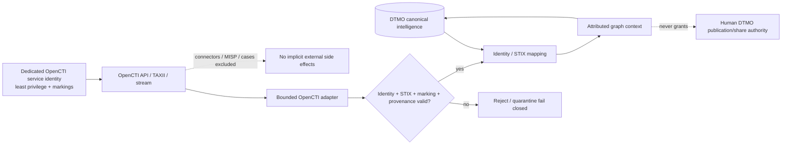

# OpenCTI → DTMO Integration Contract

Status: **PHASE 11.4 CONTRACT BASELINE / EXACT-HEAD VALIDATION REQUIRED**  
Last reviewed: **2026-08-16**

## Purpose

This contract defines the bounded Phase 11.4 service-to-service relationship between DTMO and OpenCTI. OpenCTI is the CTI relationship/knowledge-graph service; DTMO remains the education-sector CTI, vulnerability-context, governance, review and publication/share-authority layer.

This contract does not authorize production use. DTMO remains **not production authorized** until fresh Phase 11.10 production-equivalent validation, Phase 11.11 independent external assurance and a formal Phase 12 decision are complete.

## Upstream baseline

The reviewed upstream baseline is **OpenCTI 7.260811.0**, released 2026-08-11. OpenCTI documents STIX 2.1 representations for its data stream and provides API/feed mechanisms including GraphQL, TAXII 2.1 and access-controlled event streams.

Licensing is edition-sensitive:

- OpenCTI Community Edition is licensed under **Apache License 2.0**;
- OpenCTI Enterprise Edition is governed by the separate **OpenCTI Enterprise Edition License**;
- DTMO MUST NOT depend on Enterprise Edition-only capabilities unless entitlement and legal/licensing approval are explicitly recorded;
- this integration uses OpenCTI as a **separate service/API consumer** and does not vendor OpenCTI source into DTMO.

The upstream version is a reviewed compatibility baseline, not an automatic upgrade policy. Any material version change requires contract-impact review before promotion.

## Responsibility boundary

| Responsibility | OpenCTI | DTMO |
|---|---|---|
| STIX entity/relationship graph | authoritative graph service | consumes/maps graph context |
| Education-sector relevance | context input only | authoritative |
| Vulnerability/local exposure semantics | CTI context | authoritative DTMO decision semantics |
| Provenance/confidence/markings | preserve and expose | preserve, map and enforce |
| Human review | optional upstream workflow | authoritative for DTMO review decisions |
| External publication/share authority | no implicit DTMO authority | authoritative human/governed controls |
| MISP outbound sharing | not enabled through this contract | governed separately in Phase 11.5 |
| Incident/case workflow | not authoritative | TheHive boundary deferred to Phase 11.6 |

DTMO MUST NOT implement a second generic CTI graph engine merely to duplicate OpenCTI.

## Allowed integration surfaces

The initial OpenCTI integration is bounded to documented OpenCTI interfaces:

1. **GraphQL API** for explicit entity/relationship queries and narrowly governed mutations when a later adapter slice authorizes them.
2. **STIX 2.1** object and relationship representations for canonical interchange.
3. **TAXII 2.1** only where a specifically approved collection is the correct read boundary.
4. **Access-controlled OpenCTI streams** only for later synchronization/reconciliation where event replay semantics are explicitly implemented.

The first implementation slice after this contract MUST begin read-oriented. No automatic publication, MISP synchronization, connector registration, enrichment trigger, case creation or arbitrary GraphQL mutation is authorized by this contract.

## Identity and RBAC

OpenCTI documents roles/capabilities, data segregation and marking-based access. The DTMO integration therefore requires a dedicated non-human OpenCTI identity with the minimum capabilities needed for the specific API path.

Requirements:

- a dedicated DTMO service identity; no shared human administrator token;
- no `Bypass all capabilities` or equivalent superuser authority for routine integration;
- read integration requires only the minimum knowledge/read capability and required marking access;
- future mutation capability MUST be separately justified, allowlisted and tested;
- connector-specific capabilities are not granted merely because OpenCTI supports connectors;
- service credentials are runtime secrets and MUST NOT be committed to repository evidence, screenshots or documentation;
- `401` and `403` fail closed and MUST NOT cause automatic privilege broadening.

OpenCTI marking access is part of authorization, not a display preference. The integration MUST preserve marking restrictions instead of attempting to bypass them.

## Data model and identity

OpenCTI is authoritative for OpenCTI graph identity; DTMO is authoritative for DTMO canonical item identity. The adapter MUST maintain an explicit mapping rather than replacing one identity domain with the other.

Minimum mapping fields:

- DTMO canonical UUID;
- OpenCTI internal/entity identifier where applicable;
- STIX 2.1 `id` and `type` where exposed;
- entity/relationship type;
- source/origin/external references;
- object markings/TLP/PAP context;
- confidence and timestamps;
- relationship direction and endpoints;
- synchronization/reconciliation metadata.

Identity policy:

- never synthesize an OpenCTI identity from mutable labels or names;
- never collapse two upstream objects merely because display names match;
- merge/deduplication decisions must be attributable and reversible at the DTMO mapping layer;
- OpenCTI merge/delete events are synchronization inputs, not authority to destroy DTMO evidence history.

## Scope of STIX knowledge

The target graph scope includes STIX-compatible representation of indicators, vulnerabilities, malware, campaigns, infrastructure, intrusion/threat actors, attack patterns and their relationships where relevant to DTMO. MITRE ATT&CK relationships may be surfaced through the OpenCTI graph but DTMO framework/governance mappings remain explicit and provenance-backed.

Graph presence does not prove local exposure, exploitability, compromise, attribution certainty or remediation status.

## Markings, TLP, privacy and sharing

OpenCTI uses marking definitions and group-level allowed markings for data segregation. DTMO MUST preserve the stronger applicable restriction across the boundary.

Rules:

- missing, malformed or unknown marking/TLP context fails closed for write/share paths;
- `TLP:RED` or equivalent restricted material is never automatically exported, published or synchronized to a broader audience;
- OpenCTI `max shareable markings` or any upstream sharing capability does not grant DTMO external-share authority;
- personal data is minimized and processed only where the DTMO purpose and approved processing basis permit it;
- a successful graph import or relationship creation never changes DTMO `share_approved` or publication state;
- Phase 11.5 will define the single governed MISP authority/synchronization model; Phase 11.4 MUST NOT pre-empt it.

## Provenance and confidence

Every accepted OpenCTI-derived entity or relationship must retain sufficient provenance to explain what was received and why DTMO associated it with a canonical item.

Required provenance includes, where available:

- OpenCTI/STIX identity;
- entity/relationship type;
- source/origin and external references;
- markings;
- confidence;
- created/modified timestamps;
- retrieval/synchronization timestamp;
- API/collection/stream boundary used;
- raw or immutable evidence reference when retained;
- reconciliation outcome.

Confidence is contextual metadata. It MUST NOT be converted into local-compromise proof or a DTMO severity classification without explicit DTMO logic and evidence.

## Synchronization, replay and failure semantics

A later adapter may use paginated GraphQL/TAXII reads or OpenCTI stream events. Any such path MUST be bounded, restart-safe and idempotent.

Required semantics:

- pagination/checkpoint state is explicit and durable before claiming repository completion;
- replay is safe and deduplicated by stable upstream identity plus version/update context;
- stream catch-up uses an explicit cursor/event identifier rather than assuming no events were missed;
- create/update/delete/merge are handled as distinct events;
- partial pages or interrupted stream windows do not advance a checkpoint beyond successfully persisted state;
- `401`, `403`, `404`, `409`, `429`, `5xx`, malformed STIX, oversized payloads and timeouts are explicit outcomes;
- OpenCTI outage or graph synchronization failure must not make unrelated DTMO read paths unavailable;
- unknown entity/relationship/marking semantics fail closed instead of being silently flattened.

## Human authority and side effects

No OpenCTI query, import, stream event, relationship, confidence value, connector result or successful mutation grants DTMO publication/share authority.

Human approval and governed DTMO export/MISP controls remain authoritative. The initial adapter MUST NOT:

- register or invoke OpenCTI connectors;
- enable MISP synchronization;
- create TheHive cases;
- trigger external enrichment;
- publish reports externally;
- modify OpenCTI security/marking configuration;
- use administrative bypass capability.

## Trust-boundary workflow

## Licensing and source boundary

The reviewed OpenCTI repository contains Community Edition code under Apache-2.0 and Enterprise Edition code under a separate enterprise license. Therefore:

- DTMO does not vendor OpenCTI source in Phase 11.4;
- deployment must identify which edition/features are actually used;
- Enterprise Edition-only functionality is blocked pending explicit entitlement/legal review;
- upstream trademarks and notices remain respected;
- a repository-green integration contract does not authorize redistribution or operation of unapproved licensed features.

## Repository evidence and non-evidence

This contract and its CI gate may establish that DTMO documentation and tests consistently preserve the agreed service/API/data/security/licensing boundary. They do **not** prove:

- live OpenCTI connectivity;
- deployed credentials or effective production RBAC/marking configuration;
- production-scale graph correctness or performance;
- complete STIX interoperability against a real deployment;
- privacy/data-processing approval;
- HA/recovery;
- independent assurance;
- production authorization.

Historical Phase 8/9 evidence remains candidate-bound and is not reused for the materially changed Phase 11 integrated candidate.

## Acceptance and next bounded step

This contract slice is accepted only when the exact final PR head is fully green, the Professional Documentation Gate is green, authoritative lifecycle documentation is synchronized and the PR is merged with expected-head protection.

After acceptance, the next bounded Phase 11.4 step is a **read-only OpenCTI STIX/identity adapter with pagination/reconciliation and provenance preservation**. Phase 11.5 MISP consolidation does not start before Phase 11.4 repository work is complete.

## Upstream references reviewed

- OpenCTI release 7.260811.0, official OpenCTI GitHub release.
- OpenCTI repository `LICENSE`, Community Edition Apache-2.0 and separate Enterprise Edition license terms.
- OpenCTI documentation: Users and RBAC; Data Streaming; Connectors; Native feeds; Data processing and marking definitions.
