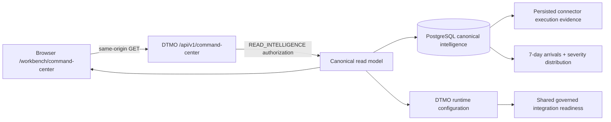

# Phase 11.10c — Canonical Command Center

## Status

`REPOSITORY RECOVERY IMPLEMENTED / OWNER FUNCTIONAL RETEST REQUIRED`

Phase 11.10q extends the original Phase 11.10c Command Center so the canonical landing workspace is not limited to point-in-time counters and integration labels. It now provides attributable trends, integration actionability and direct pivots into the governed workspaces while retaining the same read-only authority boundary.

## Objective

Deliver one read-only operational landing workspace that gives an accountable overview of canonical DTMO intelligence, governed workload and integration capability without converting configuration, missing evidence or repository CI into unsupported runtime-health or production-readiness claims.

## Canonical data path

The browser does not call Taranis, AIL, IntelOwl, OpenCTI, MISP, TheHive or Cortex directly and receives no privileged upstream credentials.

## Delivered read model

The Command Center exposes:

- total canonical intelligence objects;
- high/critical intelligence count;
- objects discovered in the preceding 24 hours;
- candidate intelligence pending human review;
- reviewed intelligence still requiring a separate external-share decision;
- intelligence with education relevance of at least 80;
- the six most recently discovered canonical intelligence objects;
- a seven-day canonical intelligence-arrival series derived from `discovered_at`;
- a current canonical severity distribution across informational, low, medium, high and critical objects;
- governed capability state for MISP, AIL, Taranis, IntelOwl, Cortex, OpenCTI and TheHive;
- readiness derived from the same server-side activation-blocker contract used by canonical Administration;
- explicit counts for integrations requiring configuration and integrations with persisted runtime observation;
- direct pivots from integration readiness to Administration or Collection;
- role-aware quick navigation derived from the authenticated principal's server-issued permissions.

## Trend semantics

The trend panels are read models, not forecasts. The seven-day chart counts canonical intelligence records by UTC discovery date. Days with no canonical records are represented as zero only when the canonical datastore was successfully queried; datastore failure produces no trend series at all.

Severity composition is derived from canonical persisted intelligence and is rendered as a distribution, not as an organizational risk score. Neither chart proves source truth, compromise, exposure, incident impact, production health or remediation status.

## Integration-state semantics

Phase 11.10q removes the previous duplicate/weak readiness interpretation in Command Center. The landing read model reuses `integration_readiness()` from the governed Administration contract and therefore evaluates endpoint, server-side credential and component-specific runtime requirements before an enabled service may appear as enabled/configured.

The following component-specific blockers are preserved in the server-derived model where applicable: AIL object scope, IntelOwl/Cortex analyzer allowlists, TheHive organization scope, OpenCTI entity allowlist/checkpoint requirements and Taranis checkpoint requirements. Command Center receives blocker categories only; secret values remain server-side.

For presentation the Command Center uses an action-oriented coarse vocabulary:

- `configuration-required` — the operator still has governed Administration work to perform. This includes an enabled capability with unresolved runtime blockers **and** a disabled capability that requires explicit governed activation;
- `enabled` — the capability flag is enabled and the shared readiness contract reports no remaining configuration blockers.

The detailed underlying readiness state remains available separately as `readiness_state`. A disabled capability is therefore never disguised as enabled: `enabled=false` and `readiness_state=disabled` remain authoritative, while the coarse `state=configuration-required` ensures the landing page provides a governed Administration pivot instead of an unexplained disabled dead end.

`enabled` still does **not** mean healthy or reachable. For connector-backed integrations Taranis, MISP and AIL, the latest persisted connector run may be shown as a runtime observation. The read model keeps `runtime_health_claim=false`; upstream service health is not inferred from configuration or a historical run.

The API also carries `credential_configured`, `can_activate`, `activation_blockers`, `action` and `detail` so later UI slices can present the same actionable detail without re-deriving security-sensitive readiness in the browser.

## Fail-closed data behavior

If the canonical datastore cannot be queried, the API returns:

- `data_state=unavailable`;
- metric values as `null`, not `0`;
- no fabricated recent-intelligence records;
- empty trend series rather than synthetic zeros;
- integration readiness from runtime configuration only, without claiming upstream health.

The frontend renders explicit unavailable states for both trend panels. It must not transform missing evidence into zero threats, a flat trend, zero pending decisions, healthy integrations or a production-ready claim.

## Authority boundary

`GET /api/v1/command-center` requires `READ_INTELLIGENCE` and is read-only.

The Command Center itself grants no authority to:

- review intelligence;
- approve external sharing;
- publish to MISP;
- mutate TheHive cases;
- execute IntelOwl or Cortex analysis;
- run connectors;
- administer users, roles or policies.

Quick-action and readiness-link visibility are convenience only. Every mutation remains authorized by its own server-side permission check and human-governance boundary.

## UX structure

The recovered workspace contains:

1. lifecycle/status heading;
2. six canonical KPI cards;
3. recent intelligence / threat-picture panel;
4. actionable integration-readiness panel with explicit no-inferred-health semantics;
5. seven-day intelligence-arrival bar chart;
6. canonical severity-distribution bars;
7. role-aware quick actions;
8. governed CTI lifecycle strip: Collect → Enrich → Analyze → Investigate → Respond → Learn;
9. permanent evidence-boundary statement.

Responsive behavior is required down to narrow mobile layouts and inherits the keyboard, contrast, focus, theme and navigation contracts accepted in Phase 11.10b.

## Phase 11.10q acceptance boundary

The repository implementation now aligns Command Center integration readiness with the canonical Administration control plane and includes all seven supported framework integrations, including AIL. Disabled capabilities are also mapped to an actionable Administration state instead of remaining unexplained dead ends in the landing read model. This resolves a repository-level consistency defect but does not retire the owner-functional blocker by itself. Green CI and browser fixtures remain repository evidence only; the accountable owner must still validate the canonical interface against the accepted same-origin environment before the Command Center row in `FUNCTIONAL_RECOVERY_ACCEPTANCE.md` can become PASS.

Repository and browser CI do not prove live upstream service health, production-equivalent continuity, independent assurance or production authorization.
