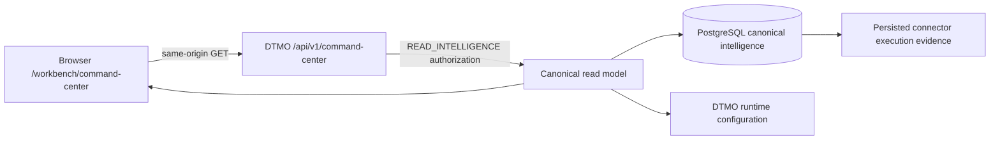

# Phase 11.10c — Canonical Command Center

## Status

`IN PROGRESS / EXACT-HEAD VALIDATION REQUIRED`

Phase 11.10a established the frontend architecture and Phase 11.10b delivered the canonical React/TypeScript/Vite application shell. Phase 11.10c is the first functional workspace implemented inside that shell.

## Objective

Deliver one read-only operational landing workspace that gives an accountable overview of canonical DTMO intelligence, governed workload and integration capability without converting configuration, missing evidence or repository CI into unsupported runtime-health or production-readiness claims.

## Canonical data path

The browser does not call Taranis, IntelOwl, OpenCTI, MISP, TheHive or Cortex directly and receives no privileged upstream credentials.

## Delivered read model

The Command Center exposes:

- total canonical intelligence objects;
- high/critical intelligence count;
- objects discovered in the preceding 24 hours;
- candidate intelligence pending human review;
- reviewed intelligence still requiring a separate external-share decision;
- intelligence with education relevance of at least 80;
- the six most recently discovered canonical intelligence objects;
- governed capability state for Taranis, IntelOwl, OpenCTI, MISP, TheHive and Cortex;
- role-aware quick navigation derived from the authenticated principal's server-issued permissions.

## Integration-state semantics

Phase 11.10c deliberately separates **configuration state** from **runtime observation**.

An integration can be:

- `disabled` — the DTMO capability flag is off;
- `configuration-required` — the capability is enabled but an API base is absent;
- `enabled` — the capability is enabled and configured.

`enabled` does **not** mean healthy or reachable. For connector-backed integrations such as Taranis and MISP, the latest persisted connector run may be shown as a runtime observation. The read model keeps `runtime_health_claim=false`; upstream service health is not inferred from configuration or a historical run.

## Fail-closed data behavior

If the canonical datastore cannot be queried, the API returns:

- `data_state=unavailable`;
- metric values as `null`, not `0`;
- no fabricated recent-intelligence records;
- integration configuration state only.

The frontend renders an explicit unavailable state. It must not transform missing evidence into zero threats, zero pending decisions, healthy integrations or a production-ready claim.

## Authority boundary

`GET /api/v1/command-center` requires `READ_INTELLIGENCE` and is read-only.

The Command Center itself grants no authority to:

- review intelligence;
- approve external sharing;
- publish to MISP;
- mutate TheHive cases;
- execute IntelOwl or Cortex analysis;
- run connectors;
- administer users, roles or policies.

Quick-action visibility is convenience only. Every mutation remains authorized by its own server-side permission check and human-governance boundary.

## UX structure

The workspace implements the operational composition defined by the Unified Operations Workbench design:

1. lifecycle/status heading;
2. six canonical KPI cards;
3. recent intelligence / threat-picture panel;
4. integration capability panel with explicit no-inferred-health wording;
5. role-aware quick actions;
6. governed CTI lifecycle strip: Collect → Enrich → Analyze → Investigate → Respond → Learn;
7. permanent evidence-boundary statement.

Responsive behavior is required down to narrow mobile layouts and inherits the keyboard, contrast, focus, theme and navigation contracts accepted in Phase 11.10b.

## Scope boundary

Phase 11.10c does not implement the full intelligence-object workspace, enrichment execution, OpenCTI graph interaction, MISP exchange, TheHive case management, exposure management, collection control, automation, governance evidence management or administration. Those remain bounded Phase 11.10d–11.10m slices.

Repository and browser CI for this slice do not prove live upstream service health, production-equivalent continuity, independent assurance or production authorization.

## Next bounded priority

After Phase 11.10c is accepted and merged, the only next implementation slice is **Phase 11.10d — Unified Intelligence Workspace**.
