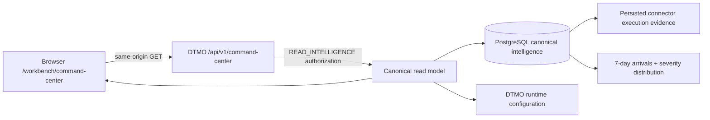

# Phase 11.10c — Canonical Command Center

## Status

`REPOSITORY RECOVERY IMPLEMENTED / OWNER FUNCTIONAL RETEST REQUIRED`

Phase 11.10q extends the original Phase 11.10c Command Center so the canonical landing workspace is not limited to point-in-time counters and integration labels. It now provides attributable trends, integration actionability and direct pivots into the governed workspaces while retaining the same read-only authority boundary.

## Objective

Deliver one read-only operational landing workspace that gives an accountable overview of canonical DTMO intelligence, governed workload and integration capability without converting configuration, missing evidence or repository CI into unsupported runtime-health or production-readiness claims.

## Canonical data path

The browser does not call Taranis, IntelOwl, OpenCTI, MISP, TheHive or Cortex directly and receives no privileged upstream credentials.

## Delivered read model

The Command Center exposes:

- total canonical intelligence objects;
- high/critical intelligence count;
- objects discovered in the preceding 24 hours;
- candidate intelligence pending human review;
- reviewed intelligence still requiring a separate external-share decision;
- intelligence with education relevance of at least 80;
- the six most recently discovered canonical intelligence objects;
- a seven-day canonical intelligence-arrival series derived from `discovered_at`;
- a current canonical severity distribution across informational, low, medium, high and critical objects;
- governed capability state for Taranis, IntelOwl, OpenCTI, MISP, TheHive and Cortex;
- explicit counts for integrations requiring configuration and integrations with persisted runtime observation;
- direct pivots from integration readiness to Administration or Collection;
- role-aware quick navigation derived from the authenticated principal's server-issued permissions.

## Trend semantics

The trend panels are read models, not forecasts. The seven-day chart counts canonical intelligence records by UTC discovery date. Days with no canonical records are represented as zero only when the canonical datastore was successfully queried; datastore failure produces no trend series at all.

Severity composition is derived from canonical persisted intelligence and is rendered as a distribution, not as an organizational risk score. Neither chart proves source truth, compromise, exposure, incident impact, production health or remediation status.

## Integration-state semantics

Phase 11.10c deliberately separates **configuration state** from **runtime observation**.

An integration can be:

- `disabled` — the DTMO capability flag is off;
- `configuration-required` — the capability is enabled but an API base is absent;
- `enabled` — the capability is enabled and configured.

`enabled` does **not** mean healthy or reachable. For connector-backed integrations such as Taranis and MISP, the latest persisted connector run may be shown as a runtime observation. The read model keeps `runtime_health_claim=false`; upstream service health is not inferred from configuration or a historical run.

The Command Center provides an actionable navigation path: configuration-required integrations pivot to Administration and other integration rows can pivot to Collection. Navigation does not grant authority; target workspaces and APIs continue to enforce their own RBAC and governance rules.

## Fail-closed data behavior

If the canonical datastore cannot be queried, the API returns:

- `data_state=unavailable`;
- metric values as `null`, not `0`;
- no fabricated recent-intelligence records;
- empty trend series rather than synthetic zeros;
- integration configuration state only.

The frontend renders explicit unavailable states for both trend panels. It must not transform missing evidence into zero threats, a flat trend, zero pending decisions, healthy integrations or a production-ready claim.

## Authority boundary

`GET /api/v1/command-center` requires `READ_INTELLIGENCE` and is read-only.

The Command Center itself grants no authority to:

- review intelligence;
- approve external sharing;
- publish to MISP;
- mutate TheHive cases;
- execute IntelOwl or Cortex analysis;
- run connectors;
- administer users, roles or policies.

Quick-action and readiness-link visibility are convenience only. Every mutation remains authorized by its own server-side permission check and human-governance boundary.

## UX structure

The recovered workspace contains:

1. lifecycle/status heading;
2. six canonical KPI cards;
3. recent intelligence / threat-picture panel;
4. actionable integration-readiness panel with explicit no-inferred-health semantics;
5. seven-day intelligence-arrival bar chart;
6. canonical severity-distribution bars;
7. role-aware quick actions;
8. governed CTI lifecycle strip: Collect → Enrich → Analyze → Investigate → Respond → Learn;
9. permanent evidence-boundary statement.

Responsive behavior is required down to narrow mobile layouts and inherits the keyboard, contrast, focus, theme and navigation contracts accepted in Phase 11.10b.

## Phase 11.10q acceptance boundary

The repository implementation now satisfies the Command Center recovery requirement for actionable readiness, real canonical graphs/trends and links into underlying workspaces. This does not retire the owner-functional blocker by itself. Green CI and browser fixtures remain repository evidence only; the accountable owner must still validate the canonical interface against the accepted same-origin environment before the Command Center row in `FUNCTIONAL_RECOVERY_ACCEPTANCE.md` can become PASS.

Repository and browser CI do not prove live upstream service health, production-equivalent continuity, independent assurance or production authorization.
