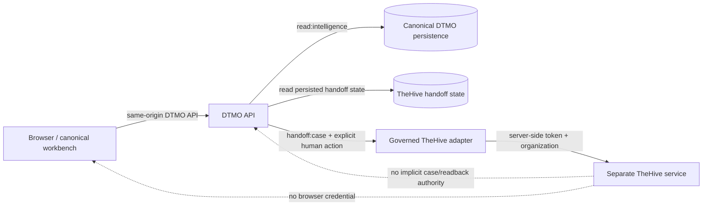
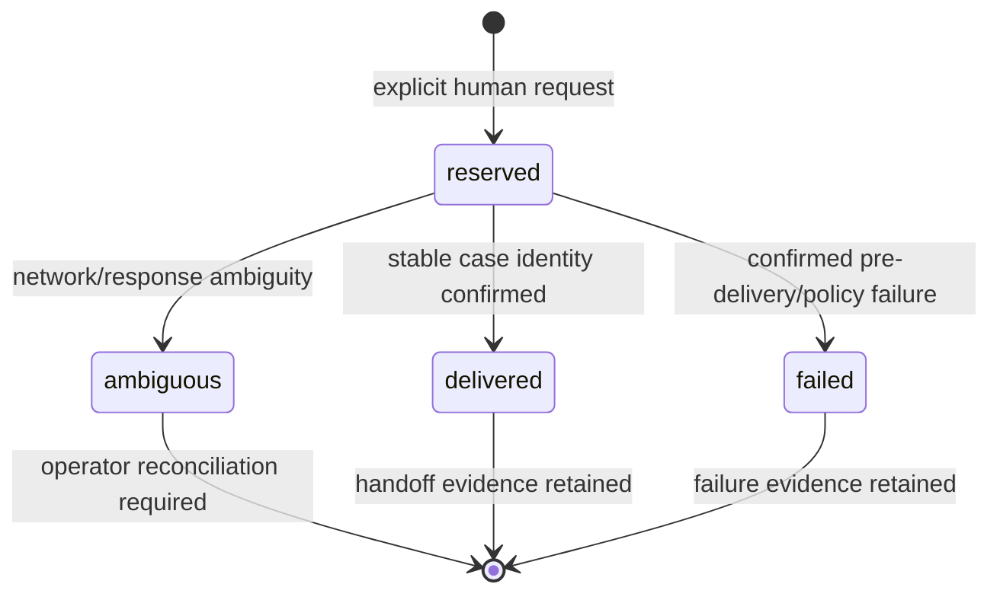

# Phase 11.10h — TheHive Investigations & Cases

## Status

`IN PROGRESS / EXACT-HEAD VALIDATION REQUIRED`

Phase 11.10g is the accepted predecessor. Phase 11.10h makes the canonical `/workbench/investigations` route functional by composing the already accepted Phase 11.6 TheHive case-handoff boundary with a DTMO-owned read projection. It does not expand TheHive authority or claim live upstream case-state coverage.

## Objective

Provide one canonical investigation workspace where an authorized operator can:

- open one canonical DTMO intelligence object;
- inspect attributable provenance, review state, severity and handling context;
- inspect durable TheHive handoff history and reconciliation state;
- create one explicit human-authorized TheHive case handoff when all server-side prerequisites are satisfied;
- see ambiguous/reserved delivery as a manual-reconciliation condition rather than a retry invitation;
- distinguish persisted DTMO handoff evidence from upstream TheHive case content that DTMO does not persist/read back.

## Trust path

The browser never receives the TheHive API token or organization authorization header. UI visibility remains usability only; server-side RBAC remains authoritative.

## Accepted authority model reused

Phase 11.10h does not create a new mutation endpoint. It reuses the accepted Phase 11.6 route:

- `POST /api/v1/thehive/items/{item_id}/cases`
- required permission: `handoff:case`;
- service accounts cannot authorize case handoff;
- canonical intelligence and provenance must exist;
- TLP/PAP mapping fails closed;
- authoritative source restrictions cannot be broadened;
- authoritative MISP distribution/sharing-group restrictions require a deployment-approved TheHive access mapping;
- a durable request reservation is committed before the external mutation;
- ambiguous delivery is persisted and requires manual reconciliation;
- database constraints keep `external_share_authorized=false` and `local_compromise_proven=false`.

## New investigation read projection

`GET /api/v1/thehive/items/{item_id}/investigation`

Required permission: `read:intelligence`.

The response is limited to canonical DTMO and durable handoff facts:

- item identity, title, source, severity and review state;
- canonical source URL;
- provenance count;
- authoritative TLP tags recorded on the canonical item;
- persisted TheHive handoff records, including request identity, requester, organization, TLP/PAP, status, confirmed case identity/number where returned, errors and timestamps;
- explicit server-issued `can_handoff` visibility;
- feature/configuration state;
- hard evidence-boundary flags.

It does **not** turn configuration into live-health evidence.

## Reconciliation model

The canonical UI treats `reserved` or `ambiguous` evidence as a manual-reconciliation condition and does not issue another request from the workspace. This prevents a blind UI replay after uncertain delivery. The existing API remains the authoritative mutation boundary and preserves the original request-level replay/reconciliation controls.

## Deliberately unavailable TheHive objects

The accepted Phase 11.6 persistence boundary stores handoff state, not a mirror of TheHive. Therefore Phase 11.10h does not fabricate:

- alerts;
- tasks;
- case timeline/events;
- responder execution/results;
- subsequent upstream case status;
- organization/platform administration.

A delivered handoff proves only that DTMO received and persisted a stable case identity at creation time. It does not prove later upstream actions or completeness.

## Handling and privacy boundary

The case payload remains minimized to reviewed summary, canonical reference, mapped severity, TLP, PAP and bounded tags. Canonical provenance remains in DTMO. TheHive remains a separate StrangeBee service and licensing/entitlement boundary.

## Evidence boundary

Repository CI and browser fixtures prove repository-controlled behavior only. They do not prove:

- live TheHive availability or entitlement;
- effective production service-account permissions or organization membership;
- real-data privacy approval;
- complete upstream case state;
- responder execution or downstream remediation;
- external sharing authority;
- local compromise;
- production-equivalent deployment/continuity;
- independent assurance;
- production authorization.

Phase 10 remains `NO-GO / BLOCKED — PLATFORM INDUSTRIALISATION REQUIRED`. Production-equivalent validation remains sequenced at 11.10p after 11.10a–o candidate completion and immutable candidate freeze.

## Next bounded priority

After protected acceptance of Phase 11.10h, the only next bounded priority is **Phase 11.10i — Vulnerability & Exposure**.
