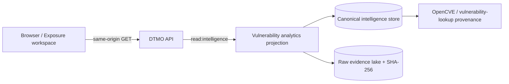

# Phase 11.10i — Vulnerability & Exposure Center

Status: **IN PROGRESS / EXACT-HEAD VALIDATION REQUIRED**

Phase 11.10i reuses DTMO's accepted canonical vulnerability ingestion, raw-evidence integrity checks and analytics projection. It does not create a second vulnerability datastore and does not make the browser a privileged upstream client.

## Canonical path

The frontend reads `GET /api/v1/console/vulnerability-analytics?window=30d`. Server-side `read:intelligence` authorization remains authoritative. Raw evidence references are integrity checked before projection; missing, inaccessible, malformed or hash-mismatched evidence degrades the result instead of being silently converted into a healthy claim.

## Semantics

CVSS, EPSS, KEV, CWE, vendor/product mappings and sightings are intelligence/prioritization evidence. Their presence does **not** prove that a local asset is exposed, vulnerable, exploitable, compromised, remediated or safe. Absence of a vulnerability record does not prove absence of exposure. Configuration or connector presence does not prove runtime health.

The workspace is read-only in this slice. It introduces no remediation action, scanner credential, browser-held service credential, publication/share authority or case-creation authority. Existing human review/share/case boundaries and separation of duties remain unchanged.

## Acceptance

The bounded slice requires deterministic contract coverage, a frontend production build and the dedicated `Phase 11 Vulnerability Exposure Workspace Gate` on the final exact PR head. Repository CI proves repository contracts only; it is not Phase 11.10p production-equivalent evidence and does not change the standing **Phase 10 NO-GO / BLOCKED — PLATFORM INDUSTRIALISATION REQUIRED** decision.
