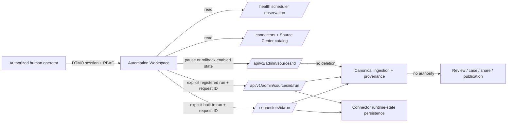

# Phase 11.10k — Automation & Playbooks

## Purpose

Phase 11.10k turns the canonical `/automation` route into a governed DTMO control-plane workspace without creating a second orchestration plane. The workspace reuses the existing server-owned `SchedulerService`, `/health` scheduler observation, built-in `/connectors` capability inventory, `/api/v1/source-center/status` governed source projection, accepted connector execution paths and the existing registered-source administration API.

## Authority and trust boundaries

The browser never receives upstream connector credentials and never calls an upstream service directly. Scheduler state is observational; a reported schedule does not authorize a browser to alter scheduler configuration. Explicit execution and registered-source state mutation remain server-authorized actions.

## Human authority

The workspace exposes bounded execution and reversible registered-source pause controls only when the DTMO session includes `manage:connectors` and is not represented as a service-account browser session. This UX restriction does not replace backend RBAC; the server remains authoritative. Service-to-service collection jobs continue to operate only through their accepted server-side scheduler boundary.

Automation does not create an autonomous decision authority. A successful run can ingest attributable intelligence but cannot itself assert source truth, compromise, containment, remediation, review completion, case creation, external-share approval, publication approval or production authorization.

## Durable execution observation

Built-in connector executions and governed registered-source executions both project their latest runtime state through `ConnectorStateStore`. The workspace re-reads Source Center after a successful trigger and displays that persisted latest state separately from the immediate HTTP result. Health events remain evidence of connector execution only; they cannot approve publication.

## Bounded rollback model

For an enabled governed registered source, the workspace may set only its persisted `enabled` state to `false` through the existing source administration route. When that pause succeeds, the browser retains one session-local rollback token recording that the prior enabled state was `true`. Until it is resolved, another pause cannot replace that token.

Rollback writes `enabled=true` through the same server-authorized route. It is not a general transaction reversal: it does not delete canonical intelligence, raw evidence, audit events or connector health history, does not alter the scheduler, and cannot reverse an upstream side effect that already occurred. If the browser session loses its rollback token, server state remains explicit and must be managed through the normal governed source administration path.

## Failure model

If session, scheduler health, connector capability state or persisted source state cannot be loaded, the workspace fails closed and does not synthesize a healthy/runnable state. Connector execution errors and source mutation errors are rendered as returned by the DTMO control plane. A disabled source or feature flag remains disabled rather than being interpreted as a successful no-op.

## Replay and evidence

The browser supplies a fresh `X-Request-ID` for explicit bounded invocation and source state mutation. Canonical connector persistence retains the accepted idempotent ingestion/search behavior. Repository browser fixtures and GitHub Actions prove only code/contract behavior at an exact commit; they are not live-runtime, production-equivalent or production-authorization evidence.
