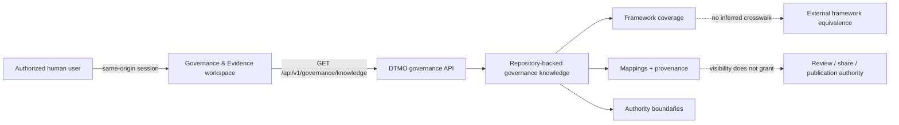

# Phase 11.10l — Governance & Evidence

Phase 11.10l makes governance knowledge visible in the canonical DTMO workbench without creating synthetic compliance claims. The workspace consumes the existing DTMO-owned `GET /api/v1/governance/knowledge` API, which is protected by `read:intelligence` and returns only repository-backed framework state, mappings, provenance and authority boundaries.

## Trust and evidence boundary

Normenkader IBP and MITRE ATT&CK remain explicitly unmapped until a governed control-/technique-level crosswalk exists in the repository. CVSS is presented as context-only where no first-class score/vector mapping exists. DTMO internal governance mappings are shown only where explicit repository provenance exists.

The browser never turns missing, stale or inaccessible evidence into PASS, compliance, risk acceptance, external assurance, production readiness or production authorization. Governance visibility is read-only and does not alter review, case, connector, sharing, publication or administrative authority.
