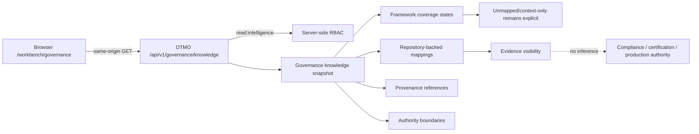

# Phase 11.10l Governance & Evidence Architecture

## Purpose

Phase 11.10l makes `/workbench/governance` a functional canonical workspace without introducing a second governance store, browser-side compliance logic or synthetic framework equivalence. The browser reads `GET /api/v1/governance/knowledge`; server-side DTMO RBAC and repository-backed provenance remain authoritative.

## Canonical flow

## Framework semantics

Normenkader IBP and MITRE ATT&CK are displayed as `unmapped` until governed repository-backed control or technique mappings exist. CVSS is `context_only` where the canonical data model does not provide a first-class governed mapping. DTMO internal security/release governance is displayed as repository-backed only for mappings carrying explicit source and section provenance.

A framework label, mapping or dashboard presence never proves control effectiveness, compliance, certification, compromise, remediation or independent assurance.

## Trust and authority boundaries

The browser remains an unprivileged DTMO client. `read:intelligence` authorization is enforced server-side. Governance visibility cannot grant review, case creation, remediation, connector execution, external-share approval, publication authority or production authority. Service integrations remain separate governed trust/licensing boundaries and no upstream credential is needed by this workspace.

Missing, malformed or inaccessible governance knowledge fails closed. DTMO does not convert missing mappings into PASS, healthy or zero-risk states.

## Evidence boundary

The dedicated 11.10l workflow provides repository-controlled exact-head contract/browser evidence only. It does not provide production-equivalent validation or independent external assurance. Historical Phase 8/9 evidence remains candidate-bound and cannot establish assurance for the materially changed Phase 11 integrated candidate. Phase 10 remains `NO-GO / BLOCKED — PLATFORM INDUSTRIALISATION REQUIRED` until later roadmap gates explicitly change that decision.
