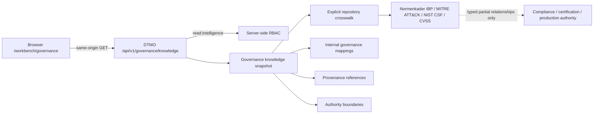

# Phase 11.10l Governance & Evidence Architecture

## Purpose

Phase 11.10l makes `/workbench/governance` a functional canonical workspace without introducing a second governance store, browser-side compliance logic or synthetic framework equivalence. The browser reads `GET /api/v1/governance/knowledge`; server-side DTMO RBAC and repository-backed provenance remain authoritative.

## Canonical flow

## Framework semantics

The repository already contains an explicit typed partial crosswalk in `backend/dtmo/governance_crosswalk.py`, governed by `docs/governance/GOVERNANCE_MAPPING_REGISTRY.md`. Phase 11.10l therefore surfaces those existing relationships instead of incorrectly presenting the entire framework as unmapped.

- **Normenkader IBP**: explicit partial `supports`/`partial-support` relationships, including `ID.02`, `ID.05`, `SM.02`, `SM.04`, `SM.07`, `SM.11`, `OP.02`, `BC.03` and `GO.03` where repository implementation evidence exists.
- **MITRE ATT&CK**: explicit typed threat/detection/classification context, including `T1078` and `T1087`; DTMO does not infer techniques from free text.
- **NIST CSF 2.0**: explicit partial outcome/category relationships where recorded in the crosswalk.
- **CVSS 4.0**: explicit `context-only` scoring relationship; it is not a compliance framework and does not prove local exposure or exploitability.

The crosswalk is deliberately partial. Unrelated or unverified framework objects remain unmapped. A framework label, typed mapping or dashboard presence never proves complete compliance, certification, control effectiveness, local compromise, remediation, audit acceptance or independent assurance.

## Trust and authority boundaries

The browser remains an unprivileged DTMO client. `read:intelligence` authorization is enforced server-side. Governance visibility cannot grant review, case creation, remediation, connector execution, external-share approval, publication authority, administration authority or production authority. Service integrations remain separate governed trust/licensing boundaries and no upstream credential is needed by this workspace.

Missing, malformed or inaccessible governance knowledge fails closed. DTMO does not convert missing mappings into PASS, healthy or zero-risk states.

## Evidence boundary

The dedicated 11.10l workflow provides repository-controlled exact-head contract/browser evidence only. It does not provide production-equivalent validation or independent external assurance. Historical Phase 8/9 evidence remains candidate-bound and cannot establish assurance for the materially changed Phase 11 integrated candidate. Phase 10 remains `NO-GO / BLOCKED — PLATFORM INDUSTRIALISATION REQUIRED` until later roadmap gates explicitly change that decision.
